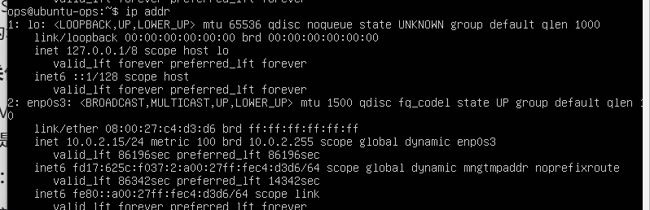
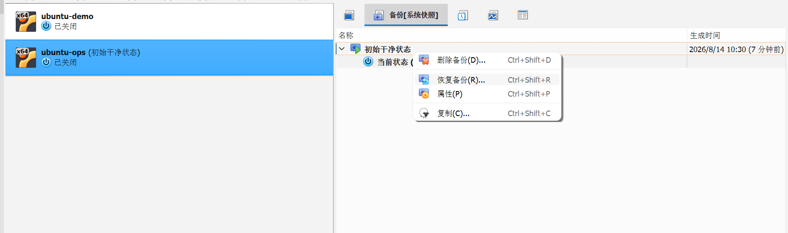
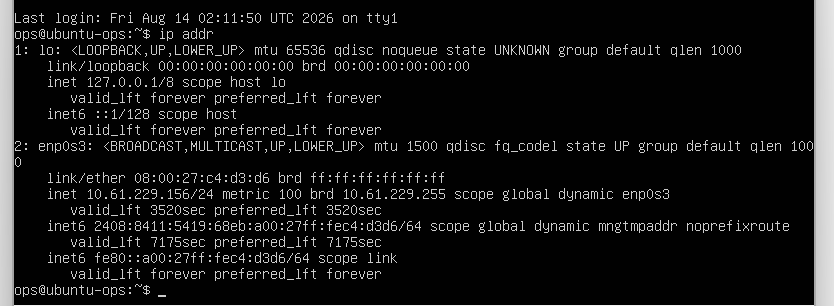

# 阶段零：环境搭建复盘

## 1. 使用 `ip addr` 获取虚拟机网卡信息

输入后如图：



从中获取到关键信息：

| 接口 | 是什么 | IP |
| --- | --- | --- |
| `lo` | loopback，回环接口——机器自己跟自己通信的虚拟网卡 | 127.0.0.1 |
| `enp0s3` | 真实网卡，虚拟机对外通信用的 | 10.0.2.15 |

`10.0.2.15` 这个 IP 有重要含义：这是 VirtualBox 默认 **NAT 网络**分配的地址。NAT 的意思是：虚拟机可以访问外网（上网没问题），但外面（包括你的 Windows）不能直接连到它——就像小区住户能出门，但外人不能直接进你家门。

这对下一步 SSH 很关键：要么把网络改成**桥接模式**（虚拟机像一台独立的机器直接连到你家路由器，拿到局域网 IP，Windows 就能直接连它），要么做**端口转发**。

## 2. 验证快照功能（实现备份效果）

1. 拍快照：VirtualBox 菜单 → 控制 → 生成备份 → 命名 `初始干净状态`——把当前“刚装好的干净系统”存档，这就是你的后悔药
2. 破坏测试：终端里执行 `touch /tmp/快照测试.txt`，然后恢复备份 → 恢复到“初始干净状态”
   （恢复备份的过程需要先关掉虚拟机 `sudo shutdown -h now`，再在 VirtualBox 主界面恢复，如图）



3. 恢复完重新开机，执行 `ls /tmp`，确认那个文件没了

### 知识点：`shutdown -h now` 和 `poweroff` 的区别

| 命令 | 立即关机 | 定时关机 | 取消关机 | 提前预警 |
| --- | --- | --- | --- | --- |
| `shutdown -h now` | ✅ | ✅ | ✅ | ✅ |
| `poweroff` | ✅ | ❌ | ❌ | ❌ |

- `shutdown` 更适用于多用户服务器
- 两个兄弟命令：`halt`（停 CPU，不一定断电，老系统上常见）、`reboot`（重启）

## 3. SSH 远程连接

### （1）如何理解

SSH = Secure Shell（安全外壳），是运维连接服务器的标准远程通道。它把 Windows 和 Ubuntu 之间建立一条加密的连接，让你在 Windows 终端里操作服务器——就像你坐在服务器面前一样。企业里你永远不可能坐在服务器机房，全靠 SSH。

### （2）配置桥接网络

1. 确保 ubuntu-ops 是关机状态（刚恢复完快照应该是关着的，没关就 `sudo shutdown -h now`）
2. 右键 ubuntu-ops → 设置 → 网络
3. 连接方式（Attached to）：**桥接网卡（Bridged Adapter）**
4. 名称（Name）：选你正在用的 WiFi 网卡——下拉列表里找带 WLAN / Wireless / Wi-Fi 字样的（比如 “Intel(R) Wi-Fi…” 或 “Realtek…”），别选 VMware 那两个（VMnet1/VMnet8），也别选“仅主机网络”
5. 确定 → 启动虚拟机 → 登录后执行 `ip addr`

这次应该出现一个 `10.61.229.x` 开头的地址（跟你 Windows 的 10.61.229.212 同一网段）。记下这个新 IP，如图：



### （3）从 Windows SSH 连过去

回到 Windows，打开 PowerShell，执行（把 IP 换成你记下的）：

```bash
ping 10.61.229.156
```

通了之后：

```bash
ssh ops@10.61.229.156
```

第一次连接会问指纹（Are you sure you want to continue connecting?），输入 `yes` 回车——这是 SSH 在验证服务器身份，防中间人攻击，后面详细学。

然后输密码（输入时不显示字符，正常）。看到 `ops@ubuntu-ops:~$` 就成功了。

### 知识点：桥接 IP 是 DHCP 动态分配的

`10.61.229.156` 是路由器通过 DHCP 动态分配的，具有时限。每次重启虚拟机后，如果 SSH 连不上，先回虚拟机里 `ip addr` 看一眼 IP 是不是变了，用新 IP 连就行。