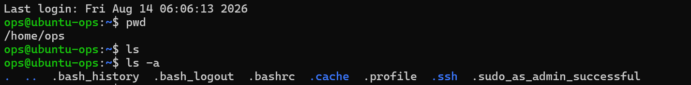
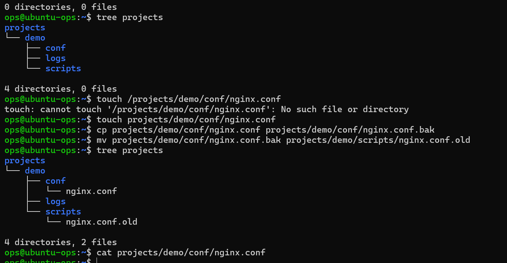

# 阶段一 第1课：文件与目录操作

## 1. 核心概念：Linux 的文件系统是一棵倒挂的树

想象所有文件都挂在一棵大树上，树根是 `/`（根目录）。每次打开终端，你都站在树的某个位置。运维的日常就是在这棵树上**走来走去、查看、创建、复制、移动、删除**文件。

## 2. 场景引入

老大说：“去服务器上看看项目部署在哪、日志在哪个目录。”

于是需要弄清楚三个问题：

- 我在哪里？
- 这里有什么？
- 去哪里？

## 3. 命令一：我在哪？这里有什么？去哪？

| 命令 | 作用 | 理解记忆 |
| --- | --- | --- |
| `pwd` | 打印当前目录（print working directory） | 我在哪 |
| `ls` | 列出当前目录内容（list） | 这里有什么 |
| `cd 目录` | 切换目录（change directory） | 去哪里 |

`cd ..` 回上一级，`cd ~` 回自己的家目录，`cd /` 回树根。

### 知识点：绝对路径 vs 相对路径

- **绝对路径**：从树根 `/` 开始写全，比如 `/home/ops/projects`——相当于报门牌号“北京朝阳区XX路XX号”，无论你在哪都能找到
- **相对路径**：从当前位置出发，比如 `../logs`——相当于说“从这往上走一层再进 logs”，你站的位置不同，结果就不同

判断方法：**以 `/` 开头的就是绝对路径**。运维中两个都要用，但配置文件里写死的一般用绝对路径（稳）。

## 4. 实战一：看看自己的家

1. `pwd` 看自己在哪
2. `ls` 查看这里有什么——结果为空：说明之前生成的文件被快照恢复了（快照回退，实验文件“穿越”消失）
3. `ls -a` 查看隐藏文件

隐藏文件逐个说明：

| 文件 | 作用 |
| --- | --- |
| `.bash_history` | 命令历史记录，终端按 ↑ 翻的历史就是它 |
| `.bash_logout` | 登出时执行的脚本，一般没啥内容 |
| `.bashrc` | Bash 启动配置，每次开新终端自动执行。配别名、环境变量都改它（最重要） |
| `.profile` | 登录时执行的脚本（SSH 登录那一刻），`.bashrc` 是每次开终端都执行 |
| `.cache` | 缓存目录，清了也无所谓 |
| `.ssh` | SSH 配置目录，以后免密登录、密钥对都在这 |
| `.sudo_as_admin_successful` | sudo 使用标记，第一次成功用 sudo 后自动生成 |

### 知识点：ls 的多种用法

| 命令 | 作用 |
| --- | --- |
| `ls` | 只显示文件名 |
| `ls -l` | 详细信息（权限、大小、时间） |
| `ls -a` | 包含隐藏文件（.开头） |
| `ls -la` | 组合：全部 + 详细信息，排查问题首选 |

## 5. 命令二：创建、复制、移动、删除

| 命令 | 作用 | 注意 |
| --- | --- | --- |
| `mkdir 目录` | 创建目录 | 加 `-p` 一次建多层：`mkdir -p a/b/c` |
| `touch 文件` | 创建空文件 | 也能更新文件时间戳 |
| `cp 源 目标` | 复制 | 复制目录要加 `-r`（递归） |
| `mv 源 目标` | 移动/重命名 | 同一目录里 mv = 重命名 |
| `rm 文件` | 删除 | ⚠️ 没有回收站，删了就是真没了；rm 之前先 ls 看清楚，重要文件先备份 |

## 6. 实战二：模拟第一天入职整理项目目录

1. 回到最初的地方（家目录）：`cd ~`
2. 看自己在哪：`pwd`
3. 建目录结构：`mkdir -p projects/demo/conf projects/demo/logs projects/demo/scripts`
4. 看树状结构：`tree projects`
5. 在 conf 下创建配置文件：`touch projects/demo/conf/nginx.conf`（可以 touch + 路径/文件名）
6. 复制一份做备份：`cp projects/demo/conf/nginx.conf projects/demo/conf/nginx.conf.bak`
7. 把备份挪到 scripts 目录并改名：`mv projects/demo/conf/nginx.conf.bak projects/demo/scripts/nginx.conf.old`
8. 再看结构确认效果：`tree projects`
9. 验证文件内容为空：`cat projects/demo/conf/nginx.conf`

## 7. 踩坑与复盘

- ⚠️ 快照恢复会把系统带回拍快照那一刻——实验文件会消失，这是快照的预期效果，不是文件丢失。做练习前先确认当前状态
- `rm` 没有回收站，删除前先 `ls` 确认
- `tree` 命令需要安装：`sudo apt install -y tree`
- 绝对路径和相对路径的判断：以 `/` 开头 = 绝对