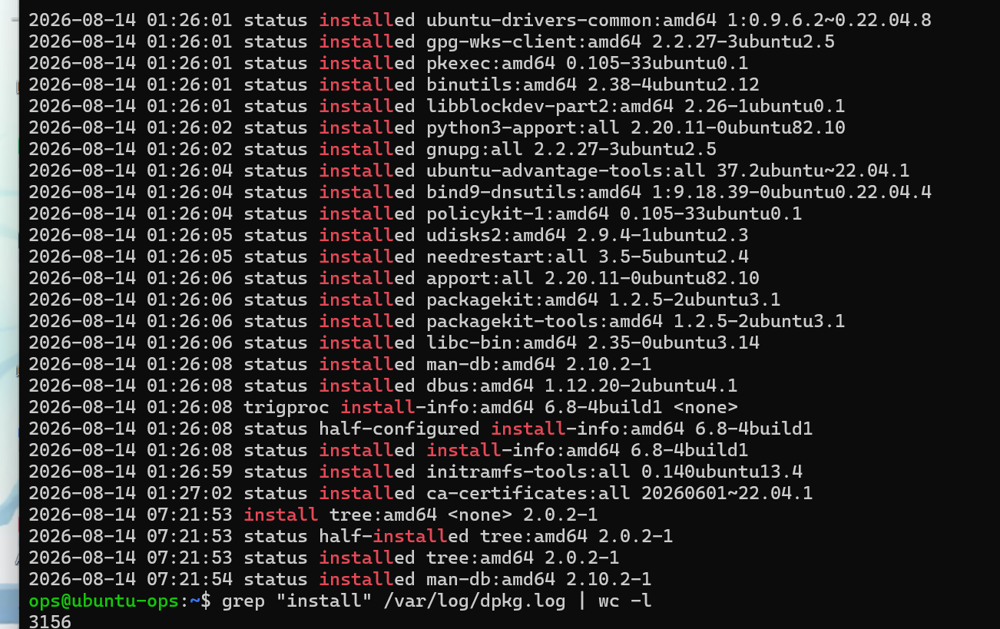
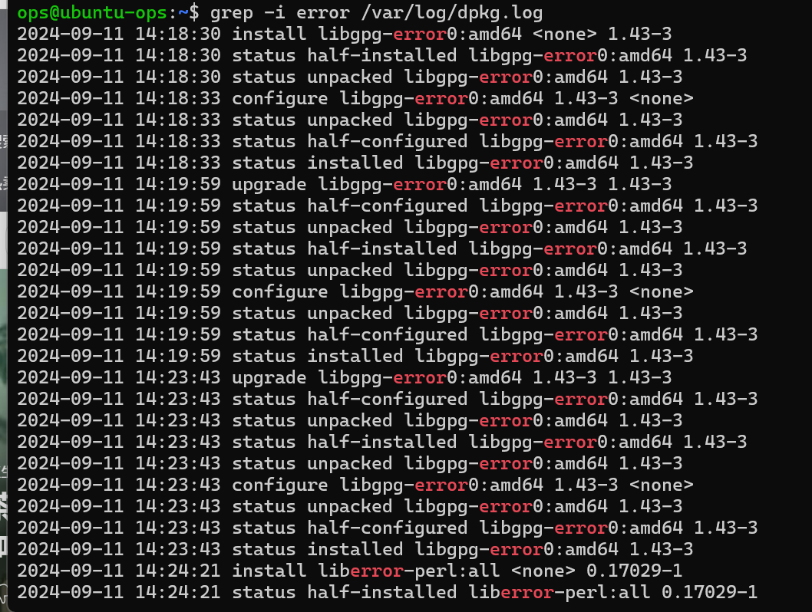

# 阶段一 第2课：文本查看与处理

## 1. 核心思想

“运维就是玩文本”——服务器的日志、配置文件、命令输出，全是文本。能多快地从文本里找到关键信息，就能多快地解决问题。

## 2. 场景

老大说：“网站刚才挂了，去查日志。”

SSH 上服务器，面对可能几 MB 甚至几百 MB 的日志文件。任务就三个：**看内容、找关键行、数数量**。

## 3. 查看内容的“四兄弟”

| 命令 | 作用 | 什么时候用 |
| --- | --- | --- |
| `cat 文件` | 整个文件一次性倒出来 | 小文件（配置文件、主机名） |
| `less 文件` | 分页查看，空格翻页，`/` 搜索，`q` 退出 | **大文件首选**（日志动辄几 MB） |
| `head -n 5 文件` | 看开头 5 行 | 看文件头部（配置文件开头） |
| `tail -n 20 文件` | 看末尾 20 行 | **日志最新内容在尾部** |
| `tail -f 文件` | 实时跟踪（follow） | 一边看程序跑一边盯日志 |

理解记忆：`head` = 头，`tail` = 尾巴，`-f` = follow（跟随）。日志是不断增长的，最新的永远在文件末尾，所以运维用得最多的是 `tail`。

**tail -f 是运维神器**：程序跑着不动，你用 `tail -f` 盯着日志，一旦有新内容就实时滚出来——排查“程序为什么卡住/报错”全靠它。

## 4. grep：大海捞针

grep = global regular expression print（全局正则匹配打印），翻译成人话：**只显示包含关键词的行**。

```bash
grep "error" app.log        # 只显示含 error 的行
grep -i "error" app.log     # -i 忽略大小写（ERROR/Error/error 都算）
grep -n "error" app.log     # -n 显示行号
grep -v "debug" app.log     # -v 反向：排除含 debug 的行
grep -c "error" app.log     # -c 只数有多少行匹配
```

真实场景：查 Nginx 日志里有多少个 500 错误——`grep " 500 " access.log | wc -l`。为什么 `" 500 "` 带空格？避免匹配到 5000 这种数字。这种细节就是经验。

## 5. 管道 |：让命令手拉手

管道把**前一个命令的输出，变成后一个命令的输入**：

```bash
grep " 500 " access.log | wc -l
        ↑ 找出500的行          ↑ 数一数
```

这背后是 Linux 的哲学：**每个命令只做一件小事，管道把它们组合起来做大事**。就像流水线：一个人切菜，一个人炒菜，管道就是传送带。

## 6. wc：数数

`wc -l 文件` 数行数，`-w` 单词数，`-c` 字节数。常用的是 `-l`。

## 7. 实战一：文本三连

1. 看主机名（cat 适合小文件）：`cat /etc/hostname`
2. 看用户数据库开头五行：`head -n 5 /etc/passwd`
3. 看末尾五行：`tail -n 5 /etc/passwd`
4. 用 less 翻页看 /etc/passwd（空格翻页，q 退出）：`less /etc/passwd`
5. grep 找自己的用户：`grep ops /etc/passwd`
6. 在 apt 安装日志里找所有 install 记录：`grep " install " /var/log/dpkg.log`
7. 管道+统计：一共装过多少个软件包：`grep " install " /var/log/dpkg.log | wc -l`



8. 大小写不敏感找 error：`grep -i error /var/log/dpkg.log`



## 8. 踩坑复盘：grep 的两个经典问题

### 问题一：install 计数对不上（3156 vs 20）

| 项目 | 内容 |
| --- | --- |
| 现象 | 同一个日志，`grep install` 数出 3156，`grep " install "` 数出 20 |
| 原因 | grep 是**字面匹配**：`install` 会命中所有包含该字样的行（`installed`、`install-info`、`half-installed`）；带空格 `" install "` 只匹配“前后都是空格”的独立单词，即真正的安装动作行 |
| 本质 | 没先想清楚“我要匹配的是**字样**还是**单词**” |
| 改进 | ① 写命令前先明确目标 ② 用 `-w` 参数匹配完整单词（`grep -w install` 效果等同带空格）③ 用 `^` 锚定行首，如 `grep "^20.* install "` 更严谨 |

### 问题二：error 搜出一堆“假错误”

| 项目 | 内容 |
| --- | --- |
| 现象 | `grep -i error` 命中大量行，看着像系统坏了 |
| 原因 | 命中 `libgpg-error0`、`liberror-perl` 等包名里带 error 的软件；grep 不理解语义，只做文本比对 |
| 本质 | 把“关键词命中”误当成了“问题命中” |
| 改进 | ① 命中后先看上下文和状态字段（`status installed` = 成功，`half-installed` = 异常）② 选问题特有的词（比如日志搜 `FATAL`、`panic`，状态字段看 `failed`）③ 用 `-v` 排除已知噪音 ④ 先 `\| wc -l` 或 `\| head` 看规模再决定是否深入 |

## 9. 实战二：tail -f 实时跟踪

1. 第一个 SSH 终端执行：`tail -f /var/log/dpkg.log`（它会停在那，等待新内容）
2. 另开一个 PowerShell，再 SSH 连一次，执行：`sudo apt install -y htop`
3. 回到第一个终端——**看到日志实时滚动了**！这就是 apt 在写安装记录，而 tail -f 在实时盯着它
4. 看完按 `Ctrl+C` 退出跟踪

## 10. 复盘：grep 使用心法

1. **先问自己要搜什么**：词？字样？什么格式？——想清楚再写模式
2. **让模式精确**：`-w` 完整单词、`" 关键词 "` 带空格、`^` 锚点，宁可多敲两个字符，别被噪音淹没
3. **命中 ≠ 问题**：看到 error/FAILED 先看上下文和状态字段，再下结论
4. **先看数量级**：`| wc -l` 数一下、`| head -n 5` 看一眼，再决定怎么处理
5. **组合拳**：`-i` 忽略大小写、`-n` 带行号、`-v` 反向排除、`-c` 直接计数

一句话总结：**grep 是“找字”，不是“判断”；命令写多精确，结果就有多可靠。**