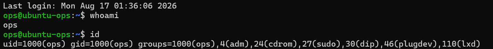
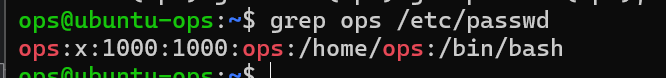
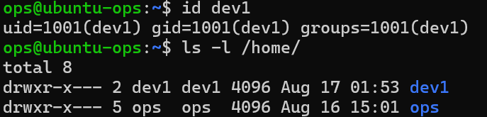
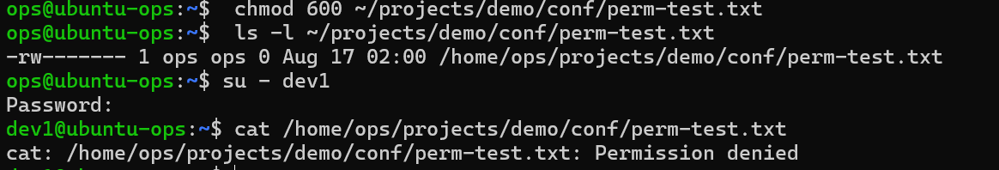
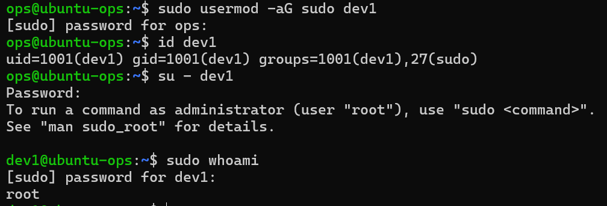
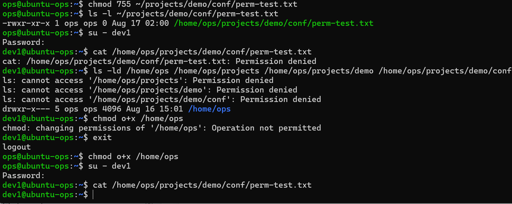

# 阶段一 第4课：用户与权限

## 1. 场景：模拟新同事入职

公司服务器多用户共用，每个人权限不同：开发能看代码、不能动数据库；运维能管服务。Linux 靠**用户、组、权限位**三件套实现。

## 2. 实战过程

### ① 看自己的身份

```bash
whoami
id
```



**id 信息重点（组 = 门禁卡）**：

| 组 | 认识它是因为 |
| --- | --- |
| `sudo` | 给同事开“管理员权限”，就是把他加进这个组（`usermod -aG sudo 用户名`） |
| `adm` | 能读系统日志。排障要看 /var/log 下的日志，谁有 adm 谁能看 |

### ② 在用户数据库里找自己

```bash
grep ops /etc/passwd
```



**/etc/passwd 七字段**：

| 字段 | 内容 | 含义 |
| --- | --- | --- |
| 1 | `ops` | 用户名 |
| 2 | `x` | 密码占位符——密码不在这里，真密码在 /etc/shadow 里 |
| 3 | `1000` | UID（用户 ID） |
| 4 | `1000` | GID（主组 ID，对应你的 ops 组） |
| 5 | `ops` | 备注字段（GECOS），一般填全名，不填也行 |
| 6 | `/home/ops` | 家目录——登录后默认就在这 |
| 7 | `/bin/bash` | 登录 Shell——登录后用的命令解释器 |

### ③ 创建新用户 dev1（模拟新同事）

```bash
sudo useradd -m -s /bin/bash dev1
sudo passwd dev1      # 设置密码，如 123456
```

### ④ 确认建好了

```bash
id dev1
ls -l /home/          # 看到 dev1 的家目录
```



### ⑤ 权限体验：创建文件看默认权限

```bash
touch ~/projects/demo/conf/perm-test.txt
ls -l ~/projects/demo/conf/perm-test.txt
```

观察：`-rw-rw-r-- 1 ops ops ...`（默认 664）

**注意**：默认权限不是固定的，由 **umask** 决定（本机是 002 → 664；常见 Ubuntu 是 022 → 644）。第 5 课讲 umask，先记住“新文件的默认权限来自 umask”。

### ⑥ 数字法改权限，用 dev1 视角验证

**先改成 600（只有属主可读写）：**

```bash
chmod 600 ~/projects/demo/conf/perm-test.txt
su - dev1
cat /home/ops/projects/demo/conf/perm-test.txt    # Permission denied ✅ 符合预期
exit
```

**再改成 755：**

```bash
chmod 755 ~/projects/demo/conf/perm-test.txt
su - dev1
cat /home/ops/projects/demo/conf/perm-test.txt    # 还是 Permission denied？！→ 见第 5 节复盘
exit
```



### ⑦ 把 dev1 变成“半个管理员”

```bash
sudo usermod -aG sudo dev1
```

| 部分 | 含义 |
| --- | --- |
| `usermod` | 修改用户信息（user modify） |
| `-a` | append，追加——往附加组列表里“加”，不动原有组 |
| `-G` | groups，指定要加入的组 |
| `sudo` | 组名（能提权的门禁卡） |
| `dev1` | 目标用户 |

**⚠️ 最重要的一条警告**：`-a` 千万别漏！写成 `usermod -G sudo dev1`（没有 -a），系统会把 dev1 现有的附加组**全部替换**成只有 sudo——原来的 adm、cdrom 那些组全没了。运维圈管这叫“组列表被清空事故”，**-aG 永远连着写**。

**验证：**

```bash
id dev1            # groups 里出现 27(sudo)
su - dev1
sudo whoami        # 输出 root 即成功
```



## 3. 半个管理员和真正管理员的区别

| | root（真管理员） | sudo 用户（ops / dev1） |
| --- | --- | --- |
| 平时权限 | 天生就是最高权限 | 普通用户，改系统文件都会被拒 |
| 要干活时 | 直接干，无验证 | sudo 命令，输密码才能借权 |
| 谁在用 | 分不清是谁（root 没有个人身份） | 有据可查：/var/log/auth.log 记录谁、何时、执行了什么 sudo |
| 出事的代价 | 一个 rm -rf 全盘覆灭 | 同样危险，但多一道“输入密码”的思考时间 |

**为什么企业坚持这套“麻烦”的流程？** 三个理由：

1. **追责**：出事了能查日志——“昨晚谁删的数据库？”一看 auth.log，是 dev1 在 3 点 sudo 删的
2. **最小权限**：平时没特权 = 误操作面小。手滑 rm -rf 时，普通用户连删的资格都没有
3. **账号管理灵活**：dev1 离职了，锁他的账号就行，root 密码永远不用换

## 4. 知识点总结：两种改权限方法

### 方法一：数字法（chmod 数字）

**原理**：每个权限对应一个数字，相加得到角色权限值

```
r = 4   w = 2   x = 1
```

**格式**：`chmod 三位数字 文件`（三个数字分别代表：属主 / 组 / 其他人）

| 数字 | 权限 | 含义 |
| --- | --- | --- |
| 7 | rwx | 读写执行 |
| 6 | rw- | 读写 |
| 5 | r-x | 读执行 |
| 4 | r-- | 只读 |
| 0 | --- | 无权限 |

**经典组合**：

| 组合 | 权限 | 用途 |
| --- | --- | --- |
| `755` | rwxr-xr-x | 网站文件/脚本 |
| `644` | rw-r--r-- | 普通文件（默认） |
| `600` | rw------- | 密钥、密码文件 |
| `700` | rwx------ | 私有目录 |
| `777` | rwxrwxrwx | 全开放（危险，慎用） |

**优点**：一次说清全部权限，简短、适合脚本；**缺点**：要心算，改一项也得写全三位。

### 方法二：字母法（chmod 字母）

**原理**：告诉系统“给谁、加还是减、什么权限”

```
chmod [对象][操作符][权限] 文件

对象：u=属主(user)  g=组(group)  o=其他人(other)  a=所有人(all)
操作符：+ 加权限  - 去掉权限  = 设为
权限：r / w / x
```

**常用例子**：

| 命令 | 效果 |
| --- | --- |
| `chmod u+x 脚本.sh` | 给属主加执行权限（最常用！） |
| `chmod g-w 文件` | 去掉组的写权限 |
| `chmod o+r 文件` | 给其他人加读权限 |
| `chmod a+x 文件` | 给所有人加执行权限 |
| `chmod u=rwx,go=r 文件` | 属主全权、组和其他只读（= 755） |

**优点**：精准，只动你想动的那一项，不碰其他权限；**缺点**：一次只能表达简单变化。

### 什么时候用哪个

| 场景 | 选哪个 |
| --- | --- |
| 部署时一次性设置完整权限 | 数字法（755 一条搞定） |
| 只给脚本加执行、只去掉组的写权限 | 字母法（不用重写全部） |
| 脚本/文档里写权限 | 数字法（可读性好） |
| 临时调整某角色单项 | 字母法 |

## 5. 踩坑与复盘：755 权限为什么 dev1 还是 Permission denied

**问题**：权限 600 无法访问可以理解，但权限 755 时 dev1 依然无法访问。文件权限一直是 755（rwxr-xr-x，其他人有 r-x），问题出在**父目录**：/home/ops 的权限是 750，缺少对“其他人”的 x（进入）权限。

**完整排障流程**：

1. 先看文件权限：`ls -l` → 755，文件本身没问题
2. 想到“访问文件要沿路径穿过每一层目录”，用 `ls -ld` 逐层检查：

```bash
ls -ld /home/ops /home/ops/projects /home/ops/projects/demo /home/ops/projects/demo/conf
```



3. 找到问题：`/home/ops` → `drwxr-x---`（750），dev1 属于“其他人”，没有 x 进不去；更深的层级全部 Permission denied（第一道门锁死，后面看不见）

**解决**：

```bash
chmod o+x /home/ops    # 给其他人加进入权限（或 chmod 755 /home/ops）
```

**知识沉淀**：

- 访问文件的完整链路 = **路径上每一层目录 + 文件本身**，全部要有权限
- 目录权限三兄弟：`r` = 能列出内容，`w` = 能建/删文件，`x` = 能进入
- Permission denied 不告诉你哪层挡的，排查必须逐层看：`ls -l 文件` + `ls -ld 每层目录`
- 错误信息相同，原因可能在任意一层——永远先怀疑“路径可达性”，再怀疑文件本身
- chmod 没有撤销键，改完用 `ls -l`/`ls -ld` 确认一眼

## 6. 一句话总结

**文件权限是最后一道门，路径上每层目录的 x 都是前面的门——门没开完，永远进不去。**