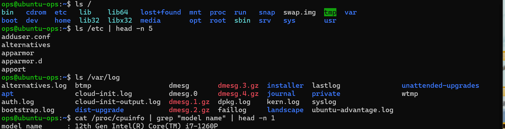
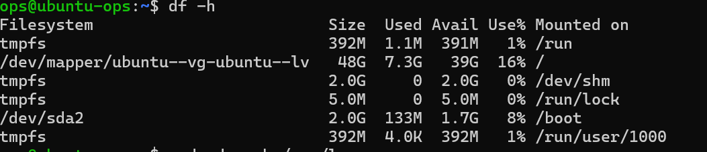
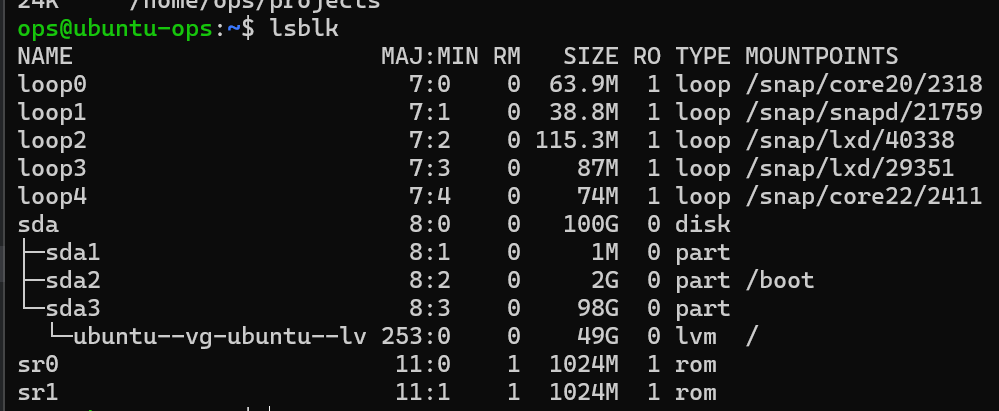

# 阶段一 第5课：文件系统深入

## 1. 场景

老大说：“服务器磁盘快满了，去查一下。”

脑子里要有三张图：**目录结构图**（东西都在哪）、**磁盘占用图**（空间被谁吃了）、**挂载图**（设备挂在哪）。

## 2. 目录结构：树上几个重要的“树枝”（FHS）

| 目录 | 干什么的 | 运维场景 |
| --- | --- | --- |
| `/etc` | 配置文件集中营 | 以后改 Nginx、MySQL 配置都在这里 |
| `/var` | 变动数据：日志、网站、缓存 | `/var/log` 日志、`/var/www` 网站目录 |
| `/usr` | 系统软件（Unix System Resources，不是 user） | 软件装这，不用管细节 |
| `/home` | 用户家目录 | 每个用户一个：/home/ops |
| `/tmp` | 临时文件 | **重启就清空**，重要东西别放这 |
| `/proc` | 虚拟文件系统，反映内核实时状态 | `cat /proc/meminfo` 看内存、`/proc/cpuinfo` 看 CPU |
| `/dev` | 设备文件（一切皆文件的体现） | 硬盘、U 盘都“变成”文件出现在这 |
| `/boot` | 启动文件 | 别碰，碰了开不了机 |
| `/root` | root 的家目录 | 和 /home 区分开 |

**理解记忆**：`/etc` 管配置、`/var` 管数据、`/home` 管用户、`/proc` 管状态——这四个记牢，其他遇到再认。

## 3. 实战一：查看树的各个树枝

```bash
ls /
ls /etc | head -n 5
ls /var/log
cat /proc/cpuinfo | grep "model name" | head -n 1   # CPU 型号
```



### 知识点 1：`~` 与 `/` 的区别

| 命令 | 看的是 | 里面有什么 |
| --- | --- | --- |
| `ls /` | 根目录（整棵树的树根） | etc、var、home、usr、tmp、proc、dev……所有系统目录 |
| `ls ~` | 你的家目录（/home/ops 的快捷写法） | 你个人文件：projects、.bashrc、.ssh…… |

`ls /` 是站在楼顶看整座城市的街区分布；`ls ~` 是站在自己家里看客厅里有什么。

### 知识点 2：`ls` 与 `cat` 的区别

- `ls` 看**目录**（列出里面有什么）；`cat` 看**文件**（读出内容）
- 目标是目录 → `ls`；目标是文件 → `cat`；拿不准先 `ls -ld` 确认

**/proc 的特殊性**：里面的“文件”不是磁盘上真实存在的文件，而是**内核实时状态伪装成的文件**。所以 `/proc` 本身是目录 → 用 `ls`；`/proc/cpuinfo` 是文件（虚拟的）→ 用 `cat`。这也印证了 Linux 哲学：**一切皆文件**。

**怎么区分是目录还是文件？**

```bash
ls -ld /etc            # 第一个字符是 d → 目录
ls -ld /proc/cpuinfo   # 第一个字符是 - → 文件
file /etc              # 输出 "directory"
file /proc/cpuinfo     # 输出 "ASCII text" 或类似
```

## 4. 实战二：磁盘体检

```bash
df -h                    # 看整体磁盘使用率
sudo du -sh /var/log     # 看 /var/log 的大小
du -sh ~/projects        # 看某个目录总大小
lsblk                    # 看磁盘/分区设备
```





### 经典排障套路（“磁盘满了怎么办”的标准答案）

1. `df -h` → 确认哪个分区满了
2. `du -sh *` → 在那个分区里找最大的目录（一层层往下钻）
3. 找到大文件 → 判断：日志？备份？垃圾？→ 清理或转移

## 5. 挂载概念

Windows 里每个盘是 C:、D:；Linux 里所有设备都“挂”到树上的某个目录——这就是“一切皆文件”的体现。

## 6. 软链接 vs 硬链接

### 实验

```bash
cd ~/projects/demo
echo "hello link" > original.txt

# 硬链接：给同一个文件起第二个名字
ln original.txt hardlink.txt

# 软链接：指向路径的快捷方式
ln -s original.txt softlink.txt

# 看三者关系（-i 显示 inode 编号）
ls -li original.txt hardlink.txt softlink.txt
```

**观察输出**：
- `original.txt` 和 `hardlink.txt` 的 **inode 编号相同**——它们是同一个文件的两个名字（像同一个人有两个户口本）
- `softlink.txt` 显示 `original.txt -> ...` 箭头——它是个快捷方式，存的只是路径

**删除源文件测试**：

```bash
rm original.txt
cat hardlink.txt    # ✅ 还在！因为硬链接指向数据本身
cat softlink.txt    # ❌ 报错！因为快捷方式指向的路径没了
```

### 一句话区分

| | 硬链接 | 软链接 |
| --- | --- | --- |
| 本质 | 同一个文件的另一个名字 | 指向路径的快捷方式 |
| inode | 相同 | 不同 |
| 源文件删除后 | 链接还在，数据还在 | 链接失效（红叉） |
| 能跨文件系统/目录吗 | 不能（同分区内） | 能 |
| 类比 | 同一个人两个户口本 | 桌面上的快捷方式 |

## 7. 复盘：磁盘 vs 文件系统（四层模型）

**核心：四层分层，先定位是哪一层再选命令**

```
┌─────────────────────────────────────────────┐
│ 第4层 内容层：ls / cat / cd / mkdir / du      │ ← 你天天操作的“文件和目录”
├─────────────────────────────────────────────┤
│ 第3层 挂载层：/  /home  /var  /mnt            │ ← 目录树上的“挂载点”
├─────────────────────────────────────────────┤
│ 第2层 文件系统层：ext4 / xfs / ntfs            │ ← 数据的“格式与管理制度”
├─────────────────────────────────────────────┤
│ 第1层 磁盘层：/dev/sda  /dev/sda1             │ ← 物理硬件与分区
└─────────────────────────────────────────────┘
```

**一句话版**：磁盘是仓库（硬件），文件系统是仓库的管理制度（格式），挂载是把仓库接入大楼（目录树），文件/目录是仓库里的货物（内容）。

### 命令对照表（按层分组）

| 层 | 命令 | 干什么 | 典型输出 |
| --- | --- | --- | --- |
| 磁盘层 | `lsblk` | 看磁盘/分区结构（几块盘、几个区） | sda、sda1、sda2 |
| 磁盘层 | `sudo fdisk -l` | 看分区表细节 | |
| 文件系统层 | `df -h` | 看已挂载文件系统的容量使用率 | Filesystem / Use% |
| 文件系统层 | `df -i` | 看 inode 使用率（容量没满但写不进时查它） | Inodes / IUse% |
| 文件系统层 | `sudo mkfs.ext4 设备` | 格式化 = 给分区装上文件系统 | |
| 文件系统层 | `sudo fsck 设备` | 检查/修复文件系统 | |
| 挂载层 | `mount` | 看/做挂载（谁挂在哪） | /dev/sda1 on / type ext4 |
| 挂载层 | `umount 挂载点` | 卸载（拔 U 盘前必须做） | |
| 挂载层 | `/etc/fstab` | 开机自动挂载的配置文件 | |
| 内容层 | `du -sh 目录` | 从内容算某个目录占多大 | 2.1G /var |
| 内容层 | `ls / cat / cd` | 日常操作文件目录 | |

**记法**：`lsblk` 看硬件仓库、`df` 看制度容量、`du` 数货物大小、`mount` 看仓库接在哪。

### 实战场景应用

**场景一：磁盘满了（最常见）**

```bash
df -h                          → 发现 / 分区 Use% 100%
du -sh *                       → 在 / 下逐层找大目录
sudo du -h --max-depth=1 /var | sort -h | tail
                               → 锁定大文件（通常是日志）
清理日志/旧备份                 → df -h 确认降下来了
```

**场景二：df -h 有空间，但写文件报 No space left**

```bash
df -i    → IUse% 100%？→ inode 满了！
```

原因：小文件太多，把“档案柜编号”用光了（容量还有，编号没了）。解决：清理 /tmp、缓存里的大量小文件。

**场景三：新加一块硬盘**

```bash
lsblk                 → 确认新盘识别为 /dev/sdb
sudo fdisk /dev/sdb   → 分区（建 /dev/sdb1）
sudo mkfs.ext4 /dev/sdb1  → 格式化（装文件系统）
sudo mount /dev/sdb1 /data  → 挂载（接入目录树）
写 /etc/fstab          → 开机自动挂载（否则重启又没了）
```

这五步就是“加仓库 → 隔房间 → 装制度 → 接入大楼 → 设为永久”的全流程。

**场景四：U 盘**

```bash
lsblk                        → 找到 U 盘设备（如 /dev/sdb1）
sudo mount /dev/sdb1 /mnt/usb → 挂载后才能访问
用完：sudo umount /mnt/usb   → 先卸载再拔，否则数据可能损坏
```

**场景五：开机进入 fsck / 文件系统报错**

文件系统损坏（异常断电等）→ 开机自动检查 fsck。了解即可：不要乱跑 fsck，一般系统会自己处理或提示。

### 常见混淆点澄清

| 容易混的 | 真相 |
| --- | --- |
| df 第一列叫 Filesystem | 它其实是“分区上装的文件系统”，不是裸盘 |
| /dev/sda1 是磁盘还是文件系统？ | 是分区（磁盘层）；上面装的 ext4 才是文件系统 |
| mkfs 是干嘛的 | 给分区装文件系统（格式化） |
| 为什么磁盘有剩余空间却写不进 | inode 满（df -i）或文件系统只读等 |
| 挂载和复制的关系 | 挂载不是复制，是把设备“接”到目录，访问目录=访问设备 |

## 8. 一句话总结

**磁盘是硬件仓库，文件系统是仓库制度，挂载是把仓库接入目录树，文件和目录是仓库里的货物——查问题先定位是哪一层。**