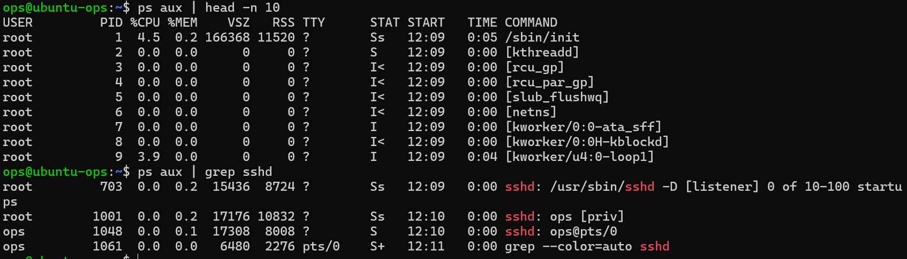

# 阶段一 第6课：进程管理

## 1. 场景

老大说：“服务器卡死了，查查谁在吃资源。”——找元凶、干掉它、让程序后台跑，就是这课的全部。

## 2. 核心概念

1. **程序 vs 进程**：程序是硬盘上的文件（静态的，比如 htop 这个文件）；进程是正在运行中的程序（在内存里，动态的）。一个程序可以同时开好几个进程。
2. **PID**：每个进程的身份证号（Process ID）。操作系统靠 PID 找到并管理每个进程。
3. **进程有爹**：进程是由其他进程启动的，形成父子关系。整个系统的老祖宗是 PID 1（systemd）。

## 3. 实战记录

### (1) 看系统里谁在跑

```bash
ps aux | head -n 10      # 看前 10 个进程
ps aux | grep sshd       # 找 sshd 的进程
pgrep -a sshd            # 另一种找法（按名字找 PID）
```



### (2) 开个“吃 CPU 的坏蛋”

`yes` 命令会疯狂输出占满 CPU，是经典实验道具：

```bash
yes > /dev/null &
```

按回车回到提示符，会看到类似 `[1] 12345`——方括号里是任务编号，后面是 PID。

### (3) 干掉它：kill 与 kill -9

```bash
# 先找到坏蛋的 PID
ps aux | grep yes        # 看到 99.6% CPU 的那个 yes

# 温柔地干掉它（信号 15，请它体面退出）
kill 1069
ps aux | grep yes        # 确认没了

# 再来一次，体验强杀（信号 9，直接拔电源）
yes > /dev/null &
kill -9 <新PID>
ps aux | grep yes        # 确认没了
```

**kill 本质是“发信号”**：

| 命令 | 信号 | 行为 | 类比 |
| --- | --- | --- | --- |
| `kill PID` | 15 (SIGTERM) | 请进程自己退出 | 点“关机” |
| `kill -9 PID` | 9 (SIGKILL) | 强制杀死，没机会保存 | 直接拔电源 |

**原则**：先 `kill`，不行再 `kill -9`。上来就 -9 是粗暴操作，可能丢数据。

### (4) 后台运行体验

```bash
sleep 30 &               # 30 秒后自己结束，但终端立刻还给你
jobs                     # 查看后台任务
nohup sleep 100 &        # 退出 SSH 再重新连，进程还在（在！）
```

## 4. 知识点：后台运行

| 写法 | 效果 |
| --- | --- |
| `命令 &` | 命令在后台运行，终端立刻还给你 |
| `nohup 命令 &` | 退出 SSH 后进程也继续跑（nohup = no hang up，不挂断）——以后部署服务的雏形 |

## 5. 知识点：ps aux vs top

| | ps aux | top |
| --- | --- | --- |
| 性质 | 一次性**快照**（拍照） | 实时**直播**（每几秒刷新） |
| 输出 | 所有进程完整列表，适合搜索 | 顶部系统汇总 + 动态排序的进程列表 |
| 交互 | 无，适合脚本管道 | 有（q 退出、M 按内存、P 按 CPU、k 杀进程） |

**记忆口诀**：找人用 ps（拍照搜名单），看病用 top（直播看指标）。

**场景怎么选**：

| 场景 | 用哪个 | 为什么 |
| --- | --- | --- |
| 服务器卡了，找谁在吃 CPU | top / htop | 实时看排行榜，一眼锁定元凶 |
| 查 nginx 进程在不在 | ps aux \| grep nginx | 快照搜索特定进程，快准狠 |
| 写脚本统计进程数量 | ps aux | 输出稳定，能接 \| wc -l |
| 看内存够不够 | top（看 Mem 行）或 free -h | 实时总量 |
| 持续盯着某服务 5 分钟 | top -p PID 或 htop | 只盯一个进程，不被打扰 |

## 6. 踩坑记录

**占位符不能原样输入**：教程里的 `kill <yes的PID>`，尖括号是“替换成实际值”的提示，不是命令的一部分。真的把 `<` 敲进去，bash 会报 `syntax error near unexpected token`（因为 `<` 是重定向符号）。

正确做法：先用 `ps aux | grep yes` 查到真实 PID（如 1069），再 `kill 1069`。

**约定**：以后看到 `<尖括号>` 或 `[方括号]`，一律替换成自己的实际值。

## 7. 完成标准

- 能说出 PID 是什么，ps aux 里 PID / %CPU / COMMAND 怎么读
- 能说出 kill 与 kill -9 的区别（15 请退 vs 9 强杀）
- 亲手抓过、杀过 yes 这个“CPU 坏蛋”
- 知道 `&` 和 `nohup` 的区别