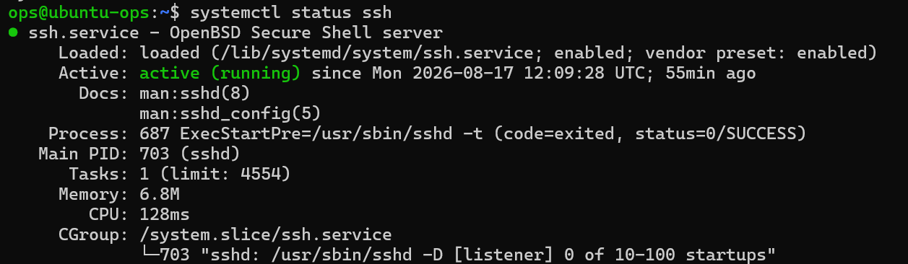
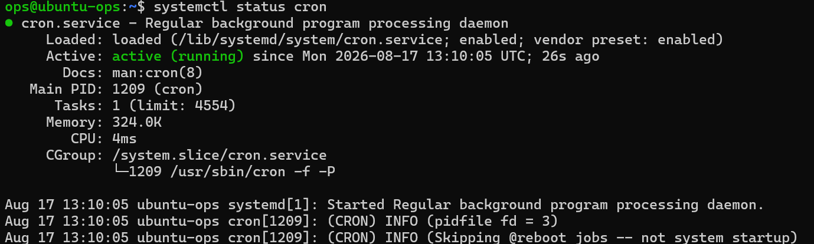

# 阶段一 第7课：服务管理 systemd

## 1. 场景

老大说：“服务器重启后，网站服务没起来。”

为什么没起来？因为服务没设**开机自启**。运维部署任何服务（Nginx、MySQL、Redis）后，第一件事永远是两连击：`systemctl enable`（开机自启）+ `systemctl start`（现在启动）。这就是 systemd 的活。

## 2. 核心概念

1. **systemd 是谁**：第 6 课说过 PID 1——它就是系统的大管家。开机流程：内核启动 → **systemd（PID 1）接管** → 按配置启动所有服务。
2. **服务单元（unit）**：systemd 把每个服务定义成一个单元文件（`.service` 文件），里面写着“这个服务是什么、怎么启动”。文件在 `/etc/systemd/system/` 和 `/lib/systemd/system/`（了解位置即可）。
3. **服务的两个维度**（重点理解，别混）：
    - 当前状态：active（正在跑）/ inactive（没跑）
    - 开机行为：enabled（开机自启）/ disabled（不自启）
    - 所以“启动”和“设自启”是两件事：`start` 管现在，`enable` 管将来。

## 3. 命令表：systemctl 全家 + journalctl

| 命令 | 作用 | 记忆 |
| --- | --- | --- |
| `systemctl status 服务` | 查看状态（最常用） | 体检 |
| `systemctl start 服务` | 启动 | 开机 |
| `systemctl stop 服务` | 停止 | 关机 |
| `systemctl restart 服务` | 重启 | 重启 |
| `systemctl reload 服务` | 重载配置（不中断服务） | 热更新 |
| `systemctl enable 服务` | 开机自启 | 以后自动起 |
| `systemctl disable 服务` | 取消自启 | 以后不自动起 |
| `systemctl is-enabled 服务` | 查询是否开机自启 | 输出 enabled/disabled |
| `systemctl is-active 服务` | 查询是否在运行 | 输出 active/inactive |
| `systemctl list-units --type=service` | 列出所有服务 | 全名单 |
| `journalctl -u 服务` | 查看该服务的日志 | 病历本 |

**status 输出怎么看**（就盯两行）：

```
● ssh.service - OpenBSD Secure Shell server
     Loaded: loaded (...); enabled; ...     ← enabled = 开机自启
     Active: active (running) ...           ← active = 正在运行
```

## 4. 实战记录

### ① 确认大管家是 systemd

```bash
ps -p 1 -o comm=
```

### ② 给 SSH 服务“体检”

```bash
systemctl status ssh
```



### ③ 重启 cron 服务（安全，不会断 SSH）

```bash
systemctl restart cron
systemctl status cron
```



**status 输出解读**：

```
Loaded: loaded (...; enabled)           ← 开机自启 ✅
Active: active (running) since ... 26s  ← 正在运行，26 秒前启动（restart 的效果）✅
Main PID: 1209 (cron)                   ← 主进程 ID
Memory / CPU                            ← 占用（324K 内存，微乎其微）
```

**`enabled` + `active (running)` = 服务最健康的状态**：现在活着，以后开机也会自己活。

### ④ 开机自启管理

```bash
systemctl is-enabled ssh    # 输出 enabled
systemctl is-active ssh     # 输出 active
```

`is-enabled` / `is-active` 是给“人和脚本”看状态用的——不带多余排版，只回一个词，方便程序判断。

### ⑤ 查看 SSH 服务日志（能看到自己的登录记录）

```bash
journalctl -u ssh -n 20
```

会看到类似 `Accepted publickey for ops from 10.11.117.24` 或 `session opened` 的记录——每次 SSH 登录的脚印。

### ⑥ 实时跟踪 cron 日志（Ctrl+C 退出）

```bash
journalctl -u cron -f
```

## 5. 复盘：systemctl 不带 sudo 弹出 polkit 认证窗口

日期：2026-08-17
环境：ubuntu-ops 虚拟机（Ubuntu 22.04）
涉及命令：systemctl、sudo、polkit

### 现象

执行 `systemctl restart cron`（没有加 sudo），终端没有直接执行，而是弹出：

```
==== AUTHENTICATING FOR org.freedesktop.systemd1.manage-units ===
Authentication is required to restart 'cron.service'.
Multiple identities can be used for authentication:
 1. ops
 2. dev1
Choose identity to authenticate as (1-2):
```

### 原因

`systemctl restart cron` 是**管理系统服务的特权操作**。命令没有加 `sudo`，所以 systemd 调用了 **polkit（PolicyKit）**——Ubuntu 的另一套授权机制，专门处理“程序在运行中需要特权”的场景（关机按钮、网络设置弹窗等都是它）。

### 解决

1. 在 polkit 弹窗里选 `1`（ops）→ 输 ops 密码 → 继续执行
2. `Ctrl+C` 取消弹窗，改用标准姿势：`sudo systemctl restart cron`

### 知识沉淀：两条授权路线

| 方式 | 什么时候用 | 认证谁 |
| --- | --- | --- |
| `sudo 命令` | 自己在终端主动执行特权命令 | 验证你自己（ops 的密码） |
| polkit 弹窗 | 程序运行时需要特权（不带 sudo 的 systemctl、图形界面操作） | 选一个管理员身份认证 |

两条路的前提相同：**必须是管理员（sudo 组成员）**，不是管理员会被直接拒绝。

### 彩蛋：dev1 出现在选项里

polkit 列出可选身份时出现了 `2. dev1`——这正是第 4 课 `usermod -aG sudo dev1` 生效的证明：系统把 dev1 也当成了“可以授权管理系统”的管理员候选人。

### 教训

- 管理服务统一用 `sudo systemctl ...` 标准姿势，别依赖 polkit 弹窗（SSH 终端里体验差，自动化场景不认它）
- polkit 和 sudo 是两套授权体系，面试问“Ubuntu 里除了 sudo 还有什么提权/授权机制”时可以答 polkit

## 6. 知识点沉淀：reload vs restart

| | restart | reload |
| --- | --- | --- |
| 行为 | 整个进程关掉重开 | 让运行中的进程重新读配置 |
| 是否断服务 | 会（短暂中断） | 不会 |
| 适合场景 | 程序异常、版本升级、改内核相关 | 改配置文件（Nginx、MySQL 等日常操作） |

**理解记忆**：`restart` = 电脑重启（关机再开机，服务会断几秒）；`reload` = 对着运行中的进程喊“重新读一遍配置文件”（人还在干活，只是换了操作手册）。

**运维原则**：

1. 改配置文件 → 优先 `reload`（热更新，不断服务）
2. 程序挂了 / 重大配置变更 / 升级 → `restart`
3. 判断依据：这个改动需不需要整个进程重新初始化？

**面试表达**：“Nginx 改配置我用 `systemctl reload nginx`，因为 reload 只让进程重新读配置、不中断连接；restart 会重启进程导致短暂断服。生产环境追求零中断，所以能用 reload 就不用 restart。”

## 7. 知识点沉淀：journalctl -f vs tail -f

| | `tail -f 文件` | `journalctl -u 服务 -f` |
| --- | --- | --- |
| 跟踪对象 | 一个**文件**（如 /var/log/nginx/access.log） | 一个**服务**（systemd 单元） |
| 数据源 | 纯文本日志文件 | journald 的二进制日志库 |
| 过滤能力 | 要自己 grep | 内置 -u 按服务、--since 按时间、-p 按级别 |
| 典型场景 | 应用自己写的日志（访问日志、业务日志） | systemd 服务的启动/崩溃/报错日志 |

**为什么有两套**：

- journald：systemd 自带日志系统，服务启动、崩溃、报错记在二进制库里 → `journalctl` 看
- rsyslog / 应用自己：很多程序还把日志写成普通文本文件放 /var/log → `tail -f` 看

真实排障经常轮着用：

```bash
journalctl -u nginx -f              # 看 Nginx 服务本身的报错
tail -f /var/log/nginx/error.log    # 看 Nginx 应用运行时日志
```

**记忆口诀**：

```
tail = 跟文件（应用日志）
journalctl = 跟服务（系统记录）
查服务起没起来、报什么错 → journalctl
查业务跑得怎么样、谁访问了 → tail
```

**实用技巧**：

```bash
journalctl -u cron --since "10 minutes ago"   # 只看最近10分钟
journalctl -u cron -p err                     # 只看错误级别以上
```

## 8. 完成标准

- 能说出 systemd 是谁（PID 1，系统大管家）和它管什么
- 背出 6 个常用 systemctl 命令（status/start/stop/restart/reload/enable）
- 能看懂 status 输出里 Active 和 Loaded 两行
- 用 journalctl 看过服务日志（能找到自己的 SSH 登录记录）
- 能讲清 reload vs restart、journalctl vs tail 两组对比


