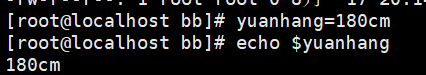

# Stage1-01 Linux 命令：文件与目录操作

> Linux 命令按功能可分为：**文件操作命令、文本处理命令、权限管理命令、系统管理命令**。本章学习**文件操作命令**。

## 1. ls —— 查看目录内容

| 命令 | 作用 |
| --- | --- |
| `ls` | 查看当前目录内容 |
| `ls -a` | 显示所有文件（含隐藏文件） |
| `ls -l` | 以详细列表显示 |
| `ls -r` | 反向排序 |
| `ls -t` | 根据时间排序 |
| `ls -rt` | 时间最早的在前面 |
| `ls -lrt` | 组合使用：按时间排序的详细列表 |
| `ls -F` | 根据文件类型区分：文件夹以 `/` 结尾，文件以 `*` 结尾 |
| `ls --help` | 查看帮助 |

```bash
ls
ls -a
ls -l
ls -rt
ls -F
ls --help
```

## 2. cd —— 切换目录

| 命令 | 作用 |
| --- | --- |
| `cd 目录` | 进入指定目录 |
| `cd -` | 回到上一次所在目录 |
| `cd ~` | 回到家目录 |
| `cd /` | 回到根目录（最高级别，没有更高一级） |

`man cd` 可查看帮助，按 `q` 键退出。

```bash
cd /etc          # 进入 /etc
cd -             # 回到上一次所在目录
cd ~             # 回到家目录
cd /             # 回到根目录
```

## 3. mkdir / rmdir —— 创建与删除目录

### mkdir 创建目录

| 命令 | 作用 |
| --- | --- |
| `mkdir 目录名` | 创建单个目录 |
| `mkdir -p 目录名/a/b/c` | 递归创建多级目录 |
| `mkdir -m 777 test` | 创建目录并设置权限 |
| `mkdir -v 目录名` | 创建目录并显示详细信息 |

```bash
mkdir test                # 创建单个目录
mkdir -p dir1/a/b/c       # 递归创建多级目录
mkdir -m 777 test         # 创建目录并设置权限
mkdir -v test             # 创建目录并显示过程
```

### rmdir 删除目录

| 命令 | 作用 |
| --- | --- |
| `rmdir 目录名` | 删除单个目录 |
| `rmdir -p 目录名` | 删除多级目录 |

> 注意：目录不为空时 `rmdir` 删除会失败；`-p` 用于递归删除多级目录，**前提是这些目录全部为空**。

```bash
rmdir test          # 删除空目录
rmdir -p a/b/c      # 递归删除多级空目录
```

## 4. rm —— 删除文件/目录

| 命令 | 作用 |
| --- | --- |
| `rm 文件` | 删除文件（删除多个文件不需要 `-p`） |
| `rm -r 目录` | 递归删除目录，会一级一级提示 |
| `rm -f 文件` | 强制删除，不提示确认 |
| `rm -rf 目录` | 强制删除非空目录，不提示确认 |

```bash
rm 1.txt 2.txt        # 删除多个文件
rm -r dir1            # 递归删除目录（会一级一级提示）
rm -f 1.txt           # 强制删除文件
rm -rf dir1           # 强制删除非空目录，不提示确认
```

> ⚠️ 提示：`rm -rf` 删除后不可恢复，使用前务必确认路径。

## 5. cp —— 复制文件/目录

| 场景 | 命令 |
| --- | --- |
| 复制单个文件 | `cp 源文件 目标` |
| 复制多个文件 | `cp file1 file2 目标目录/` |
| 复制空目录 | `cp -r 源目录 目标` |
| 复制非空目录 | `cp -r 源目录 目标` |

```bash
cp 1.txt /tmp/           # 复制单个文件
cp 1.txt 2.txt /tmp/     # 复制多个文件
cp -r dir1 dir2          # 递归复制目录（空/非空都需要 -r）
```

## 6. mv —— 移动/重命名

| 场景 | 命令 |
| --- | --- |
| 重命名 | `mv 旧名 新名` |
| 移动 | `mv 文件 目标目录/` |
| 移动并改名 | `mv 2.sh dir1/yuanhang.sh` |
| 覆盖前提示 | `mv -i 源 目标`（输入 `n` 取消） |
| 显示操作过程 | `mv -v 源 目标` |

```bash
mv 1.txt 2.txt             # 重命名
mv 1.txt /tmp/             # 移动
mv 2.sh dir1/yuanhang.sh   # 移动的同时改名
mv -i 1.txt /tmp/          # 同名时提示是否覆盖
mv -v 1.txt /tmp/          # 显示移动过程
```

> 注意：直接 `mv` 遇到同名文件会**直接覆盖、不提示**；加 `-i` 会询问是否覆盖，输入 `n` 即可取消。

## 7. touch —— 创建空文件/修改时间戳

| 命令 | 作用 |
| --- | --- |
| `touch 文件` | 创建单个或多个空文件 |
| `touch -t 时间 文件` | 设置文件时间戳（`ls -l` 可查看） |

```bash
touch 1.txt                    # 创建空文件
touch 1.txt 2.txt              # 同时创建多个文件
touch -t 202608080808 1.txt    # 将 1.txt 时间戳设为 2026-08-08 08:08
touch 1.txt                    # 时间戳恢复为当前时间
touch -t 202502181818 *.js     # 用通配符批量更新时间戳
```

> 提示：如果想恢复为当前时间，直接 `touch 文件` 即可。

## 8. cat —— 查看/合并文件

| 命令 | 作用 |
| --- | --- |
| `cat 文件` | 查看文件内容 |
| `cat -E 文件` | 显示文件中的非打印字符 |
| `cat file1 file2 > file3` | 合并 file1、file2 内容到 file3 |

```bash
cat 1.txt
cat -E 1.txt
cat file1.txt file2.txt > file3.txt
```

## 9. echo —— 输出

| 命令 | 作用 |
| --- | --- |
| `echo 内容` | 输出内容 |
| `echo $变量名` | 存取/引用变量 |
| `echo $(cat 文件)` | 输出文件内容到终端（内容不会分行，换行变成空格，相当于 `cat -E` 查到的隐藏占位符） |

变量定义与引用（注意：等号两边不能有空格）：

```bash
yuanhang=180cm
echo $yuanhang
```




