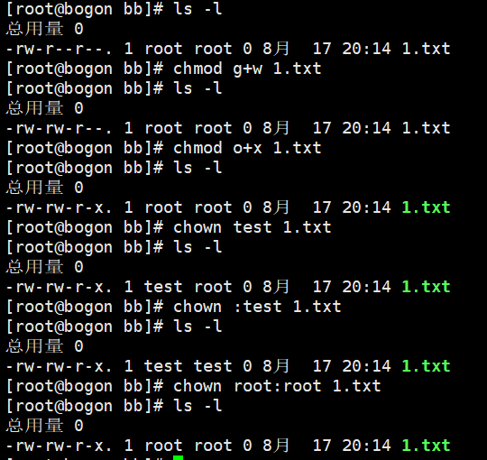
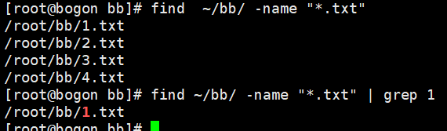

# 文件系统简介：仓库管理员

> 把文件系统比作一个仓库，文件权限就是仓库的管理规则。

## 1. 文件权限

### 三种角色类别

| 角色 | 比喻 |
| --- | --- |
| 文件所有者 | 户主 |
| 所属成员（所属组） | 家庭成员 |
| 其他用户 | 访客 |

### 三种权限

| 权限 | 符号 | 作用 |
| --- | --- | --- |
| 读 | r | 查看文件内容 |
| 写 | w | 修改文件内容 |
| 执行 | x | 运行文件 |

## 2. 权限符号

| 类别 | 符号 | 含义 |
| --- | --- | --- |
| 角色 | u | 文件所有者（user） |
| 角色 | g | 所属组（group） |
| 角色 | o | 其他用户（others） |
| 角色 | a | 所有角色（all） |
| 权限 | r | 读 |
| 权限 | w | 写 |
| 权限 | x | 执行 |
| 操作符 | `+` | 添加权限 |
| 操作符 | `-` | 移除权限 |
| 操作符 | `=` | 设置权限 |

## 3. chmod —— 改变权限

### 字母法

```bash
chmod 角色+权限 文件名/文件夹名
```

```bash
chmod u+x 1.txt     # 给所有者添加执行权限
chmod g+w 1.txt     # 给所属组添加写权限
chmod o-r 1.txt     # 移除其他用户的读权限
chmod a+r 1.txt     # 给所有角色添加读权限
```

### 数字法

数字法通过数字相加表示权限：**r=4，w=2，x=1**

| 数字 | 权限 |
| --- | --- |
| 7 | rwx（4+2+1） |
| 6 | rw-（4+2） |
| 5 | r-x（4+1） |
| 4 | r-- |
| 0 | --- |

```bash
chmod 755 test      # 所有者 rwx，所属组 r-x，其他 r-x
chmod 777 test      # 所有角色都可读可写可执行
chmod 644 1.txt     # 所有者 rw-，所属组 r--，其他 r--
```

## 4. chown —— 改变所有者、所属组

| 命令 | 作用 |
| --- | --- |
| `chown test 文件名` | 文件所有者改为 test |
| `chown :test 文件名` | 文件所属组改为 test |
| `chown root:root 文件名` | 所有者和所属组都改为 root |



## 5. 系统目录用途

| 目录 | 用途 |
| --- | --- |
| `/bin` | 存放基本命令、系统恢复工具 |
| `/etc` | 系统配置文件、用户管理文件等 |
| `/home` | 个人文件 |
| `/var` | 日志、临时文件、数据库文件 |

## 6. 查找文件命令

### find

```bash
find / -name 1.txt        # 全盘查找，查找到会输出路径
find ~/bb/ -name "*.txt"  # 在指定目录下查找所有 .txt 文件
```

### grep 配合 find 使用

```bash
find ~/bb/ -name "*.txt" | grep 1   # 在 find 的结果中筛选包含 1 的文件
```



## 7. 软链接、硬链接

可查看 `notes` 目录下的 `stage1-05-文件系统深入.md`