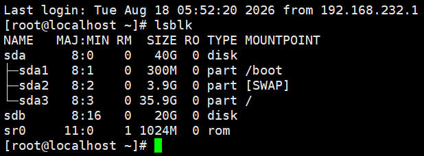
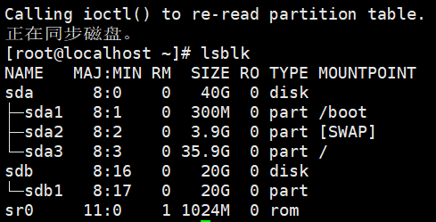
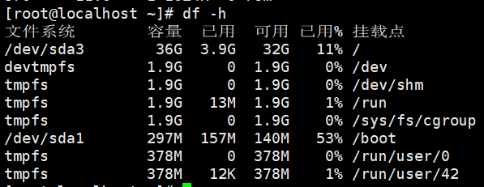
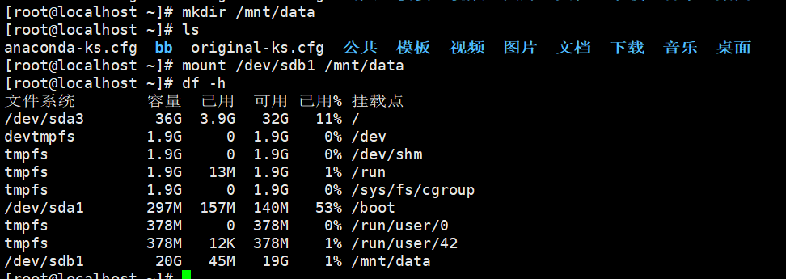
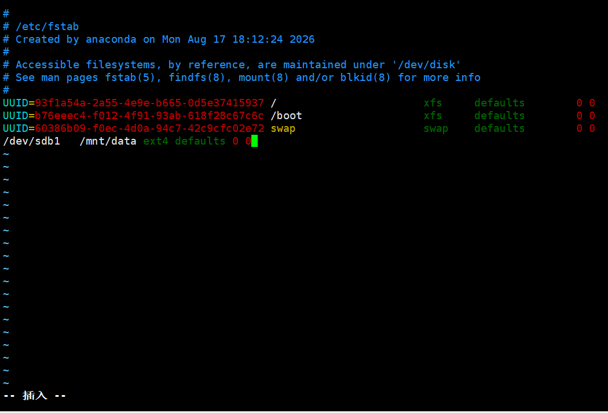

# Linux 磁盘分区与挂载实战

## 1. 磁盘命名

| 命名方式 | 示例 | 说明 |
| --- | --- | --- |
| 基于设备类型命名 | `sda`、`sdb` | a、b、c 表示第几块磁盘 |
| 基于分区编号命名 | `sda1` | sda 的第一个分区 |

## 2. 分区类型

| 类型 | 说明 |
| --- | --- |
| 主分区 | 最多 4 个 |
| 扩展分区 | 不实际存在（只是一个"容器"） |
| 逻辑分区 | 在扩展分区内部创建 |

## 3. 查看磁盘信息

| 命令 | 作用 |
| --- | --- |
| `df` | 查看已挂载文件系统的使用情况 |
| `du` | 查看目录/文件占用的空间 |
| `lsblk` | 查看块设备（磁盘、分区）树状结构 |
| `iostat` | 查看磁盘 I/O 统计、性能 |

> 详细内容可看 `stage1-05-文件系统深入.md`

### lsblk 与 df -h 的区别

| 对比 | `lsblk` | `df -h` |
| --- | --- | --- |
| 全称 | list block devices | disk free |
| 展示对象 | 磁盘/分区（sda、sdb 等） | 已挂载的文件系统 |
| 能看到未挂载的分区吗 | ✅ 能 | ❌ 不能 |
| 显示容量和使用率 | ❌ 只有大小 | ✅ 总量、已用、可用、使用率 |
| 树状显示设备关系 | ✅ 父子结构清晰 | ❌ |
| 常用场景 | 查看有哪些盘、新硬盘认没认出来 | 查看磁盘空间够不够 |

> 仓库比喻：`lsblk` 是看仓库里有哪些货架和箱子（箱子还没摆上货架也能看到）；`df -h` 是看摆上货架的货已经占了多大地方、还剩多少地方。

## 4. 分区操作实战

### ① 虚拟机新建磁盘

在 VMware 中给虚拟机添加一块 20G 的新磁盘，对应设备为 `sdb`。

### ② 用 lsblk 查看



`sdb` 和 `sda` 的区别：**sdb 还没有分区**（sda 下面有 sda1、sda2）。

### ③ 使用 fdisk 分区

```bash
fdisk /dev/sdb
```

交互流程（按顺序输入）：

| 提示 | 输入 | 说明 |
| --- | --- | --- |
| 命令(输入 m 获取帮助) | `n` | 新建分区 |
| Partition type | `p` | 主分区 |
| 分区号 (1-4，默认 1) | `1` | 第一个分区 |
| 起始 扇区 | `2048` | 默认起始扇区 |
| Last 扇区 | `41943039`（或直接回车） | 默认使用全部空间 |
| 命令 | `w` | 写入分区表并退出 |

fdisk 常用菜单命令：

| 命令 | 作用 |
| --- | --- |
| `m` | 显示帮助菜单 |
| `n` | 新建分区 |
| `p` | 打印当前分区表 |
| `d` | 删除分区 |
| `t` | 修改分区类型 |
| `q` | 不保存更改退出 |
| `w` | 保存更改并退出 |

> ⚠️ 注意：`q` 和 `w` 的区别——**q 不保存，w 才写入**。分区操作不会立即生效，只有按 `w` 才真正写入磁盘。

### ④ 查看分区结果



分区完成后 `lsblk` 应该能看到 `sdb1`。

## 5. 文件系统格式化

分区之后还不能直接用，需要格式化（创建文件系统）：

```bash
mkfs.ext4 /dev/sdb1
```



> 此时 `lsblk` 能看到 `sdb1`，但 `df -h` 找不到它的挂载信息——因为**还没挂载**，df 只看已挂载的文件系统。

## 6. 挂载分区

挂载 = 把抽屉（分区）安装到书桌上（目录）：

```bash
mkdir -p /mnt/data              # 先创建挂载点目录
mount /dev/sdb1 /mnt/data       # 挂载
```



验证：

```bash
lsblk               # sdb1 的 MOUNTPOINT 显示 /mnt/data
df -h               # 能看到 /dev/sdb1 的使用情况
```

### 卸载

```bash
umount /mnt/data
```

> ⚠️ 卸载前**先备份数据**，并确保没有进程正在使用该目录（否则会报 target is busy）。

## 7. 自动挂载配置 /etc/fstab

```bash
vim /etc/fstab
```

在末尾加上一行：

```text
/dev/sdb1   /mnt/data   ext4   defaults   0 0
```



字段含义：

| 字段 | 含义 | 示例 |
| --- | --- | --- |
| 1 | 磁盘分区 | `/dev/sdb1` |
| 2 | 挂载点 | `/mnt/data` |
| 3 | 文件系统格式 | `ext4` |
| 4 | 挂载选项 | `defaults` |
| 5 | 是否 dump 备份 | `0`（不备份） |
| 6 | 开机是否 fsck 检查 | `0`（不检查） |

保存后执行：

```bash
mount -a       # 按照 /etc/fstab 里的"挂载清单"，把里面定义的所有文件系统一次性挂载好
```

再用 `lsblk` 和 `df -h` 检查是否挂载成功。

### 验证开机自动挂载

```bash
umount /mnt/data    # 先卸载
reboot              # 重启
```

重启后再次检查：

```bash
lsblk
df -h
```

能看到 `/dev/sdb1` 自动挂载到 `/mnt/data`，说明 fstab 配置成功 ✅