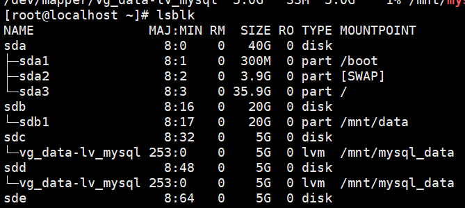
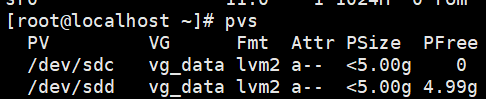
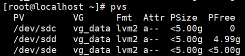
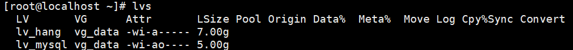
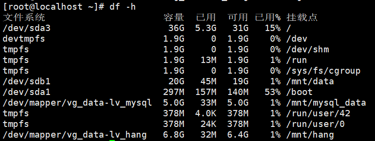
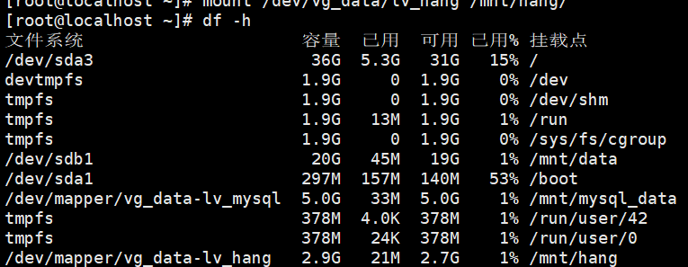

# LVM 逻辑卷管理实战

## 1. LVM 定义

| 概念 | 类比 |
| --- | --- |
| 物理卷 PV | 砖块 |
| 卷组 VG | 墙 |
| 逻辑卷 LV | 墙划分出来的空间 |

**核心价值：** 多块硬盘可以合并成一个大空间，逻辑卷可以动态扩容/缩容，不用停机、不用迁移数据。

## 2. 安装

```bash
rpm -qa | grep lvm2      # 检查是否已安装
yum -y install lvm2      # 未安装则安装
```

## 3. 基本使用流程

### (1) 新建硬盘

在虚拟机中新建两个 5G 硬盘，系统识别为 `sdc`、`sdd`。

### (2) 查看磁盘

```bash
lsblk
```

确认 sdc、sdd 已创建。

### (3) 创建物理卷（PV）

```bash
pvcreate /dev/sdc
```

```bash
pvs              # 简略查看
pvdisplay        # 详细查看
```

### (4) 创建卷组（VG）

```bash
vgcreate vg_data /dev/sdc
```

```bash
vgs              # 简略查看
vgdisplay        # 详细查看
```

### (5) 创建逻辑卷（LV）

```bash
lvcreate -L 3G -n lv_mysql vg_data
```

```bash
lvs              # 简略查看
lvdisplay        # 详细查看
```

### (6) 格式化逻辑卷为 XFS

```bash
mkfs.xfs /dev/vg_data/lv_mysql
```

### (7) 创建挂载目录并挂载

```bash
mkdir /mnt/mysql_data
mount /dev/vg_data/lv_mysql /mnt/mysql_data/
df -h            # 查看是否挂载成功
```

### (8) 开机自动挂载

```bash
vim /etc/fstab
```

```ini
/dev/vg_data/lv_mysql /mnt/mysql_data xfs defaults 0 0
```

```bash
mount -a         # 检查配置是否正确，没有报错即成功
```

## 4. 动态扩展逻辑卷

> ⚠️ 注意：`vgextend` 前必须先 `pvcreate`，不能省略。

```bash
pvcreate /dev/sdd
vgextend vg_data /dev/sdd        # ① 把新硬盘加入卷组（扩容池子）
lvextend -L +2G /dev/vg_data/lv_mysql   # ② 扩展逻辑卷容量
xfs_growfs /dev/vg_data/lv_mysql        # ③ 扩展文件系统（df 才生效）
```

## 5. 新场景：新增 7G 逻辑卷 lv_hang

**背景：** 现在 sdc 的空间已全部被占满（5G），卷组里还有 sdd 未使用（5G），但需要新增一个 7G 的文件系统挂载。

### (1) 新建 sde 磁盘（5G）

在虚拟机中再新建一块 5G 硬盘，然后：

```bash
lsblk
```

确认 sde 是否创建成功。



### (2) 动态扩展卷组

```bash
vgextend vg_data /dev/sde        # 将 sde 的 5G 扩展进卷组
pvs                              # 查看 sde 是否扩展成功
```

卷组 vg_data 空间变为理想中的 10G 空余（sdd 5G + sde 5G）。

添加前：sdc 已满，sdd 还有 5G，卷组只有 sdc 和 sdd。



添加后：sde 已扩展进 vg_data，由 PFree 可知空余空间有 10G。



### (3) 创建逻辑卷 lv_hang

```bash
lvcreate -L 7G -n lv_hang vg_data
lvs
```

查看逻辑卷情况。



### (4) 格式化文件系统（注意：这里用 ext4，方便后续缩容）

```bash
mkfs.ext4 /dev/vg_data/lv_hang
```

> ext4 支持缩容，XFS 只能扩容不能缩容——这是本场景选 ext4 的原因。

### (5) 创建挂载目录并挂载

```bash
mkdir /mnt/hang
mount /dev/vg_data/lv_hang /mnt/hang/
df -h
```

查看是否挂载成功。



## 6. 缩容逻辑卷（7G → 3G）

### ① 先卸载

```bash
umount /mnt/hang
df -h        # 确认卸载成功
```

### ② 检查文件系统（ext4 才能缩容）

```bash
e2fsck -f /dev/vg_data/lv_hang
```

### ③ 调整文件系统大小

```bash
resize2fs /dev/vg_data/lv_hang 3G
```

### ④ 调整逻辑卷大小

```bash
lvreduce -L 3G /dev/vg_data/lv_hang
lvs        # 查看发现逻辑卷已变为 3G
```

### ⑤ 重新挂载验证

```bash
mount /dev/vg_data/lv_hang /mnt/hang/
df -h
```



> 缩容口诀：**先缩文件系统（resize2fs），再缩逻辑卷（lvreduce），顺序不能反。** 扩容则反过来：先扩 LV 再扩 FS（xfs_growfs / resize2fs）。

## 7. 创建快照卷

### (1) 创建快照

```bash
lvcreate -L 1G -s -n lv_hang_snap /dev/vg_data/lv_hang
lvs        # 查看快照卷是否创建成功
```

### (2) 挂载查看数据

```bash
mount /dev/vg_data/lv_hang_snap /mnt/snapshot
df -h
```

> ⚠️ 注意：快照只备份**创建那一刻**的数据，之后的变化不会被记录。

## 8. 删除逻辑卷（不能删除正在使用的逻辑卷）

### 0️⃣ 准备：先卸载，并删除 /etc/fstab 中的自动挂载配置

```bash
umount /mnt/hang
vim /etc/fstab        # 删除对应行
```

### 1️⃣ 删除逻辑卷

```bash
lvremove /dev/vg_data/lv_mysql /dev/vg_data/lv_hang    # 可一次删除多个
lvs                    # 确认已无逻辑卷
```

> 注：快照卷会跟着原逻辑卷一起被删除。

### 2️⃣ 删除卷组

```bash
vgremove vg_data
```

### 3️⃣ 删除物理卷

```bash
pvremove /dev/sdc
pvremove /dev/sdd /dev/sde
pvs                    # 确认已删除
```

### 4️⃣ 移除磁盘

`lsblk` 仍能看到三块磁盘，需要在虚拟机中手动移除磁盘并重启。

## 9. 命令总结

| 层级 | 全称 | 创建 | 查看 |
| --- | --- | --- | --- |
| 物理卷 | Physical Volume | `pvcreate` | `pvs` |
| 卷组 | Volume Group | `vgcreate` | `vgs` |
| 逻辑卷 | Logical Volume | `lvcreate` | `lvs` |

## 10. 理解性记忆（积木水池故事）

**第 1 步：买砖头（虚拟机加硬盘）**

你在虚拟机里加了两块 5G 硬盘，系统认出来是 sdc 和 sdd。

> 比喻：你买了两块**砖头**，堆在仓库里，还不能直接用。

**第 2 步：把砖头加工成积木（pvcreate）**

```bash
pvcreate /dev/sdc
pvcreate /dev/sdd
```

> 比喻：把两块砖头加工成**标准积木**（物理卷 PV）。砖头有棱有角、没法拼，积木才能和其他积木拼接。加工完，`pvs` 就能看到两块积木了。

**第 3 步：搭水池（vgcreate + vgextend）**

```bash
vgcreate vg_data /dev/sdc        # 第一块积木入池
vgextend vg_data /dev/sdd        # 第二块积木入池
```

> 比喻：建了一个**大水池**（卷组 VG），把积木丢进去。水池的容量 = 所有积木之和，两块 5G 拼成 10G 的大池子——单块硬盘做不到的"合并扩容"，水池做到了。

```text
水池 vg_data（10G）= 积木 sdc（5G）+ 积木 sdd（5G）
```

**第 4 步：从水池舀水（lvcreate）**

```bash
lvcreate -L 3G -n lv_mysql vg_data    # 舀 3G 给 MySQL
lvcreate -L 7G -n lv_hang vg_data     # 舀 7G 给 hang
```

> 比喻：从水池里舀出两杯水（逻辑卷 LV）。杯子多大你说了算，而且可以多舀几杯——一块硬盘可以切成多个"虚拟硬盘"，每个还能单独格式化、挂载、管理。

```text
lv_mysql = 3G 的一杯水（后来扩到 5G）
lv_hang  = 7G 的一杯水
```

**第 5 步：给水杯贴刻度（格式化 + 挂载）**

```bash
mkfs.xfs /dev/vg_data/lv_mysql
mount /dev/vg_data/lv_mysql /mnt/mysql_data/
```

> 比喻：杯子舀出来了，还得贴上刻度线（格式化文件系统），才能知道装了多少水；再把杯子放到书桌上（挂载到目录），以后数据就往这个目录里写。

```text
lv_mysql ──mkfs──► XFS 文件系统（刻度线）──mount──► /mnt/mysql_data（书桌）
```