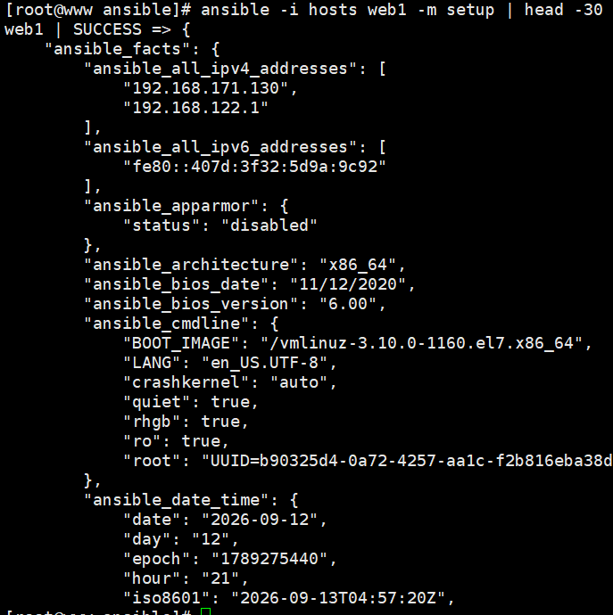
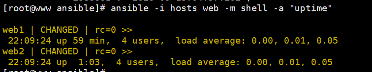
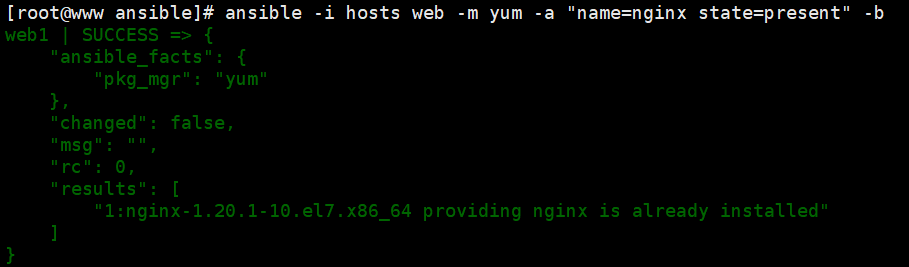

# Ansible 实战笔记:原理 + YAML + 可直接运行的示例

> 定位:原理和 YAML 语法必须掌握,Playbook 与 Roles 通学即可。
> 本文所有示例都可直接运行,建议边看边敲。

---

## 一、实验环境

| 角色 | IP | 说明 |
| --- | --- | --- |
| 控制节点 | 172.22.4.2 | 安装 Ansible |
| 被管节点 1 | 172.22.4.3 | 无需安装任何东西 |
| 被管节点 2 | 172.22.4.4 | 无需安装任何东西 |

### 1. 控制节点安装 Ansible

```bash
yum install -y epel-release
yum install -y ansible
ansible --version
```

输出示例:

```text
ansible 2.9.27
  config file = /etc/ansible/ansible.cfg
  python version = 2.7.5
```

### 2. 配置 SSH 免密登录

```bash
ssh-keygen -t rsa -N "" -f ~/.ssh/id_rsa   #生成私钥
ssh-copy-id root@192.168.171.130                #ssh-copy-id 远程连接传输公钥
ssh-copy-id root@192.168.171.131

ssh root@192.168.171.131 "hostname"   # 免密验证
```

### 3. 编写主机清单

```bash
mkdir -p /opt/ansible && cd /opt/ansible
vim hosts
```

```ini
[web]
web1 ansible_host=192.168.171.130
web2 ansible_host=192.168.171.131

[web:vars]
ansible_user=root
ansible_port=22

[all:vars]
ansible_python_interpreter=/usr/bin/python
```

### 4. 编写配置文件

```bash
vim ansible.cfg
```

```ini
[defaults]
inventory         = ./hosts
remote_user       = root
forks             = 10
host_key_checking = False
roles_path        = ./roles
```

---

## 二、原理:一条命令看懂执行流程

### 1. 连通性测试

```bash
ansible -i hosts web -m ping
```

输出示例:

```text
192.168.171.130 | SUCCESS => {
    "ansible_facts": {
        "discovered_interpreter_python": "/usr/bin/python"
    },
    "changed": false,
    "ping": "pong"
}
192.168.171.131 | SUCCESS => {
    "changed": false,
    "ping": "pong"
}
```

这一条命令背后发生了什么:

```text
1. 读取 hosts 清单,匹配到 web 组两台主机
2. 用 SSH 连接目标主机
3. 把 ping 模块的代码临时传到目标主机
4. 目标主机用 Python 执行模块,返回 JSON
5. 执行完删除临时文件
6. 控制端把结果渲染成上面看到的格式
```

关键理解:**Ansible 只负责"送模块 + 收结果",真正干活的是目标主机上的模块代码**,所以被管节点不需要装 Agent,只需要有 SSH 和 Python。

### 2. 收集主机信息(了解被管节点)

```bash
ansible -i hosts web1 -m setup | head -30
```



这些 `ansible_*` 变量可以直接用在 Playbook 的条件和模板里。

这些 `ansible_*` 变量可以直接用在 Playbook 的条件和模板里。

### 3. 批量执行命令(ad-hoc)

```bash
ansible -i hosts web -m shell -a "uptime"
```



结果状态说明:

| 状态 | 含义 |
| --- | --- |
| `ok` | 执行成功,但没有任何变更 |
| `changed` | 执行成功,并且产生了变更 |
| `failed` | 执行失败 |
| `unreachable` | SSH 都连不上 |
| `skipped` | 被 `when` 等条件跳过 |

### 4. 幂等性实测(核心概念)

执行同一个安装命令两次:

```bash
ansible -i hosts web -m yum -a "name=nginx state=present" -b
```

第一次(真的装了):

```text
172.22.4.3 | CHANGED => {"changed": true, "msg": "Installed: nginx-1.20.1"}
```




这就是**幂等性**:模块自己会先检查"当前状态是否已经满足",不满足才动手。所以同一个 Playbook 可以放心反复执行。

> 例外:`command`、`shell` 模块不具备幂等性,执行几次就跑几次,需要手动用 `creates`、`when`、`changed_when` 控制。

---

## 三、YAML 语法:每个规则配示例

### 1. 缩进只能用空格

```yaml
# ✅ 正确
user:
  name: alice
  age: 25
```

```yaml
# ❌ 错误(用了 Tab)
user:
	name: alice
```

报错:

```text
ERROR! Syntax Error while loading YAML.
found character '\t' that cannot start any token
```

### 2. 冒号后面必须有空格

```yaml
# ✅ 正确
name: nginx
```

```yaml
# ❌ 错误
name:nginx
```

报错:

```text
ERROR! We were unable to read either as JSON nor YAML
```

### 3. 列表:短横线后面要加空格

```yaml
# ✅ 正确
fruits:
  - apple
  - banana
```

```yaml
# ❌ 错误:被当成一个普通字符串 "-apple"
fruits:
  -apple
```

### 4. 三种结构对照

```yaml
# 字典(映射)
server:
  host: 172.22.4.3
  port: 80

# 列表
databases:
  - mysql
  - redis

# 列表套字典 —— Ansible 任务的标准写法
tasks:
  - name: 安装 nginx
    yum:
      name: nginx
      state: present
```

同样内容的 JSON 写法(帮助理解结构):

```json
{
  "tasks": [
    {
      "name": "安装 nginx",
      "yum": { "name": "nginx", "state": "present" }
    }
  ]
}
```

### 5. 引号什么时候必须加

```yaml
# 含冒号的字符串必须加引号
msg: "错误: 服务未启动"      # ✅
# msg: 错误: 服务未启动      # ❌ 解析失败

# 看起来像布尔/数字的值,要当字符串时必须加引号
version: "8.0"               # 字符串
count: 80                    # 数字
enabled: true                # 布尔
alias_yes: "yes"             # 字符串,不加引号会变布尔

# 单引号不转义,双引号转义
win_path: 'C:\new\test'      # 原样
escape_demo: "第一行\n第二行"  # \n 变成换行
```

### 6. 多行字符串

```yaml
# | 原样保留换行
motd: |
  Welcome to server
  Please do not reboot
# 结果:"Welcome to server\nPlease do not reboot\n"

# > 折叠成一行
desc: >
  this is a
  long sentence
# 结果:"this is a long sentence\n"

# |- 去掉末尾换行
config: |-
  line1
  line2
```

### 7. 注释

```yaml
---
# 这是整行注释
name: nginx    # 这是行尾注释
```

### 8. YAML ↔ Ansible 的对应关系

| YAML 结构 | 在 Ansible 中是什么 |
| --- | --- |
| 文档中的每个列表项 | 一个 play |
| play 里的 `tasks:` | 任务列表 |
| 每个任务里的 `name:` | 任务描述(会打印在执行日志里) |
| 缩进在 `name:` 下的模块名 | 要调用的模块 |
| 模块下的键值对 | 模块参数 |

### 9. 语法检查命令

```bash
ansible-playbook -i hosts site.yml --syntax-check
```

```text
playbook: site.yml
```

只输出文件名、没有报错,就说明语法通过。

---

## 四、第一个 Playbook:安装并启动 nginx

```bash
vim nginx.yml
```

```yaml
---
- name: 部署 nginx 服务
  hosts: web
  become: yes
  vars:
    pkg: nginx
  tasks:
    - name: 1. 安装 nginx
      yum:
        name: "{{ pkg }}"
        state: present

    - name: 2. 启动服务并设置开机自启
      service:
        name: nginx
        state: started
        enabled: yes

    - name: 3. 部署首页
      copy:
        content: "<h1>Hello from Ansible</h1>\n"
        dest: /usr/share/nginx/html/index.html
      notify: 重启 nginx

    - name: 4. 验证 80 端口
      shell: "ss -nltp | grep ':80 '"
      register: port_check
      changed_when: false
      failed_when: port_check.rc != 0

  handlers:
    - name: 重启 nginx
      service:
        name: nginx
        state: restarted
```

执行:

```bash
ansible-playbook -i hosts nginx.yml
```

第一次输出(关键部分):

```text
PLAY [部署 nginx 服务] *********************************************

TASK [1. 安装 nginx] ***********************************************
changed: [172.22.4.3]
changed: [172.22.4.4]

TASK [2. 启动服务并设置开机自启] ***********************************
changed: [172.22.4.3]
changed: [172.22.4.4]

TASK [3. 部署首页] *************************************************
changed: [172.22.4.3]
changed: [172.22.4.4]

TASK [4. 验证 80 端口] *********************************************
ok: [172.22.4.3]
ok: [172.22.4.4]

PLAY RECAP *********************************************************
172.22.4.3 : ok=4 changed=3 unreachable=0 failed=0
172.22.4.4 : ok=4 changed=3 unreachable=0 failed=0
```

再执行一次(幂等性生效):

```bash
ansible-playbook -i hosts nginx.yml
```

```text
PLAY RECAP *********************************************************
172.22.4.3 : ok=4 changed=0 unreachable=0 failed=0
172.22.4.4 : ok=4 changed=0 unreachable=0 failed=0
```

`changed=0` 就是幂等性的直接证据:所有状态都已满足,什么都没改。

### 试运行(不真正执行)

```bash
ansible-playbook -i hosts nginx.yml --check --diff
```

`--check` 只模拟,`--diff` 显示差异,非常适合上线前确认变更范围。

---

## 五、常用写法小示例(每个都能单独跑)

### 1. 变量与引用

```yaml
- name: 变量示例
  hosts: web
  vars:
    site_port: 8080
    site_name: "演示站点"
  tasks:
    - name: 打印变量
      debug:
        msg: "站点 {{ site_name }} 使用端口 {{ site_port }}"
```

```text
ok: [172.22.4.3] => {
    "msg": "站点 演示站点 使用端口 8080"
}
```

### 2. 条件判断 when

```yaml
    - name: 只在 CentOS 上执行
      debug:
        msg: "这是 CentOS 系统"
      when: ansible_distribution == "CentOS"

    - name: 文件不存在时才创建
      file:
        path: /tmp/marker
        state: touch
      when: not ansible_check_mode
```

### 3. 循环 loop

```yaml
- name: 批量创建用户
  hosts: web
  become: yes
  vars:
    users:
      - alice
      - bob
      - carol
  tasks:
    - name: 创建用户
      user:
        name: "{{ item }}"
        state: present
      loop: "{{ users }}"
```

```text
TASK [创建用户] ****************************************************
changed: [172.22.4.3] => (item=alice)
changed: [172.22.4.3] => (item=bob)
changed: [172.22.4.3] => (item=carol)
```

> 老版本用 `with_items: "{{ users }}"`,效果相同。

### 4. register 保存结果

```yaml
    - name: 检查 nginx 状态
      command: systemctl is-active nginx
      register: nginx_state
      changed_when: false
      failed_when: false

    - name: 输出状态
      debug:
        msg: "nginx 状态: {{ nginx_state.stdout }}"
```

```text
ok: [172.22.4.3] => {"msg": "nginx 状态: active"}
```

### 5. 模板 template

```bash
mkdir -p templates
vim templates/index.html.j2
```

```html
<h1>{{ site_name }}</h1>
<p>主机名:{{ inventory_hostname }}</p>
<p>端口:{{ nginx_port | default(80) }}</p>
```

```yaml
    - name: 渲染首页
      template:
        src: templates/index.html.j2
        dest: /usr/share/nginx/html/index.html
      notify: 重启 nginx
```

### 6. 精确修改配置行 lineinfile

```yaml
    - name: 修改 SSH 端口配置
      lineinfile:
        path: /etc/ssh/sshd_config
        regexp: '^#?Port '
        line: 'Port 22'
      notify: 重启 sshd
```

### 7. 标签 tags

```yaml
    - name: 安装 nginx
      yum: { name: nginx, state: present }
      tags: [install]

    - name: 部署配置
      template: { src: nginx.conf.j2, dest: /etc/nginx/nginx.conf }
      tags: [config]
```

```bash
ansible-playbook -i hosts site.yml -t config      # 只执行 config 标签的任务
ansible-playbook -i hosts site.yml --list-tasks   # 查看所有任务
```

---

## 六、Role 实战:把 Playbook 变成可复用的角色

### 1. 生成骨架

```bash
cd /opt/ansible
ansible-galaxy init roles/nginx
```

```text
roles/
└── nginx
    ├── README.md
    ├── defaults
    │   └── main.yml
    ├── files
    ├── handlers
    │   └── main.yml
    ├── meta
    │   └── main.yml
    ├── tasks
    │   └── main.yml
    ├── templates
    ├── tests
    └── vars
        └── main.yml
```

### 2. 填写各文件(真实内容)

**roles/nginx/tasks/main.yml**

```yaml
---
- name: 安装 nginx
  yum:
    name: nginx
    state: present

- name: 下发首页模板
  template:
    src: index.html.j2
    dest: /usr/share/nginx/html/index.html
    mode: "0644"
  notify: 重启 nginx

- name: 启动服务并设置开机自启
  service:
    name: nginx
    state: started
    enabled: yes
```

**roles/nginx/handlers/main.yml**

```yaml
---
- name: 重启 nginx
  service:
    name: nginx
    state: restarted
```

**roles/nginx/defaults/main.yml**

```yaml
---
site_name: "Ansible 部署的站点"
nginx_port: 80
```

**roles/nginx/templates/index.html.j2**

```html
<h1>{{ site_name }}</h1>
<p>部署主机:{{ inventory_hostname }}</p>
<p>监听端口:{{ nginx_port }}</p>
```

**roles/nginx/meta/main.yml**

```yaml
---
galaxy_info:
  author: ops
  description: 部署 nginx 站点
  license: MIT
  min_ansible_version: 2.9
dependencies: []
```

### 3. 调用 Role

**site.yml**

```yaml
---
- name: 使用 Role 部署站点
  hosts: web
  become: yes
  roles:
    - role: nginx
      vars:
        site_name: "公司官网"
        nginx_port: 80
```

执行:

```bash
ansible-playbook -i hosts site.yml
```

```text
PLAY [使用 Role 部署站点] *******************************************

TASK [nginx : 安装 nginx] *******************************************
ok: [172.22.4.3]

TASK [nginx : 下发首页模板] *****************************************
changed: [172.22.4.3]

RUNNING HANDLER [nginx : 重启 nginx] ********************************
changed: [172.22.4.3]

TASK [nginx : 启动服务并设置开机自启] *******************************
ok: [172.22.4.3]

PLAY RECAP *********************************************************
172.22.4.3 : ok=4 changed=2 unreachable=0 failed=0
```

注意 `RUNNING HANDLER` 那一行:**只有模板内容发生变化(状态为 changed)时,handler 才会被执行**——这就是"改配置才重启服务"的实现方式。

### 4. 验证结果

```bash
curl http://172.22.4.3
```

```html
<h1>公司官网</h1>
<p>部署主机:web1</p>
<p>监听端口:80</p>
```

### 5. 改一个变量看看效果

```yaml
        site_name: "新的官网名称"
```

再次执行 Playbook,template 任务变为 `changed`,handler 自动重启 nginx,页面内容随之更新——**变量驱动 + 幂等 + 自动触发**,这就是 Ansible 配置管理的完整闭环。

---

## 七、常见报错与排查

| 报错信息 | 原因 | 解决 |
| --- | --- | --- |
| `found character '\t' that cannot start any token` | YAML 里用了 Tab 缩进 | 改成空格 |
| `mapping values are not allowed in this context` | 冒号后没空格,或字符串含冒号没加引号 | `name: nginx` / `msg: "a: b"` |
| `UNREACHABLE! ... Permission denied (publickey)` | SSH 免密没配好 | 重新 `ssh-copy-id` |
| `Missing sudo password` | 需要提权但没给密码 | 执行时加 `-K`,或配置免密 sudo |
| `/usr/bin/python: not found` | 目标机没装 Python | 安装 Python,或用 `ansible_python_interpreter` 指定路径 |
| `ERROR! 'yum' is not a valid attribute for a Play` | 模块写在错误的层级 | 检查缩进,模块要放在 `tasks` 列表项下 |
| 任务一直重复 `changed` | 用了 `shell`/`command` 这类非幂等模块 | 加 `creates`、`when`、`changed_when: false` |

排查三板斧:

```bash
ansible-playbook -i hosts site.yml --syntax-check   # 先查语法
ansible-playbook -i hosts site.yml --check --diff   # 再试运行
ansible -i hosts web -m ping                        # 最后确认连通性
```

---

## 八、命令速查

| 目的 | 命令 |
| --- | --- |
| 连通性测试 | `ansible -i hosts web -m ping` |
| 批量执行命令 | `ansible -i hosts web -m shell -a "uptime"` |
| 收集主机信息 | `ansible -i hosts web -m setup` |
| 执行 Playbook | `ansible-playbook -i hosts site.yml` |
| 语法检查 | `ansible-playbook -i hosts site.yml --syntax-check` |
| 试运行 | `ansible-playbook -i hosts site.yml --check --diff` |
| 限制主机 | `ansible-playbook -i hosts site.yml -l web1` |
| 按标签执行 | `ansible-playbook -i hosts site.yml -t config` |
| 查看任务列表 | `ansible-playbook -i hosts site.yml --list-tasks` |
| 创建 Role | `ansible-galaxy init roles/nginx` |
| 安装外部 Role | `ansible-galaxy install -r requirements.yml` |
| 查看模块文档 | `ansible-doc yum` |
| 加密敏感文件 | `ansible-vault encrypt vars/secret.yml` |

---

## 九、练习路线

1. 跑通 `ansible -m ping` 和 `-m shell`,观察 ok / changed 的区别
2. 手写 YAML,故意用 Tab、漏空格,看报错长什么样(比看规则印象深)
3. 跑通 nginx.yml,连续执行两次,对比 `PLAY RECAP` 的 changed 数
4. 给 Playbook 加上变量、when、loop、register,各改一次再跑
5. 把 Playbook 拆成 Role,改 `defaults/main.yml` 里的变量,观察页面变化和 handler 触发