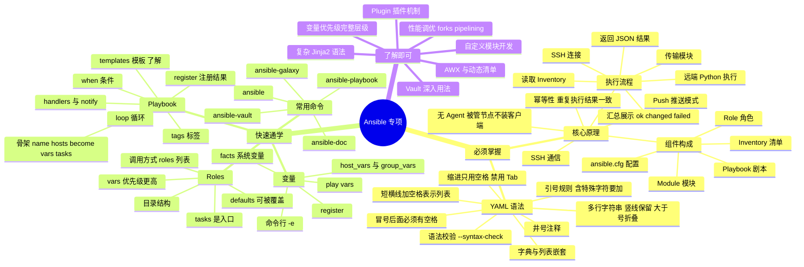

# Ansible 专项学习梳理(按掌握程度分级)

> 学习策略:原理和 YAML 语法是"必须掌握",Playbook 与 Roles 只需要"能读懂 + 能写基础",其余内容了解即可。
> 下面这张导图直接按掌握程度分层,而不是按知识顺序,复习时照它抓重点就行。

## 一、掌握程度总览

| 模块 | 要求 | 达标标准 |
| --- | --- | --- |
| 核心原理 | 必须掌握 | 能说清执行流程、幂等性、为什么无 Agent |
| YAML 语法 | 必须掌握 | 能独立写出没有语法错误的 Playbook |
| Inventory | 会用即可 | 能写分组、写内置变量、用匹配模式 |
| 常用模块 | 会用即可 | 知道 yum / copy / service / file / template 怎么用 |
| Playbook | 快速通学 | 能读懂别人写的,能自己写基础剧本 |
| Roles | 快速通学 | 能看懂目录结构、能调用、能改默认变量 |
| 插件 / 自定义模块 / Jinja2 深入 / 调优 | 了解即可 | 知道是什么、用在哪,不深究实现 |

## 二、思维导图(按掌握程度分层)



## 三、纯文本版(不支持 Mermaid 时用)

```text
Ansible 专项
│
├── 【必须掌握】核心原理
│   ├── 无 Agent:被管节点不装客户端,只依赖 SSH + Python
│   ├── Push 模式:控制端主动推送任务
│   ├── 幂等性:状态已满足时不重复修改
│   ├── 执行流程(6 步)
│   │   ├── 1 读取 Inventory 确定目标
│   │   ├── 2 SSH 连接被管节点
│   │   ├── 3 传输模块代码到远端
│   │   ├── 4 远端用 Python 执行模块
│   │   ├── 5 返回 JSON 结果
│   │   └── 6 控制端汇总展示 ok / changed / failed
│   └── 组件:Inventory、Module、Playbook、Role、Plugin、ansible.cfg
│
├── 【必须掌握】YAML 语法
│   ├── 缩进只用空格,禁用 Tab
│   ├── 冒号后必须有空格
│   ├── 短横线加空格表示列表项
│   ├── 字典与列表可嵌套
│   ├── 含特殊字符的字符串要加引号
│   ├── 多行字符串:| 保留换行,> 折叠换行
│   ├── # 表示注释
│   └── 校验命令:ansible-playbook --syntax-check
│
├── 【快速通学】Playbook
│   ├── 骨架:name / hosts / become / vars / tasks
│   ├── handlers + notify:只有 changed 时才触发
│   ├── when 条件、loop 循环、register 注册结果
│   ├── tags 标签:可选择性执行任务
│   └── template 模板:会用 {{ 变量 }} 就行
│
├── 【快速通学】变量
│   ├── 命令行 -e(最高优先级)
│   ├── play 里的 vars
│   ├── host_vars / group_vars
│   ├── facts(ansible_* 系统变量)
│   └── register 保存任务结果
│
├── 【快速通学】常用命令
│   ├── ansible(ad-hoc 临时命令)
│   ├── ansible-playbook(执行剧本)
│   ├── ansible-galaxy(角色管理)
│   ├── ansible-vault(加密敏感文件)
│   └── ansible-doc(查模块文档)
│
├── 【快速通学】Roles
│   ├── 目录:tasks / handlers / templates / files / vars / defaults / meta
│   ├── tasks/main.yml 是任务入口
│   ├── defaults 可被外部覆盖,vars 优先级更高
│   └── 调用:在 play 里写 roles 列表,可传 vars
│
└── 【了解即可】不用深入
    ├── 插件类型与开发
    ├── 自定义模块编写
    ├── 复杂 Jinja2(循环、宏、过滤器链)
    ├── 变量优先级的完整层级
    ├── 大规模性能调优(forks、pipelining、strategy)
    └── AWX / Tower / 动态清单
```

## 四、原理:必须能讲出来的 6 句话

1. Ansible 是**无 Agent** 的自动化运维工具,通过 **SSH** 管理被管节点,被管节点只需要有 Python
2. 采用 **Push 模式**:控制端主动把任务推给被管节点,不需要被管节点定时拉取
3. 执行流程:读清单 → SSH 连接 → 传模块 → 远端 Python 执行 → 返回 JSON → 汇总展示
4. **幂等性**:同一任务重复执行结果一致,状态已满足时显示 `ok` 而不做修改
5. 组件构成:Inventory(清单)、Module(模块)、Playbook(剧本)、Role(角色)、Plugin(插件)、ansible.cfg(配置)
6. 它是**声明式**工具:你描述"目标状态",模块自己判断该怎么达到,所以配置可以反复执行

## 五、YAML:必须能默写的 6 条规则

| 规则 | 正确写法 | 错误写法 |
| --- | --- | --- |
| 缩进用空格 | 两个空格缩进 | Tab 缩进 |
| 冒号后有空格 | `name: nginx` | `name:nginx` |
| 列表项短横线后加空格 | `- apple` | `-apple` |
| 嵌套靠缩进 | 字典下缩进写列表 | 所有内容平铺 |
| 特殊字符加引号 | `msg: "a: b"` | `msg: a: b` |
| 多行字符串 | `|` 保留换行、`>` 折叠 | 直接换行写 |

必须能默写的 Playbook 骨架:

```yaml
---
- name: 剧本描述
  hosts: 主机组
  become: yes
  vars:
    key: value
  tasks:
    - name: 任务描述
      module_name:
        param1: value1
  handlers:
    - name: handler 名称
      module_name:
        param: value
```

自查是否写对:

```bash
ansible-playbook -i hosts site.yml --syntax-check
```

## 六、Playbook 与 Roles:只需要会到这一步

| 能力 | 是否会 |
| --- | --- |
| 读懂一个别人写的 Playbook,说出它做了什么 | ☐ |
| 自己写出"安装软件 + 启动服务 + 部署文件"的 Playbook | ☐ |
| 说清 handlers 为什么不一定会执行 | ☐ |
| 用 when 做条件判断(task 会 / 不会执行) | ☐ |
| 用 loop 批量处理多个用户或目录 | ☐ |
| 用 register 保存结果并 debug 打印 | ☐ |
| 说出 Role 各目录的作用 | ☐ |
| 调用一个现成 Role 并覆盖它的默认变量 | ☐ |

## 七、明确不用深入的内容

- 插件机制与回调插件开发、自定义模块编写
- 复杂 Jinja2(宏、过滤器链、模板继承)
- 变量优先级的完整层级(知道"命令行 > play vars > host_vars > defaults"即可)
- 大规模性能调优(forks、pipelining、strategy、mitogen)
- AWX / Tower 平台、动态 Inventory 脚本
- 源码级调试与内部实现

## 八、学习顺序与时间分配

| 阶段 | 内容 | 目标 | 建议占比 |
| --- | --- | --- | --- |
| 1 | 核心原理 | 能口述执行流程与幂等性 | 30% |
| 2 | YAML 语法 | 能默写规则,能写对 Playbook 骨架 | 30% |
| 3 | Inventory + 常用模块 | 能跑通 ad-hoc 命令 | 10% |
| 4 | Playbook | 能写基础剧本并执行 | 20% |
| 5 | Roles | 能看懂结构、能调用 | 10% |

## 九、达标自测(全部能答上就算过关)

- [ ] 一句话解释:为什么 Ansible 不需要在被管节点装 Agent
- [ ] 说出执行流程的 6 个步骤
- [ ] 用 yum 装 nginx 的例子解释幂等性
- [ ] 指出一段 YAML 里的 3 处语法错误(Tab、冒号、引号)
- [ ] 默写 Playbook 骨架
- [ ] 说明 handlers 的触发条件
- [ ] 说出 Role 目录中 tasks、defaults、vars、templates 的作用
- [ ] 写出 5 个最常用的 Ansible 命令