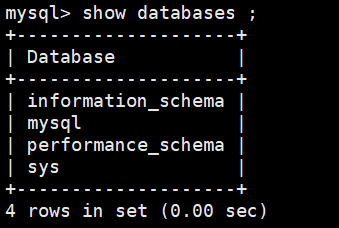
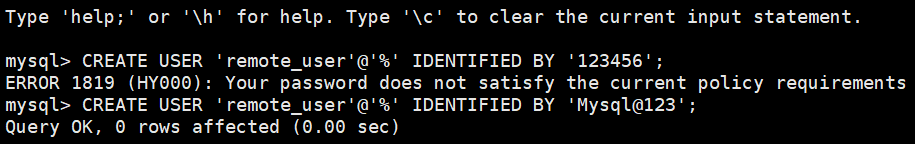
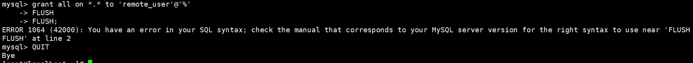

# 数据库分类与 MySQL 安装配置笔记

## 一、按数据模型分类

| 类别 | 代表产品 | 特点 | 适用场景 |
| --- | --- | --- | --- |
| 关系型数据库 | MySQL、Oracle、PostgreSQL | 支持 SQL 查询,表结构固定,支持事务 | 业务系统、订单、财务 |
| 非关系型数据库 | MongoDB(文档型)、Redis(键值型) | 结构灵活、读写快,弱化表结构 | 缓存、日志、内容管理 |
| 时间序列数据库 | InfluxDB、Prometheus | 按时间存储与聚合 | 服务器监控、传感器数据 |
| 图数据库 | Neo4j | 用节点和关系表示数据 | 社交网络、关系图谱、风控 |

关系型数据库的选型经验:

- **MySQL**:轻量级项目首选,生态成熟、运维成本低
- **Oracle**:高可用、功能强,但授权费用高,适合“不差钱”的核心系统
- **PostgreSQL**:复杂查询需求多、对 SQL 标准要求高的场景

## 二、选型决策树

```text
是否需要强一致性和复杂事务?
   └─ 是 → 关系型数据库(MySQL / Oracle / PostgreSQL)

数据结构是否固定?
   └─ 是 → 关系型数据库

是否需要高速读写、低延迟?
   └─ 是 → 内存数据库(Redis)

是否需要处理时间相关数据?
   └─ 是 → 时间序列数据库

是否涉及复杂关系网络?
   └─ 是 → 图数据库
```

## 三、MySQL 安装(CentOS)

### 1. 启用 MySQL 官方仓库

```bash
yum -y install https://repo.mysql.com/mysql80-community-release-el7-3.noarch.rpm
```

### 2. 切换到 MySQL 5.7(可选,默认安装 8.0)

```bash
yum install -y yum-utils-1.1.31-54.el7_8.noarch

# 禁用 8.0 仓库
yum-config-manager --disable mysql80-community

# 启用 5.7 仓库
yum-config-manager --enable mysql57-community
```

### 3. 安装 MySQL 服务端

```bash
yum install -y mysql-community-server
```

### 4. 启动服务并设置开机自启

```bash
systemctl start mysqld
systemctl enable mysqld
systemctl status mysqld
```

> CentOS/RHEL 上服务名是 `mysqld`;Ubuntu/Debian 上是 `mysql`。

### 5. 查看 MySQL 初始临时密码

```bash
grep -i password /var/log/mysqld.log
```

### 6. 登录并修改密码

```bash
mysql -uroot -p
```

```sql
ALTER USER 'root'@'localhost' IDENTIFIED BY 'Mysql@123';
FLUSH PRIVILEGES;
```

用新密码登录:

```bash
mysql -uroot -p
```

### 7. 验证

```sql
SHOW DATABASES;
```



## 四、初始化安全配置

退出数据库后执行交互式安全脚本:

```bash
mysql_secure_installation
```

交互项说明:

| 交互项 | 建议选择 | 说明 |
| --- | --- | --- |
| 是否启用密码强度检查(validate_password) | 新手可先选 N | 选 N 可设置简单密码,方便练习;生产环境建议选 Y 并设置强密码 |
| 设置 root 密码 | 输入并确认 | 需牢记,后续登录使用 |
| 删除匿名用户 | Y | 提高安全性 |
| 禁止 root 远程登录 | Y | 只允许本地登录更安全 |
| 删除测试数据库 | Y | 减少冗余与风险 |
| 重新加载权限表 | Y | 使配置立即生效 |

## 五、配置远程访问

### 1. 修改 MySQL 绑定地址

```bash
# CentOS / RHEL
vim /etc/my.cnf

# Ubuntu / Debian
vim /etc/mysql/mysql.conf.d/mysqld.cnf
```

找到或添加:

```ini
bind-address = 0.0.0.0
```

### 2. 重启服务

```bash
# CentOS / RHEL
systemctl restart mysqld

# Ubuntu / Debian
systemctl restart mysql
```

### 3. 创建远程访问用户

```bash
mysql -uroot -p
```

```sql
-- 用户名为 remote_user,允许从任意 IP 登录
CREATE USER 'remote_user'@'%' IDENTIFIED BY 'Mysql@123';

-- 授权
GRANT ALL PRIVILEGES ON *.* TO 'remote_user'@'%' WITH GRANT OPTION;

-- 刷新权限表
FLUSH PRIVILEGES;
EXIT;
```





如果上面的创建/授权语句报**密码复杂度不够**(ERROR 1819),有两种解决方式:

**方式一:换成满足策略的强密码**(推荐)

```sql
-- 至少 8 位,且包含大小写字母、数字、特殊符号
CREATE USER 'remote_user'@'%' IDENTIFIED BY 'Mysql@1234';
```

**方式二:临时降低密码策略(仅练习环境)**

```sql
-- MySQL 8.0
SET GLOBAL validate_password.policy = LOW;
SET GLOBAL validate_password.length = 6;

-- MySQL 5.7
SET GLOBAL validate_password_policy = LOW;
SET GLOBAL validate_password_length = 6;
```

### 4. 防火墙放行 3306 端口

```bash
firewall-cmd --permanent --add-port=3306/tcp
firewall-cmd --reload
```

> 云主机还需要在控制台安全组中放行 3306。

### 5. 在其他服务器上远程连接

```bash
mysql -h 部署服务器IP -u remote_user -p
```

输入密码后即可登录,说明远程访问配置成功。

## 六、注意事项

- `bind-address = 0.0.0.0` + `'remote_user'@'%'` + `GRANT ALL ... WITH GRANT OPTION` 是**风险最高的组合**:等于把数据库完全暴露并可被任意转授权
- 更安全的做法:只放行指定来源 IP(如 `'remote_user'@'10.1.1.%'`),只授予业务库权限(`ON db_name.*`),不轻易使用 `WITH GRANT OPTION`
- 生产环境建议保持 root 仅本地登录,应用使用独立账号,并定期备份数据