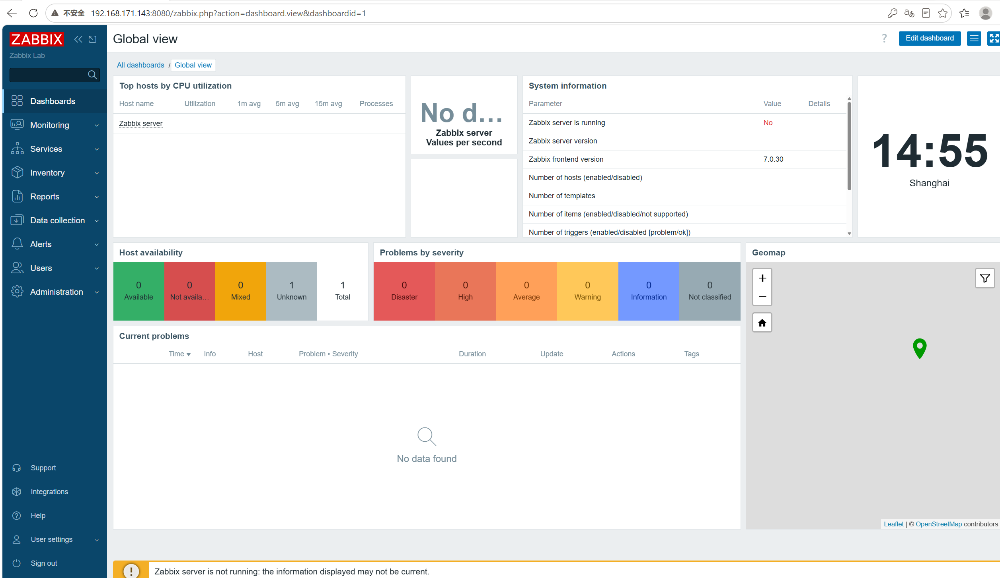
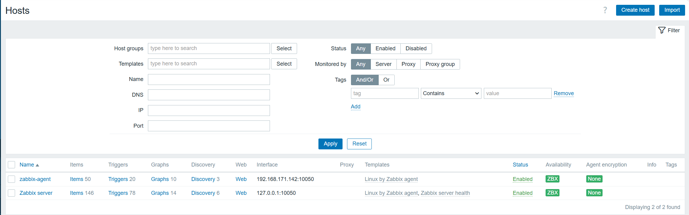
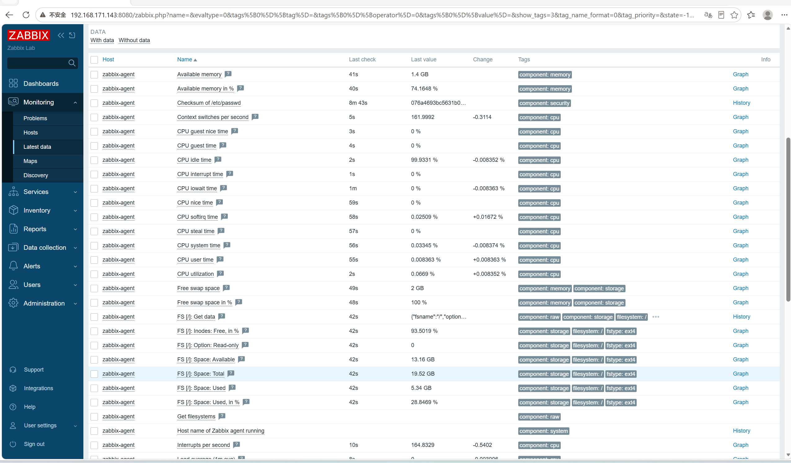
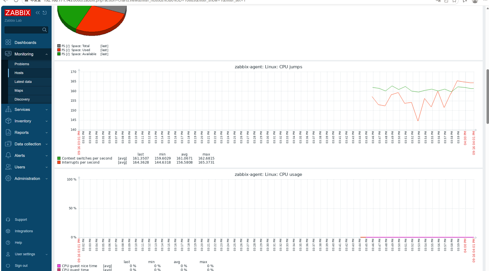
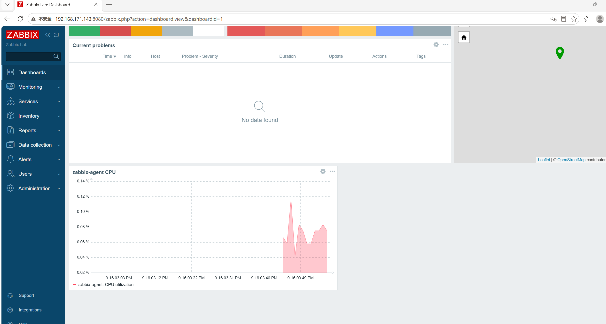

# stage5-03 Zabbix 实战入门(Ubuntu)

> 环境:Ubuntu 22.04 LTS + Zabbix 7.0 LTS + MySQL 8 + Nginx + PHP 8.1
> 目标:两台机器搭出完整的 Zabbix 监控系统,并通过 Web 前端安装向导完成初始化。
> 本文每一步都配「操作 + 检验」,检验不通过不要往下走;文末附本次实战真实踩过的坑和关机/重启规范。

## 一、知识点

### 1. Zabbix 是什么

Zabbix 是一套企业级开源监控系统,由五部分组成:

| 组件 | 作用 | 本实验位置 |
| --- | --- | --- |
| zabbix-server | 核心服务:接收数据、计算触发器、发告警 | zabbix-server(192.168.171.143) |
| zabbix-agent | 被监控端:采集本机指标并上报 | zabbix-server + zabbix-agent(192.168.171.142) |
| zabbix-web | Web 前端(PHP 写的),提供浏览器操作界面 | zabbix-server |
| MySQL | 存储配置、历史数据和趋势数据 | zabbix-server |
| zabbix-proxy | 代理,用于大规模分布式监控(第 08 节讲) | 暂不使用 |

### 2. 数据流向

```text
zabbix-agent(被监控机)
    │ 采集 CPU/内存/磁盘等指标
    │ 上报到 server 的 10051
    ↓
zabbix-server ──写入──→ MySQL
    ↑ 读取展示
zabbix-web(浏览器界面)
```

### 3. 端口约定

| 端口 | 服务 | 说明 |
| --- | --- | --- |
| 10050 | zabbix-agent | 被动模式:等 server 来拉数据 |
| 10051 | zabbix-server | 主动模式:agent 推数据 |
| 8080 | Nginx | Web 前端(Ubuntu 版 Zabbix 默认用 8080) |
| 3306 | MySQL | 仅本机访问 |

### 4. 组件依赖关系(理解这一步很关键)

```text
浏览器 → Nginx(8080) → PHP-FPM(通过 socket)→ Zabbix 前端代码(/usr/share/zabbix)
                              ↓
                       Zabbix Server(10051) → MySQL(3306)
```

**Nginx + PHP-FPM + Zabbix 前端 + Zabbix Server + MySQL 五者缺一不可**。其中 PHP-FPM 必须单独安装,这是最容易漏的一步。

### 5. 需要在 server 上运行的服务清单

| 服务 | 依赖 | 启动顺序 |
| --- | --- | --- |
| `mysql` | 无 | 1(最先) |
| `zabbix-server` | mysql | 2 |
| `zabbix-agent` | 无 | 3 |
| `php8.1-fpm` | 无 | 3 |
| `nginx` | php8.1-fpm | 3 |

> **server 上五个服务全部要 `enable`**。少启一个,表现完全不同:
> server 没启 → 所有主机 ZBX 变灰;php8.1-fpm 没启 → 前端 502;nginx 没启 → 8080 打不开。

## 二、环境规划

| 角色 | 主机名 | IP | 配置 |
| --- | --- | --- | --- |
| Server | zabbix-server | 192.168.171.143 | 2 核 / 4GB |
| Agent | zabbix-agent | 192.168.171.142 | 1 核 / 1GB |

> **实验前先核对 IP**:两台机器分别执行 `ip addr | grep 'inet '`,确认与上表一致。
> 如果是 DHCP 动态分配,IP 可能变化,建议参照第七节配置静态 IP。

两台机器都安装 Ubuntu 22.04 Server,NAT 模式,能访问外网。装完后先打一次快照。

## 三、实操

### 3.1 系统初始化(两台都做)

**操作**

```bash
# 1. 设置主机名(agent 那台改成 zabbix-agent)
sudo hostnamectl set-hostname zabbix-server
exec bash

# 2. 更新软件源并升级
sudo apt update && sudo apt upgrade -y

# 3. 基础工具 + 时间同步
sudo apt install -y vim curl wget net-tools chrony
sudo systemctl enable --now chrony

# 4. 设置时区(Zabbix 前端会检查 PHP 时区)
sudo timedatectl set-timezone Asia/Shanghai

# 5. 生成并设置 UTF-8 locale(Zabbix 前端会检查 System locale)
sudo apt install -y locales
sudo sed -i 's/^# *en_US\.UTF-8 UTF-8/en_US.UTF-8 UTF-8/' /etc/locale.gen
sudo locale-gen
sudo update-locale LANG=en_US.UTF-8 LC_ALL=en_US.UTF-8
```

**检验**

```bash
hostname                                     # 期望:zabbix-server
timedatectl | grep "Time zone"               # 期望:Asia/Shanghai
ip addr | grep 'inet '                       # 记下本机 IP
chronyc sources -v                           # 期望:能看到 ^* 的同步源
locale -a | grep -i en_US                    # 期望:en_US.utf8
locale | grep -E 'LANG|LC_ALL'               # 期望:en_US.UTF-8
```

> 时区 + locale 就是安装向导第 2 屏最容易变红的两项,提前设好可以少走弯路。

### 3.2 安装 MySQL 并建库(仅 server)

**操作**

```bash
sudo apt install -y mysql-server
sudo systemctl enable --now mysql
```

Ubuntu 的 MySQL 8 root 默认用 socket 认证,直接 `sudo mysql`:

```bash
sudo mysql
```

```sql
CREATE DATABASE zabbix CHARACTER SET utf8mb4 COLLATE utf8mb4_bin;
CREATE USER 'zabbix'@'localhost' IDENTIFIED BY 'Zabbix@123456';
GRANT ALL PRIVILEGES ON zabbix.* TO 'zabbix'@'localhost';
SET GLOBAL log_bin_trust_function_creators = 1;
FLUSH PRIVILEGES;
QUIT;
```

**检验**

```bash
sudo mysql -e "SHOW DATABASES;" | grep zabbix
mysql -uzabbix -p'Zabbix@123456' zabbix -e "SELECT DATABASE();"
systemctl is-active mysql                    # 期望:active
```

### 3.3 安装 PHP-FPM 与扩展(仅 server)★必须显式安装

**操作**

```bash
sudo apt install -y php8.1-fpm php8.1-cli php8.1-mysql php8.1-gd \
  php8.1-bcmath php8.1-xml php8.1-mbstring php8.1-ldap php8.1-opcache

sudo systemctl enable --now php8.1-fpm
```

**检验**

```bash
php -v | head -1                       # 期望:PHP 8.1.x
systemctl is-active php8.1-fpm         # 期望:active
ls -d /etc/php/8.1/fpm/                # 期望:目录存在
php -m | grep -Ei 'gd|bcmath|mbstring|xml|mysqli|opcache'
```

> 如果 PHP 版本不是 8.1,用 `ls -d /etc/php/*/` 查到实际版本,把后面所有路径里的 `8.1` 换成对应版本。

### 3.4 安装 Zabbix Server 与前端(仅 server)

**操作**

```bash
# 添加 Zabbix 7.0 官方源(Ubuntu 22.04)
wget https://repo.zabbix.com/zabbix/7.0/ubuntu/pool/main/z/zabbix-release/zabbix-release_latest_7.0+ubuntu22.04_all.deb
sudo dpkg -i zabbix-release_latest_7.0+ubuntu22.04_all.deb
sudo apt update

# 安装服务端 + 前端 + nginx 配置 + SQL 脚本 + agent
sudo apt install -y zabbix-server-mysql zabbix-frontend-php zabbix-nginx-conf \
  zabbix-sql-scripts zabbix-agent
```

**检验**

```bash
dpkg -l | grep zabbix | awk '{print $2, $3}'
ls /etc/zabbix/zabbix_server.conf
ls /etc/zabbix/nginx.conf
ls /usr/share/zabbix-sql-scripts/mysql/server.sql.gz
```

四个文件都存在,说明包装齐了。

### 3.5 导入 Zabbix 表结构(仅 server)

**操作**

```bash
zcat /usr/share/zabbix-sql-scripts/mysql/server.sql.gz \
  | mysql --default-character-set=utf8mb4 -uzabbix -p'Zabbix@123456' zabbix
```

这一步要跑 1~3 分钟,没有输出是正常的,不要中断。

**检验**

```bash
mysql -uzabbix -p'Zabbix@123456' zabbix \
  -e "SELECT COUNT(*) AS tables_count FROM information_schema.tables WHERE table_schema='zabbix';"

mysql -uzabbix -p'Zabbix@123456' zabbix \
  -e "SELECT userid, username FROM users;"
```

期望:表数量约 **170**;`users` 表里有 `Admin` 和 `guest`。

### 3.6 配置 Server、Nginx、PHP-FPM(仅 server)

**操作 1:写数据库密码**

```bash
sudo sed -i 's/^# DBPassword=/DBPassword=Zabbix@123456/' /etc/zabbix/zabbix_server.conf
grep -E '^DB(Host|Name|User|Password)' /etc/zabbix/zabbix_server.conf
```

期望输出:

```text
DBHost=localhost
DBName=zabbix
DBUser=zabbix
DBPassword=Zabbix@123456
```

**操作 2:配置 Nginx**

```bash
sudo vim /etc/zabbix/nginx.conf
```

取消这两行的注释:

```nginx
listen 8080;
server_name example.com;
```

确保被 nginx 加载:

```bash
ls -l /etc/nginx/conf.d/zabbix.conf
# 不存在就建立软链接
sudo ln -sf /etc/zabbix/nginx.conf /etc/nginx/conf.d/zabbix.conf
```

**操作 3:检查 PHP-FPM 的 pool 文件**

```bash
ls -l /etc/php/8.1/fpm/pool.d/
```

应能看到 `zabbix.conf`,`listen` 必须是 `/run/php/zabbix.sock`。
**若不存在就手动创建:**

```bash
sudo tee /etc/php/8.1/fpm/pool.d/zabbix.conf > /dev/null <<'EOF'
[zabbix]
user = www-data
group = www-data
listen = /run/php/zabbix.sock
listen.allowed_clients = 127.0.0.1
listen.owner = www-data
listen.group = www-data
listen.mode = 0660

pm = dynamic
pm.max_children = 50
pm.start_servers = 5
pm.min_spare_servers = 5
pm.max_spare_servers = 35

php_value[session.save_handler] = files
php_value[session.save_path] = /var/lib/php/sessions
php_value[max_execution_time] = 300
php_value[memory_limit] = 128M
php_value[post_max_size] = 16M
php_value[upload_max_filesize] = 2M
php_value[max_input_time] = 300
php_value[max_input_vars] = 10000
php_value[date.timezone] = Asia/Shanghai

env[LANG] = en_US.UTF-8
env[LC_ALL] = en_US.UTF-8
EOF
```

**操作 4:修正时区与 locale(不管 pool 文件来自哪里都统一执行一遍)**

```bash
sudo sed -i 's|^php_value\[date.timezone\].*|php_value[date.timezone] = Asia/Shanghai|' \
  /etc/php/8.1/fpm/pool.d/zabbix.conf

sudo grep -q '^env\[LANG\]' /etc/php/8.1/fpm/pool.d/zabbix.conf || \
  sudo tee -a /etc/php/8.1/fpm/pool.d/zabbix.conf > /dev/null <<'EOF'

env[LANG] = en_US.UTF-8
env[LC_ALL] = en_US.UTF-8
EOF

sudo grep -E 'date.timezone|env\[' /etc/php/8.1/fpm/pool.d/zabbix.conf
```

**操作 5:给前端目录写权限**

```bash
ls -ld /etc/zabbix/web
sudo chown -R www-data:www-data /etc/zabbix/web
```

**操作 6:启动并启用全部服务(★最容易漏,务必逐条执行)**

```bash
# 首次启动
sudo systemctl start mysql zabbix-server zabbix-agent php8.1-fpm nginx

# 设置开机自启(虚拟机重启后能自动恢复的关键)
sudo systemctl enable mysql zabbix-server zabbix-agent php8.1-fpm nginx
```

**检验(五项都要 active,少一个都不行)**

```bash
systemctl is-active mysql zabbix-server zabbix-agent php8.1-fpm nginx
```

期望输出五行 `active`:

```text
active
active
active
active
active
```

> 如果 `zabbix-server` 显示 `inactive`,后面所有主机的 ZBX 都会是灰色。
> 启动失败时看日志:`sudo tail -50 /var/log/zabbix/zabbix_server.log`。

### 3.7 启动后的闭环检验

```bash
# 1. 五个服务都应是 active
systemctl is-active mysql zabbix-server zabbix-agent php8.1-fpm nginx

# 2. 端口都应在监听
ss -nltp | grep -E ':10051|:10050|:8080|:3306'

# 3. socket 已生成,且与 nginx 配置一致
ls -l /run/php/zabbix.sock
grep fastcgi_pass /etc/zabbix/nginx.conf

# 4. server 日志应出现启动成功
sudo tail -20 /var/log/zabbix/zabbix_server.log

# 5. nginx 语法检查与前端响应
sudo nginx -t
curl -sI http://127.0.0.1:8080 | head -1
curl -sI http://127.0.0.1:8080 | grep -i location
```

| 检查 | 期望 |
| --- | --- |
| 服务状态 | 五个 `active` |
| 端口 | 10051、10050、8080、3306 |
| socket | `/run/php/zabbix.sock` 存在,属主 www-data |
| nginx 配置 | `fastcgi_pass unix:/var/run/php/zabbix.sock;` |
| server 日志 | `server #0 started [main process]` |
| curl | `302 Found`,Location 为 `setup.php` |

### 3.8 Web 前端安装向导

**准备:确认防火墙放行**

```bash
sudo ufw status
# 若为 active
sudo ufw allow 8080/tcp
sudo ufw allow 10051/tcp
sudo ufw allow 10050/tcp
```

**浏览器访问**

```text
http://192.168.171.143:8080
```

| 步骤 | 界面 | 做什么 | 检查点 |
| --- | --- | --- | --- |
| 1 | Welcome | 选 `Chinese (zh_CN)` → Next step | 页面能打开 |
| 2 | Check of pre-requisites | 无需填写 | **27 项全部 OK** |
| 3 | Configure DB connection | Host `localhost`、Port `3306`、Name `zabbix`、User `zabbix`、Password `Zabbix@123456` | 不报连接错误 |
| 4 | Settings | Name 填 `Zabbix Lab`,Timezone 选 `Asia/Shanghai` | 能进入下一步 |
| 5 | Pre-installation summary | 核对信息 | - |
| 6 | Install | 点 Finish | 跳到登录页 |

第 2 屏常见红色项与对应处理:

| 红色项 | 处理 |
| --- | --- |
| System locale = `C` → Fail | 回到 3.1 第 5 步生成 `en_US.UTF-8`,并在 pool 文件里加 `env[LANG]`,重启 php8.1-fpm |
| PHP timezone 未设置 | 确认 pool 里 `date.timezone = Asia/Shanghai`,重启 php8.1-fpm |
| 缺少扩展 | `apt install php8.1-<扩展名>` 后重启 php8.1-fpm |

**登录验收**

```text
用户名:Admin
密码:zabbix
```

首次登录会强制改密码。登录后确认:

```text
1. Dashboard 显示「Zabbix server is running: Yes」
2. Data collection → Hosts 里有「Zabbix server」,ZBX 图标为绿色
```

进入后的界面:



### 3.9 接入 agent 主机(在 agent 机器上做)

**操作**

```bash
# 1. 添加 Zabbix 官方源
wget https://repo.zabbix.com/zabbix/7.0/ubuntu/pool/main/z/zabbix-release/zabbix-release_latest_7.0+ubuntu22.04_all.deb
sudo dpkg -i zabbix-release_latest_7.0+ubuntu22.04_all.deb
sudo apt update

# 2. 安装 agent
sudo apt install -y zabbix-agent

# 3. 指向 server
sudo sed -i 's/^Server=127.0.0.1/Server=192.168.171.143/'            /etc/zabbix/zabbix_agentd.conf
sudo sed -i 's/^ServerActive=127.0.0.1/ServerActive=192.168.171.143/' /etc/zabbix/zabbix_agentd.conf
sudo sed -i 's/^Hostname=Zabbix server/Hostname=zabbix-agent/'        /etc/zabbix/zabbix_agentd.conf

# 4. 启动并设置开机自启
sudo systemctl restart zabbix-agent
sudo systemctl enable zabbix-agent
```

**检验 1:agent 本机**

```bash
grep -E '^(Server|ServerActive|Hostname)=' /etc/zabbix/zabbix_agentd.conf
systemctl is-active zabbix-agent
ss -nltp | grep 10050
```

**检验 2:从 server 主动探测(必须在 server 上执行)**

```bash
# 在 192.168.171.143(server)上
sudo apt install -y zabbix-get
zabbix_get -s 192.168.171.142 -k agent.ping                   # 期望 1
zabbix_get -s 192.168.171.142 -k system.cpu.load[all,avg1]
```

> 常见误区:在 agent 本机执行 `zabbix_get -s agentIP` 会报
> `connection error (POLLERR,POLLHUP)`,因为 agent 只接受 `Server=` 白名单内主机的连接。
> 本机自测请用 `zabbix_agentd -t <key>`,它不走网络。

**检验 3:Web 端添加主机**

```text
Data collection → Hosts → Create host
  Host name:   zabbix-agent
  Host groups: Linux servers
  Interfaces:  Agent → IP 192.168.171.142 → Port 10050
  Templates:   Linux by Zabbix agent
→ Add
```

保存后等 1 分钟,到 `Monitoring → Hosts` 看 ZBX 是否变绿:



> **如果两台主机的 ZBX 一直是灰色,先查 server 自己:**
> `systemctl is-active zabbix-server`。服务没启动时,任何主机都不会被采集。

### 3.10 查看监控数据

Zabbix 看数据主要有四个入口,用途不同:

| 想看什么 | 去哪里 | 说明 |
| --- | --- | --- |
| 最新数值(最常用) | Monitoring → Latest data | 所有监控项的当前值和时间戳 |
| 曲线图 | Monitoring → Hosts → 点该行的 `Graphs` | 该主机所有图表的集合 |
| 告警事件 | Monitoring → Problems | 只有处于问题状态的事件 |
| 汇总大屏 | Dashboards | 内置仪表盘 + 自建组件 |

**最新数值**:



**曲线图**:



### 3.11 自建 Dashboard 图表

```text
Dashboards → 右上角 Edit dashboard → Add widget → Graph
```

注意 Zabbix 7.0 的选择顺序是**先选主机组,再选主机**:

1. Name:`zabbix-agent CPU`
2. Host group:点 Select → 勾选 `Linux servers` → Select
3. Hosts:点 Select → 列表出现该组主机 → 勾选 `zabbix-agent` → Select
4. Item:点 Select → 搜索 `CPU utilization` → 选中
5. Add → 右上角 Save changes

> 不选 Host group 时列表是空的(提示 "Filter is not set"),这是 7.0 的改动,不是故障。



## 四、本节闭环自检清单

| 检查项 | 命令或位置 | 通过标准 |
| --- | --- | --- |
| 时区正确 | `timedatectl \| grep "Time zone"` | Asia/Shanghai |
| locale 正确 | `locale -a \| grep -i en_US` | en_US.utf8 |
| MySQL 就绪 | `mysql -uzabbix -p zabbix -e "SELECT 1;"` | 返回 1 |
| 表结构完整 | information_schema | 约 170 张表 |
| PHP-FPM 运行 | `systemctl is-active php8.1-fpm` | active |
| socket 存在 | `ls -l /run/php/zabbix.sock` | 文件存在 |
| nginx 配置正确 | `grep fastcgi_pass /etc/zabbix/nginx.conf` | 指向 zabbix.sock |
| **五个服务运行** | `systemctl is-active mysql zabbix-server zabbix-agent php8.1-fpm nginx` | **全 active** |
| **五个服务已自启** | `systemctl is-enabled mysql zabbix-server zabbix-agent php8.1-fpm nginx` | **全 enabled** |
| 端口监听 | `ss -nltp \| grep -E ':10051\|:10050\|:8080\|:3306'` | 四个都在 |
| 前端可访问 | `curl -sI http://127.0.0.1:8080` | 200 或 302 |
| 向导检查全绿 | 浏览器第 2 屏 | 27 项全 OK |
| 向导完成 | 浏览器登录 | 能进 Dashboard |
| server 状态 | Dashboard | Zabbix server is running: Yes |
| agent 连通 | `zabbix_get -s agentIP -k agent.ping` | 返回 1 |
| 主机可用 | Monitoring → Hosts | ZBX 绿色 |
| 数据采集 | Latest data | 有实时数值 |

## 五、常见问题速查

| 现象 | 原因 | 处理 |
| --- | --- | --- |
| **所有主机 ZBX 都是灰色** | **zabbix-server 服务没启动** | `sudo systemctl start zabbix-server` 并 `enable`,再看 3.7 检验 |
| `/etc/php/8.1/fpm/pool.d/zabbix.conf` 不存在 | PHP-FPM 或前端包没装 | 执行 3.3 装 PHP-FPM 与 `zabbix-frontend-php`;仍缺就按 3.6 操作 3 手动创建 |
| 向导第 2 屏 System locale 为 C | 系统没生成 en_US.UTF-8 | `locale-gen` + `update-locale` + pool 里加 `env[LANG]`,见 3.1 与 3.6 |
| 向导第 2 屏时区未设置 | PHP 时区未配 | 改 pool 的 `date.timezone`,重启 php8.1-fpm |
| 向导第 2 屏缺扩展 | PHP 扩展没装 | `apt install php8.1-<扩展名>`,重启 php8.1-fpm |
| 向导第 6 步无法写配置 | `/etc/zabbix/web` 权限不对 | `chown -R www-data:www-data /etc/zabbix/web` |
| 向导第 3 步连不上数据库 | 账号/密码/库名错 | 命令行先验证 `mysql -uzabbix -p zabbix` |
| 8080 打不开 | Nginx 没加载 zabbix.conf | `ln -sf /etc/zabbix/nginx.conf /etc/nginx/conf.d/zabbix.conf` |
| 8080 打开是 Apache 页面 | apt 依赖装了 apache2,占了 80 | `systemctl disable --now apache2` |
| 前端 502 | php8.1-fpm 没启动或 socket 路径不一致 | `systemctl is-active php8.1-fpm`,核对 `fastcgi_pass` |
| server 起不来 | 数据库连接配置错 | 看 `/var/log/zabbix/zabbix_server.log` |
| agent 显示红色 | Server 地址写错或 10050 不通 | 检查 `Server=`、ufw、`ss -nltp` |
| 导入 SQL 报函数权限错 | 少了 trust 设置 | 重新执行 `SET GLOBAL log_bin_trust_function_creators = 1;` |

## 六、实战踩坑记录(本次实验真实遇到)

| # | 现象 | 根因 | 解决 |
| --- | --- | --- | --- |
| 1 | `/etc/php/8.1/fpm/pool.d/zabbix.conf` 不存在 | 笔记只装了 `zabbix-frontend-php`,没有显式安装 `php8.1-fpm` | 补装 `php8.1-fpm` 与各扩展(3.3);缺失的 pool 文件按 3.6 手动补 |
| 2 | 向导第 2 屏 `System locale = C → Fail` | 最小化安装没生成 `en_US.UTF-8`,PHP-FPM 也拿不到 locale 环境变量 | 3.1 提前 `locale-gen` + `update-locale`;3.6 在 pool 里加 `env[LANG]`,重启 php8.1-fpm |
| 3 | 向导最后一步无法创建配置文件 | `/etc/zabbix/web` 不可写 | `chown -R www-data:www-data /etc/zabbix/web` |
| 4 | 前端 8080 打不开 | Nginx 没加载 Zabbix 站点配置 | `ln -sf /etc/zabbix/nginx.conf /etc/nginx/conf.d/zabbix.conf` |
| 5 | apt 顺带装了 apache2,占用 80 端口 | `php` 依赖可能拉入 `libapache2-mod-php` | `systemctl disable --now apache2`,`ss -nltp \| grep ':80 '` 确认 |
| 6 | **主机列表里 ZBX 全是灰色** | **`zabbix-server` 服务没启动**(`systemctl is-active` 返回 inactive),server 根本没发起采集 | `sudo systemctl start zabbix-server` + `enable`;并把"五服务 active + enabled"写进检验清单(3.6/3.7) |

**经验总结**:

1. **PHP-FPM 是独立组件,必须显式安装**,不要指望前端包帮你带
2. **时区 + locale 是向导第 2 屏的两大红灯**,在系统初始化阶段就设好最省事
3. **涉及写文件的操作**,先确认目标目录对 `www-data` 可写
4. **Ubuntu 上的服务是拆分安装的**,装完必须 `systemctl is-active` 逐个验证,同时别忘了 `enable`
5. **主机全部不可用时,先看 server 自己活没活**,不要一上来就查 agent

## 七、虚拟机关机与重启操作规范

> 本节涉及两台机器,所有命令都标注了执行位置:
> **【server】** = 192.168.171.143,**【agent】** = 192.168.171.142,**【两台】** = 都要执行,**【Windows】** = 在你自己的电脑上操作。

### 7.1 关机前要做什么

#### 第 1 步【两台】确认服务状态

**【server 上执行】**

```bash
systemctl is-active mysql zabbix-server zabbix-agent php8.1-fpm nginx
```

期望五行都是 `active`。

**【agent 上执行】**

```bash
systemctl is-active zabbix-agent
```

如果正在做告警实验(第 06 节),先把可能触发告警的测试项恢复掉,否则关机期间会攒一堆告警邮件。

#### 第 2 步【两台】优雅关机

**顺序建议:先关 server,再关 agent。**

原因是:如果先关 agent,server 还在运行,会检测到 agent 不可达并触发"agent 不可用"告警;反过来先关 server,agent 上报失败但不会产生告警。

**【server 上执行】**

```bash
sudo shutdown -h now
```

**【agent 上执行】**

```bash
sudo shutdown -h now
```

> 不要直接点 VMware 的"关闭电源",那相当于拔电源,MySQL 正在写数据时可能损坏;
> `shutdown -h now` 会让 systemd 按顺序停服务,安全得多。

#### 第 3 步【Windows】打快照(可选但推荐)

VMware → 虚拟机 → 快照 → 拍摄快照,命名如 `zabbix-working`。以后实验做坏了可以秒回滚。

### 7.2 开机后要做什么

#### 第 1 步【两台】确认 IP 没变

**【server 上执行】**

```bash
ip addr | grep 'inet '
```

期望看到 `192.168.171.143`。

**【agent 上执行】**

```bash
ip addr | grep 'inet '
```

期望看到 `192.168.171.142`。

IP 变了怎么办 → 见 7.3。

#### 第 2 步【server】检查五个服务是否自动起来

```bash
systemctl is-active mysql zabbix-server zabbix-agent php8.1-fpm nginx
```

- 五行全是 `active` → 说明 `enable` 生效,直接跳到第 3 步
- 有 `inactive` → 按下面的顺序手动拉起

```bash
sudo systemctl start mysql
sudo systemctl start zabbix-server
sudo systemctl start zabbix-agent php8.1-fpm nginx
```

还起不来就看日志:

```bash
sudo tail -50 /var/log/zabbix/zabbix_server.log
```

确认都正常后,重新设置开机自启:

```bash
sudo systemctl enable mysql zabbix-server zabbix-agent php8.1-fpm nginx
```

#### 第 3 步【server】检查端口与前端

```bash
ss -nltp | grep -E ':10051|:10050|:8080|:3306'
curl -sI http://127.0.0.1:8080 | head -1        # 期望 200 或 302
```

#### 第 4 步【agent】检查 agent 服务与配置

```bash
systemctl is-active zabbix-agent
grep -E '^(Server|ServerActive|Hostname)=' /etc/zabbix/zabbix_agentd.conf
```

期望:`active`;`Server` 和 `ServerActive` 都指向 `192.168.171.143`;`Hostname=zabbix-agent`。

如果 agent 没起来:

```bash
sudo systemctl start zabbix-agent
sudo systemctl enable zabbix-agent
```

#### 第 5 步【server】命令行验证连通性

```bash
zabbix_get -s 192.168.171.142 -k agent.ping        # 期望 1
zabbix_get -s 192.168.171.142 -k system.cpu.load[all,avg1]
```

#### 第 6 步【Windows】浏览器确认监控恢复

```text
1. 打开 http://192.168.171.143:8080,用 Admin 登录
2. Dashboard 显示「Zabbix server is running: Yes」
3. Monitoring → Hosts 里两台主机 ZBX 变绿(可能需要等 1 分钟)
4. Monitoring → Latest data 有带当前时间的数值
```

### 7.3 重启后 IP 变了怎么办

IP 变化后,三处都要改:

**1)【agent 上执行】更新 server 地址**

```bash
# 把 <新serverIP> 换成 server 的新 IP
sudo sed -i 's/^Server=.*/Server=<新serverIP>/'            /etc/zabbix/zabbix_agentd.conf
sudo sed -i 's/^ServerActive=.*/ServerActive=<新serverIP>/' /etc/zabbix/zabbix_agentd.conf
sudo systemctl restart zabbix-agent

# 验证
grep -E '^(Server|ServerActive)=' /etc/zabbix/zabbix_agentd.conf
```

**2)【Windows / 浏览器】更新 Web 里主机的接口地址**

```text
Data collection → Hosts → zabbix-agent → Interfaces
  → 把 IP 改成 agent 的新 IP → Update
```

如果 server 自己的 IP 也变了,还要检查:

```text
Data collection → Hosts → Zabbix server → Interfaces
  → 该主机通常用 127.0.0.1,一般不受影响
```

**3)【Windows】更新笔记里的 IP**

同步修改笔记,避免下次又对不上。

### 7.4 固定 IP(一劳永逸,建议做一次)

#### 【server 上执行】

```bash
# 先看网卡名和网关
ip addr | grep 'inet '
ip route | grep default
ls /etc/netplan/
```

假设网卡是 `ens33`、网关是 `192.168.171.2`:

```bash
sudo cp /etc/netplan/*.yaml /etc/netplan/backup.yaml

sudo tee /etc/netplan/01-static.yaml > /dev/null <<'EOF'
network:
  version: 2
  ethernets:
    ens33:
      dhcp4: no
      addresses: [192.168.171.143/24]
      routes:
        - to: default
          via: 192.168.171.2
      nameservers:
        addresses: [223.5.5.5, 114.114.114.114]
EOF

sudo netplan try         # 有 120 秒确认期,直接回车确认
```

#### 【agent 上执行】

同样的步骤,只把地址改成 agent 的:

```bash
sudo cp /etc/netplan/*.yaml /etc/netplan/backup.yaml

sudo tee /etc/netplan/01-static.yaml > /dev/null <<'EOF'
network:
  version: 2
  ethernets:
    ens33:
      dhcp4: no
      addresses: [192.168.171.142/24]
      routes:
        - to: default
          via: 192.168.171.2
      nameservers:
        addresses: [223.5.5.5, 114.114.114.114]
EOF

sudo netplan try
```

#### 【两台】检验

```bash
ip addr | grep 'inet '                    # 确认为固定 IP
ping -c 2 192.168.171.143                 # 从 agent ping server
ping -c 2 192.168.171.142                 # 从 server ping agent
systemctl is-active zabbix-agent          # 各自确认服务正常
```

### 7.5 关机 / 重启动线速查

| 时机 | 在哪台机器 | 要做什么 |
| --- | --- | --- |
| 关机前 | **server** | `systemctl is-active mysql zabbix-server zabbix-agent php8.1-fpm nginx` |
| 关机前 | **agent** | `systemctl is-active zabbix-agent` |
| 关机 | **server(先)** | `sudo shutdown -h now` |
| 关机 | **agent(后)** | `sudo shutdown -h now` |
| 关机前 | **Windows** | 可选:VMware 打快照 |
| 开机后 | **server** | 查 IP → 查五个服务是否 active → 没起来就 start + enable |
| 开机后 | **server** | 查端口(10051/10050/8080/3306)+ `curl` 前端 |
| 开机后 | **agent** | 查 agent 服务 + `Server=`/`ServerActive=` 是否指向 143 |
| 开机后 | **server** | `zabbix_get -s 192.168.171.142 -k agent.ping` 验证 |
| 开机后 | **Windows** | 浏览器登录,确认 Dashboard 正常 + 两台主机 ZBX 变绿 |
| IP 变了 | **agent** | 改 `Server=` / `ServerActive=` → 重启 agent |
| IP 变了 | **Windows** | 改 Web 里主机的接口 IP |
| IP 变了 | **Windows** | 更新笔记里的 IP |
