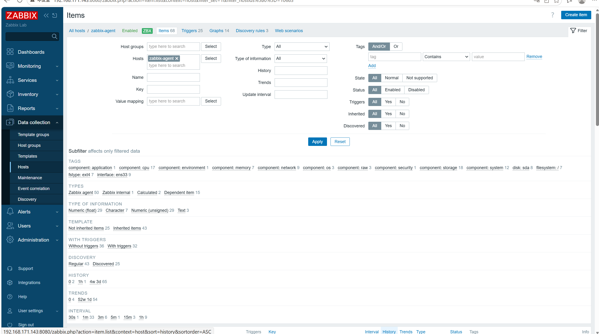
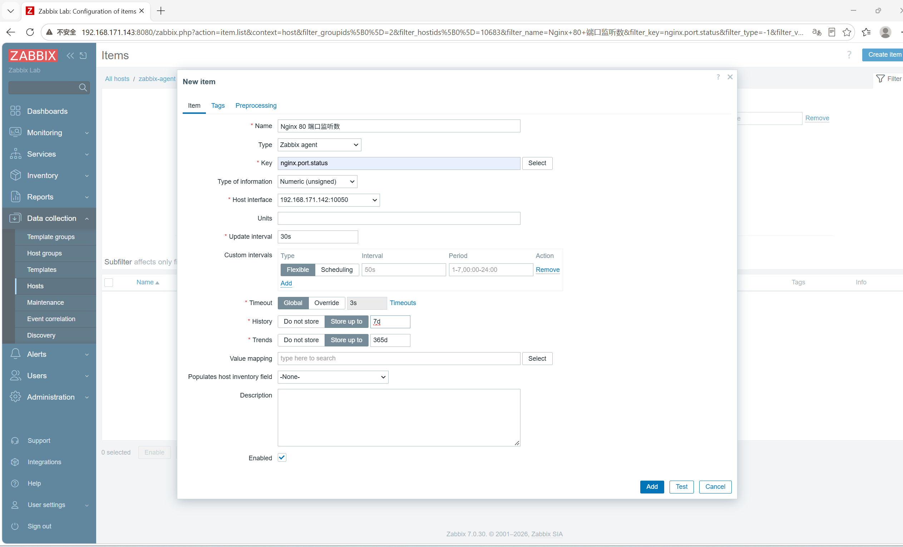

# stage5-04 Zabbix 监控项配置

> 前置:第 03 节已完成,主机 `zabbix-agent` 已接入并显示绿色 ZBX。
> 本文所有命令都标注了执行位置:**【server】**=192.168.171.143,**【agent】**=192.168.171.142。

## 一、知识点

### 1. 监控项(Item)是什么

监控项 = "从被监控对象采集某一个具体指标"的配置。一个监控项由这些要素组成:

| 要素 | 说明 | 示例 |
| --- | --- | --- |
| Name | 界面显示的名称 | CPU 1 分钟平均负载 |
| Type | 采集方式 | Zabbix agent / SNMP / HTTP agent / Simple check |
| Key | 采集命令的"键值" | `system.cpu.load[all,avg1]` |
| Type of information | 数值类型 | 浮点 / 无符号整数 / 字符 / 文本 |
| Update interval | 采集频率 | 30s |
| History / Trends | 历史与趋势保留天数 | 7d / 365d |
| Preprocessing | 取值后的处理 | 正则、JSONPath、单位换算 |

### 2. Key 的结构

```text
key[参数1,参数2,...]

system.cpu.load[all,avg1]         # CPU 1 分钟平均负载
net.if.in[ens33]                  # 网卡入流量
vfs.fs.size[/,pfree]              # 根分区剩余空间百分比
net.tcp.service[tcp,,80]          # 80 端口是否可连(1 通 / 0 不通)
```

### 3. 常见采集类型

| 类型 | 谁来采集 | 说明 |
| --- | --- | --- |
| Zabbix agent | server 主动拉 | 需要 agent 的 10050 可达 |
| Zabbix agent (active) | agent 主动推 | 适合 agent 在 NAT 后面的场景 |
| Simple check | server 自己发 | 只做 ping、端口探测这类简单检查,不经过 agent |
| HTTP agent | server 自己发 | 请求 URL 并解析响应 |
| Zabbix trapper | 脚本主动推 | 用 `zabbix_sender` 上报自定义数据 |

### 4. 自定义监控项

用 `UserParameter` 在 **agent 端**定义新 key:

```text
UserParameter=<key>[,<参数>],<shell 命令>
```

原则:

- 命令必须**输出单个值**(多行输出会导致取值失败)
- 脚本要用**绝对路径**
- 执行身份是 `zabbix` 用户,所以涉及权限的命令要先用 `sudo -u zabbix <命令>` 验证
- **key 定义在哪台机器,就只能去哪台机器取**——这是本节最容易错的一点

## 二、实操

### 2.1 用 zabbix_get 验证内置 key

**【server 上执行】**

```bash
zabbix_get -s 192.168.171.142 -k agent.ping                   # 期望 1
zabbix_get -s 192.168.171.142 -k system.cpu.load[all,avg1]
zabbix_get -s 192.168.171.142 -k vfs.fs.size[/,pfree]
zabbix_get -s 192.168.171.142 -k net.if.in[ens33]
zabbix_get -s 192.168.171.142 -k net.tcp.service[tcp,,22]
```

**检验**

| 命令 | 期望结果 |
| --- | --- |
| `agent.ping` | `1` |
| `system.cpu.load[all,avg1]` | 一个小数,如 `0.0200` |
| `vfs.fs.size[/,pfree]` | 一个百分比数字 |
| `net.if.in[ens33]` | 一个整数(字节数) |
| `net.tcp.service[tcp,,22]` | `1` |

> 只要 `zabbix_get` 能取到值,这个 key 在 agent 上就是可用的,后面做成监控项一定能采到数据。
> **这一步是排错的第一道关口。**

### 2.2 编写自定义监控项

需求:监控 80 端口是否在监听、监控指定文件大小。

#### 操作:【agent(192.168.171.142)上执行】

```bash
sudo tee /etc/zabbix/zabbix_agentd.d/userparameter_my.conf > /dev/null <<'EOF'
UserParameter=nginx.port.status,ss -nlt | grep -c ':80 '
UserParameter=my.file.size[*],stat -c %s "$1" 2>/dev/null || echo 0
EOF

sudo systemctl restart zabbix-agent
```

#### 检验 1:【agent 上执行】本机验证 key 是否生效

```bash
# 先跑一遍原始命令,看输出是否符合预期
ss -nlt | grep -c ':80 '
stat -c %s /etc/passwd

# 再用 agent 自己的配置测试 key(不走网络,不受白名单影响)
sudo zabbix_agentd -t nginx.port.status
sudo zabbix_agentd -t 'my.file.size[/etc/passwd]'
```

期望:`zabbix_agentd -t` 输出形如 `nginx.port.status  [t|2]`,说明 key 已被 agent 识别。

#### 检验 2:【server 上执行】通过网络取值

```bash
zabbix_get -s 192.168.171.142 -k nginx.port.status
zabbix_get -s 192.168.171.142 -k 'my.file.size[/etc/passwd]'
```

> key 里带方括号时**用引号包起来**,避免被 shell 当通配符处理。

期望:返回与 agent 本机一致的数字。

#### 两种报错要分清

| 报错 | 含义 | 排查方向 |
| --- | --- | --- |
| `connection error (POLLERR,POLLHUP)` | TCP 连上了,但被对端掐断 | 来源 IP 不在 agent 的 `Server=` 白名单里;或 IP 写错 |
| `ZBX_NOTSUPPORTED: Unsupported item key` | 连上了、agent 正常,但**没有这个 key** | 检查 key 拼写;检查 UserParameter 是否定义在**被查询的那台机器**上 |

> 口诀:**POLLERR 是"不让你连",NOTSUPPORTED 是"连上了但我不认识这个 key"。**

### 2.3 在 Web 前端创建监控项

#### 操作 1:创建 Nginx 端口监控项(Zabbix agent 类型)

```text
Data collection → Hosts → zabbix-agent → Items → Create item
```



```text
Name:                   Nginx 80 端口监听数
Type:                   Zabbix agent
Key:                    nginx.port.status
Type of information:    Numeric (unsigned)
Update interval:        30s
History storage period: 7d
→ Add
```



#### 操作 2:创建 SSH 端口监控项(Simple check 类型)

体会"不经过 agent"的采集方式:

```text
Name:                   SSH 端口可用性
Type:                   Simple check
Key:                    net.tcp.service[tcp,,22]
Type of information:    Numeric (unsigned)
Update interval:        1m
→ Add
```

区别:`Zabbix agent` 类型由 agent 采集;`Simple check` 由 **server 自己**发起探测,不需要 agent 参与。

#### 检验

```text
Monitoring → Latest data → Filter:Hosts 选 zabbix-agent → Apply
```

| 检查项 | 期望结果 |
| --- | --- |
| Items 列表 | 两个监控项状态为 Enabled,无红色感叹号 |
| Latest data | 两个监控项都有最新值和时间戳 |
| History | 等 2~3 分钟后,点 History 能看到历史数据 |

典型输出:

```text
zabbix-agent | Nginx 80 端口监听数 | 4s  | 0
zabbix-agent | SSH 端口可用性      | 27s | 1
```

> **重要提示**:如果 agent 上没有装 nginx,`nginx.port.status` 的值会恒为 `0`。
> 这不影响监控项本身,但下一节配 `=0` 的触发器时,它会**立刻报警且永远不会恢复**。
> 建议先在 agent 上装一个 nginx,方便后面演示"故障 → 告警 → 恢复"的完整闭环:
> ```bash
> # 【agent 上执行】
> sudo apt install -y nginx
> sudo systemctl start nginx
> ss -nlt | grep -c ':80 '        # 期望 1
> ```

### 2.4 加一个预处理(选做,理解取值加工)

需求:`my.file.size[/etc/passwd]` 得到的是字节数,换算成 KB。

**操作**

```text
Data collection → Hosts → zabbix-agent → Items → 打开该监控项 → Preprocessing → Add
  Name: Custom multiplier
  Parameter: 0.001
→ Update
```

**检验**:Latest data 里该监控项的数值从 `2053` 变成 `2.053`。

## 三、闭环自检清单

| 检查项 | 命令或位置 | 通过标准 |
| --- | --- | --- |
| agent 内置 key 可用 | 【server】`zabbix_get -s 142 -k agent.ping` | 返回 1 |
| 自定义 key 已下发 | 【agent】`cat /etc/zabbix/zabbix_agentd.d/userparameter_my.conf` | 能看到两行 UserParameter |
| agent 已重启 | 【agent】`systemctl is-active zabbix-agent` | active |
| 本机 key 测试通过 | 【agent】`sudo zabbix_agentd -t nginx.port.status` | 输出带数值 |
| 网络取值成功 | 【server】`zabbix_get -s 142 -k nginx.port.status` | 返回数字 |
| Web 监控项存在 | Items 列表 | Enabled,无报错 |
| 数据在采集 | Latest data | 有值和新的时间戳 |
| 预处理生效 | Latest data | 数值已被换算 |

## 四、常见问题

| 现象 | 原因 | 处理 |
| --- | --- | --- |
| `POLLERR,POLLHUP` | 来源 IP 不在 `Server=` 白名单,或目标 IP 写错 | 【agent】`grep '^Server=' /etc/zabbix/zabbix_agentd.conf`;核对 IP |
| `ZBX_NOTSUPPORTED` | key 拼错,或 UserParameter 定义在了别的机器上 | 确认 key 拼写;确认在被查询的机器上定义了 UserParameter |
| 自定义 key 完全不存在 | UserParameter 文件未被加载 | 文件必须在 `/etc/zabbix/zabbix_agentd.d/` 且以 `.conf` 结尾 |
| 取值结果为空 | 命令输出多行或没有输出 | 命令只输出单个值,必要时加 `head -1` |
| 数值一直是 0 | 被监控的服务确实没在监听 | 先确认业务状态,再确认权限:`sudo -u zabbix <命令>` |
| Web 里监控项报错 | 采集类型选错 | agent 类 key 必须选 `Zabbix agent` 类型 |
| 触发器一保存就报警 | 指标当前值本身就异常(如端口确实是 0) | 先让业务恢复正常,再验证触发器 |

## 五、实战踩坑记录(本次实验真实遇到)

| # | 现象 | 根因 | 解决 |
| --- | --- | --- | --- |
| 1 | 连 `192.168.171.137` 报 `POLLERR,POLLHUP` | 用了笔记里最早的示例 IP,实际 agent 是 `192.168.171.142` | 每次测试前先去 `Data collection → Hosts` 抄接口 IP;并把笔记里的旧 IP 全局替换 |
| 2 | 连到正确的 142 却报 `ZBX_NOTSUPPORTED` | `userparameter_my.conf` 建在了 **server(143)** 上,而查询的是 **agent(142)** | 记住规则:**key 定义在哪台机器,就只能去哪台取**;要在 agent 上取就在 agent 上建文件 |
| 3 | 不清楚两种报错的区别 | 缺少对照认知 | `POLLERR/POLLHUP` = 白名单拒绝;`ZBX_NOTSUPPORTED` = key 不存在 |
| 4 | `nginx.port.status` 一直是 0 | agent 上确实没装 nginx | 要么在 agent 上装 nginx,要么把 key 改成监控已监听的端口(如 22) |

**本节经验总结**:

1. **IP 一律从 Web 界面抄**,不要凭记忆或旧笔记填
2. **UserParameter 必须定义在被查询的那台机器上**
3. **两种报错含义完全不同**,先看是"连不上"还是"不认识 key",再决定查网络还是查 key
4. **监控项的当前值会影响触发器行为**,配触发器之前先确认指标本身是否正常