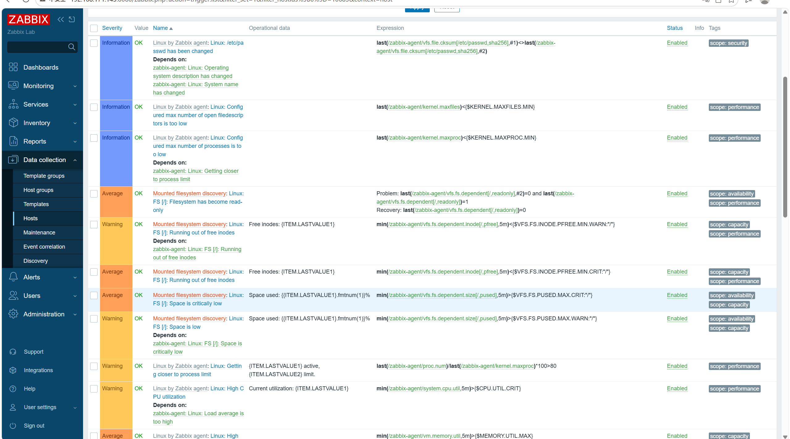
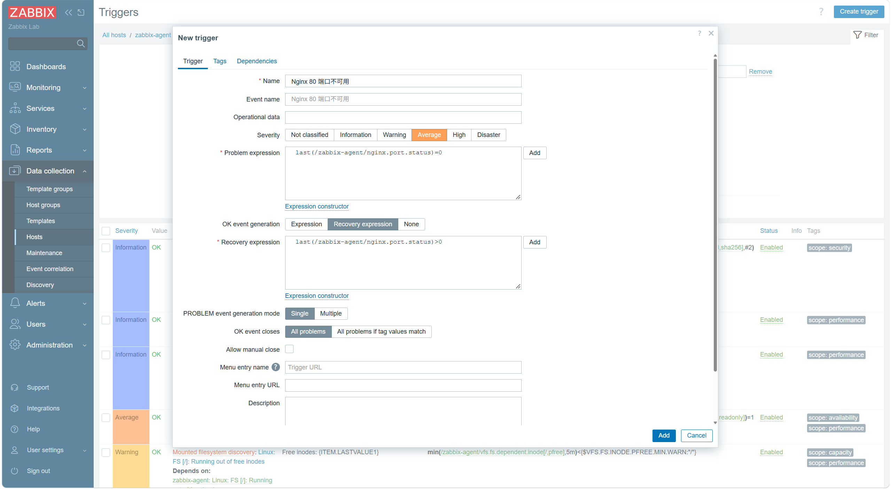
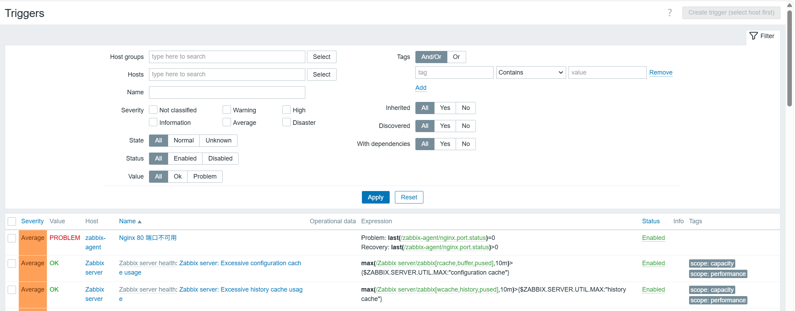
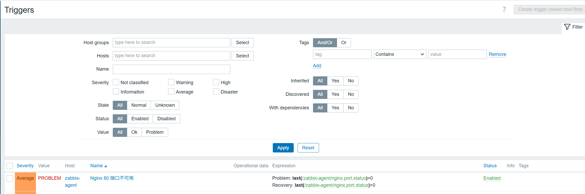
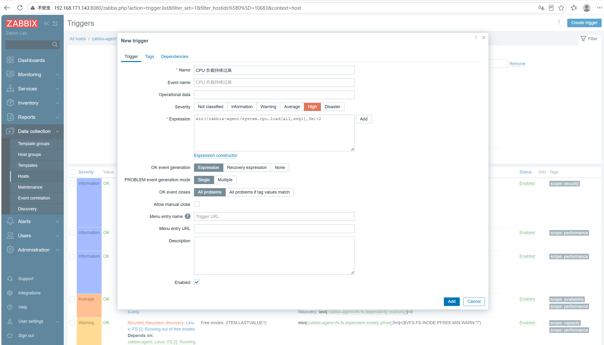
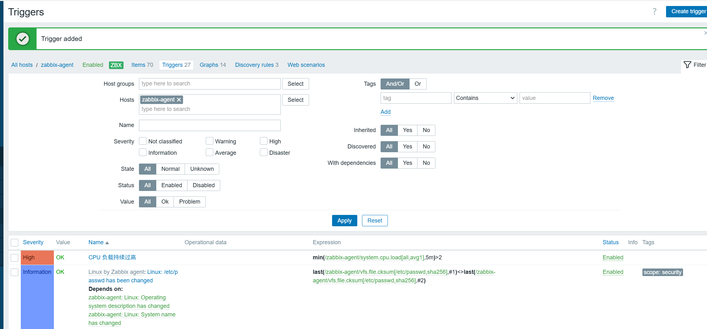

# stage5-05 Zabbix 触发器配置指南

> 前置:第 04 节已创建好监控项。
> 本文命令都标注了执行位置:**【server】**=192.168.171.143,**【agent】**=192.168.171.142,**【Web】**=浏览器界面。

## 一、知识点

### 1. 触发器(Trigger)是什么

监控项回答"这个指标现在是多少",触发器回答"这个指标到了什么程度算异常"。触发器是一个**表达式**,由 Zabbix 用采集到的历史数据持续计算。

### 2. 表达式语法

```text
{主机:key.函数(参数)} 运算符 阈值
```

```text
last(/zabbix-agent/system.cpu.load[all,avg1])>5         # 最近一次负载大于 5
min(/zabbix-agent/system.cpu.load[all,avg1],5m)>5       # 5 分钟内最小负载都大于 5
avg(/zabbix-agent/vfs.fs.size[/,pfree],10m)<10          # 10 分钟平均剩余空间小于 10%
last(/zabbix-agent/nginx.port.status)=0                 # 80 端口监听数为 0
nodata(/zabbix-agent/agent.ping,5m)=1                   # 5 分钟没有数据
```

| 常用函数 | 含义 |
| --- | --- |
| `last()` | 最近一次取值 |
| `avg()` / `min()` / `max()` | 时间段内的平均 / 最小 / 最大 |
| `sum()` | 时间段内求和 |
| `change()` | 前后两次取值的变化量 |
| `nodata()` | 指定时间内没有数据 |

时间参数写法:`5m`、`1h`、`1d`,也可用 `#5` 表示最近 5 次。

### 3. 严重级别

```text
Not classified < Information < Warning < Average < High < Disaster
```

级别决定告警的展示颜色,也决定了动作(Action)能不能匹配到它——第 06 节的邮件告警就是按级别过滤的。

### 4. 恢复与依赖

- **恢复表达式**:满足则事件变成 Resolved(不写也可以,表达式不成立时自动恢复)
- **依赖**:例如"主机不可达"存在时,抑制该主机上所有其他告警,避免告警风暴

## 二、实操

### 2.1 查看内置触发器

**【Web】**

```text
Data collection → Hosts → zabbix-agent → Triggers
```



**检验**:能看到模板自带的触发器,例如 `CPU load is too high`、`Disk space is critically low`,点进去看它的表达式怎么写的。

### 2.2 创建"80 端口不可用"触发器

**【Web】**

```text
Data collection → Hosts → zabbix-agent → Triggers → Create trigger

Name:        Nginx 80 端口不可用
Severity:    Average          ← 必须选中,否则第 06 节的邮件动作匹配不到

Problem expression:
  last(/zabbix-agent/nginx.port.status)=0

OK event generation:  Recovery expression
Recovery expression:
  last(/zabbix-agent/nginx.port.status)>0

→ Add
```



#### 填写时的三个易错点

| 字段 | 正确做法 | 说明 |
| --- | --- | --- |
| **Event name** | **留空** | 留空就用触发器名;若填了内容(比如误填成 "Average"),Problems 里所有事件都会显示这个名字,无法区分 |
| **Severity** | 点选 `Average` | 选成 `Not classified` 时,第 06 节 `>= Warning` 的邮件动作不会匹配 |
| Recovery expression | 填 `>0` | 不填的话表达式不成立时也会恢复,但显式写出来更清晰 |

#### 检验

**【server 执行】**

```bash
zabbix_get -s 192.168.171.142 -k nginx.port.status
```

**【Web 执行】**

```text
Data collection → Hosts → zabbix-agent → Triggers
```





期望:触发器状态 Enabled,表达式列能看到完整公式,Severity 显示 Average。

> **重要提示**:如果 agent 上没有程序监听 80 端口,`nginx.port.status` 的值就是 `0`,
> 触发器保存后会**立刻变成 PROBLEM 且不会自己恢复**——这是指标本身的状态,不是触发器写错。
> 想在验证时看到完整过程,先在 agent 上装好 nginx(见 2.4)。

### 2.3 用"5 分钟持续超限"的写法做 CPU 触发器

**【Web】**

```text
Data collection → Hosts → zabbix-agent → Triggers → Create trigger

Name:        CPU 负载持续过高
Severity:    High
Problem expression:
  min(/zabbix-agent/system.cpu.load[all,avg1],5m)>2

→ Add
```





**检验**:对比内置触发器的写法,理解"加时间参数"和"不加时间参数"的区别——不加是瞬时抖动,加了才是持续异常。

### 2.4 端到端验证:故意制造故障

#### 前置:先在 agent 上准备 nginx

**【agent 执行】**

```bash
sudo apt install -y nginx
sudo systemctl start nginx

# Ubuntu 上 nginx 默认同时监听 IPv4 和 IPv6,所以这里通常输出 2 而不是 1
ss -nlt | grep -c ':80 '
```

**【server 执行】确认取值**

```bash
zabbix_get -s 192.168.171.142 -k nginx.port.status      # 期望 2
```

> **不要用「停掉 sshd」来模拟故障**——那会让你自己的 SSH 连接立刻断开,操作被迫中断。
> 模拟端口消失请用 nginx 的启停。

#### 制造故障

**【agent 执行】**

```bash
sudo systemctl stop nginx
```

#### 检验

**【server 执行】**

```bash
zabbix_get -s 192.168.171.142 -k nginx.port.status      # 期望 0
```

**【Web 执行】**

```text
Monitoring → Problems
```

| 时间点 | 期望结果 |
| --- | --- |
| 停服务后 1~2 分钟 | Problems 里出现 `Nginx 80 端口不可用`,级别 Average |
| 点进问题详情 | 有开始时间、主机、触发器名、最新值 |
| 恢复服务后 1~2 分钟 | 问题状态变为 `Resolved`,并从 Problems 列表移到"最近解决" |

#### 恢复服务

**【agent 执行】**

```bash
sudo systemctl start nginx
```

等 1~2 分钟,Problems 里该问题自动变为 **Resolved**。

### 2.5 验证"无数据"触发器

**【Web】**

```text
Data collection → Hosts → zabbix-agent → Triggers → Create trigger

Name:        Agent 无数据
Severity:    Warning
Problem expression:
  nodata(/zabbix-agent/agent.ping,5m)=1

→ Add
```

**检验**

**【agent 执行】**

```bash
sudo systemctl stop zabbix-agent
```

等待 5~6 分钟,`Monitoring → Problems` 应出现 `Agent 无数据`。

> 停掉 agent 后,该主机的所有监控项都会变成无数据,所以可能同时看到 `Zabbix agent is not available` 等告警,这是正常的。

**【agent 执行】恢复**

```bash
sudo systemctl start zabbix-agent
```

再等 1~2 分钟,问题应自动恢复。

## 三、闭环自检清单

| 检查项 | 位置 | 通过标准 |
| --- | --- | --- |
| 触发器创建成功 | Triggers 列表 | Enabled |
| Severity 正确 | 触发器详情 | 显示 Average / High |
| Event name 未误填 | 触发器详情 | 为空 |
| 表达式引用 key 有值 | 【server】`zabbix_get` | 能取到数值 |
| 故障被识别 | Monitoring → Problems | 出现对应问题,级别正确 |
| 恢复被识别 | Monitoring → Problems | 状态变 Resolved |
| 无数据触发器生效 | Monitoring → Problems | 停 agent 后出现,恢复后消失 |
| 能看懂已有触发器 | 模板触发器详情 | 能说明每个函数的作用 |

## 四、常见问题

| 现象 | 原因 | 处理 |
| --- | --- | --- |
| 触发器一直报问题 | 指标当前值本身就异常(如端口确实为 0) | 先确认业务状态,再验证触发器 |
| 触发器从来不触发 | 主机名写错 | 表达式里的主机名必须是技术名称 `zabbix-agent`,或改用 `{HOST.HOST}` |
| 故障恢复了但问题不关闭 | 数据还没回来 / 恢复条件写错 | 等一个采集周期,检查恢复表达式 |
| Problems 里事件名全都一样 | 误填了 Event name | 把 Event name 清空 |
| 邮件动作匹配不到 | Severity 选成了 Not classified | 改成 Average 或更高 |
| 停 agent 后没有 nodata 告警 | 时间参数太大 / 触发器未启用 | 用 `5m` 并确认 Enabled |
| 表达式保存时报语法错 | 括号、函数名拼写 | 用界面上的 Expression 构造器逐项添加 |

## 五、实战踩坑记录(本次实验真实遇到)

| # | 现象 | 根因 | 解决 |
| --- | --- | --- | --- |
| 1 | Event name 被填成了 `Average` | 误把严重级别的名称填进了事件名输入框 | Event name **留空**,严重级别用按钮点选 |
| 2 | 触发器一保存就报警且不恢复 | agent 上确实没有程序监听 80 端口,值恒为 0 | 在 agent 上装 nginx,让值变成 2 |
| 3 | 检验命令里用了 `192.168.171.137` | 沿用了旧笔记的示例 IP | 统一改成 agent 的真实 IP `192.168.171.142` |
| 4 | 想用"停 sshd"模拟故障 | 会直接切断自己的 SSH 会话 | 改用 nginx 启停来模拟 |
| 5 | 误以为 `ss -nlt \| grep -c ':80 '` 应该等于 1 | Ubuntu 的 nginx 默认同时监听 IPv4 和 IPv6,所以是 2 | 记住这个值是 2;触发器写 `=0` 不受影响 |

**本节经验总结**:

1. **Event name 留空**、Severity 用按钮选,别把两者弄混
2. **表达式里的主机名必须和 Host name 完全一致**
3. **模拟故障不要停 sshd**,用业务服务(nginx)启停
4. **触发器是否报警取决于指标当前状态**,配之前先用 Latest data 或 `zabbix_get` 看一眼值