# stage5-06 Zabbix 告警对接邮箱

> 前置:第 05 节的触发器能正常产生 PROBLEM / RESOLVED 事件。
> 需要准备:一个支持 SMTP 的邮箱(QQ、163、企业邮箱均可)和它的**授权码**。
> 本文命令都标注执行位置:**【server】**=192.168.171.143,**【agent】**=192.168.171.142,**【Web】**=浏览器。

## 一、知识点

### 1. 告警完整链路

```text
监控项采集 → 触发器判定 → 产生事件 → 动作(Action)匹配条件
      → 操作(Operation)选择用户和媒介 → 媒介发送 → 用户收到邮件
```

任何一环缺失,邮件都收不到。排错时按这条链路从后往前查。

### 2. 四个核心概念

| 概念 | 作用 | 位置 |
| --- | --- | --- |
| 媒介类型(Media types) | 定义"用什么方式发" | Alerts → Media types |
| 用户媒介(User media) | 定义"发给谁" | Users → Users → Media |
| 动作(Action) | 定义"什么条件下发给谁" | Alerts → Actions |
| 动作日志(Action log) | 排查告警是否发出 | **Reports → Action log** |
| 通知明细(Notifications) | 看实际发出的内容 | **Reports → Notifications** |

> 注意:Action log **不在 Alerts 菜单下**,而在 **Reports** 菜单里。
> Reports 里同时有 Audit log(谁改了配置)和 Action log(动作有没有执行),两者不要混。

### 3. 两种邮件实现方式

| 方式 | 原理 | 优缺点 |
| --- | --- | --- |
| 内置 Email 媒介 | 调用本机 sendmail/postfix | 需要装 MTA、容易被判为垃圾邮件 |
| **脚本媒介(推荐)** | 自己写脚本,用第三方 SMTP + 授权码发信 | 稳定、不依赖本机 MTA、可控 |

### 4. 授权码 ≠ 登录密码

邮箱的 SMTP 服务需要用"授权码"认证。获取路径:邮箱设置 → 账户 → 开启 SMTP 服务 → 生成授权码。

常见 SMTP 参数:

| 邮箱 | 服务器 | 端口 | 加密 |
| --- | --- | --- | --- |
| QQ 邮箱 | smtp.qq.com | 465 | SSL |
| 163 邮箱 | smtp.163.com | 465 | SSL |
| 企业邮箱 | 按管理员提供 | 465/587 | SSL/TLS |

### 5. 触发器的状态翻转规则(理解这条,能省很多排查时间)

Zabbix 的动作**只在事件发生的那一刻执行**,而事件只在状态**翻转**时产生:

```text
OK → PROBLEM        产生问题事件 → 执行 Operations(发告警)
PROBLEM → OK        产生恢复事件 → 执行 Recovery operations(发恢复通知)
PROBLEM → PROBLEM   状态没变,不产生任何事件 → 不会有邮件
```

所以"我已经制造故障了,为什么没收到邮件"最常见的原因就是:**问题还挂在 PROBLEM 状态没恢复过**。

## 二、实操

### 2.1 获取邮箱授权码

**【Windows】**

登录邮箱网页版 → 设置 → 账户/安全 → 开启 SMTP 服务 → 生成授权码,记下来。

**检验**:能拿到一串 16 位左右的授权码(不是登录密码)。

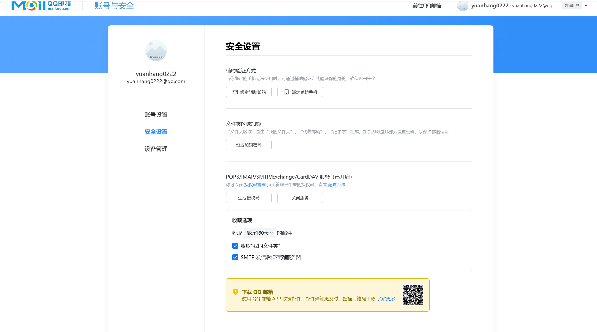

### 2.2 编写发信脚本(在 server 上操作)

**【server】**

```bash
sudo tee /usr/lib/zabbix/alertscripts/sendmail.py > /dev/null <<'EOF'
#!/usr/bin/env python3
import smtplib, sys
from email.mime.text import MIMEText
from email.header import Header

SMTP_HOST = 'smtp.qq.com'
SMTP_PORT = 465
SMTP_USER = '你的邮箱@qq.com'
SMTP_PASS = '你的授权码'

def main():
    if len(sys.argv) < 4:
        print('usage: sendmail.py <to> <subject> <body>')
        sys.exit(1)

    to_addr, subject, body = sys.argv[1], sys.argv[2], sys.argv[3]

    msg = MIMEText(body, 'plain', 'utf-8')
    msg['Subject'] = Header(subject, 'utf-8')
    msg['From'] = SMTP_USER
    msg['To'] = to_addr

    server = smtplib.SMTP_SSL(SMTP_HOST, SMTP_PORT, timeout=10)
    server.login(SMTP_USER, SMTP_PASS)
    server.sendmail(SMTP_USER, [to_addr], msg.as_string())
    server.quit()
    print('sent')

if __name__ == '__main__':
    main()
EOF

sudo chmod +x /usr/lib/zabbix/alertscripts/sendmail.py
```

#### 把两个占位符换成真实值

**注意**:直接复制上面的 heredoc 时,中文占位符可能出现编码问题(变成乱码),用 sed 覆盖更稳:

```bash
sudo sed -i "s|^SMTP_USER.*|SMTP_USER = 'yourmail@qq.com'|" /usr/lib/zabbix/alertscripts/sendmail.py
sudo sed -i "s|^SMTP_PASS.*|SMTP_PASS = '你的授权码'|" /usr/lib/zabbix/alertscripts/sendmail.py

sudo grep -E '^SMTP_(HOST|PORT|USER|PASS)' /usr/lib/zabbix/alertscripts/sendmail.py
```

> 这两条 sed 命令**必须在同一行输入**,如果被换行截断会报 `sed: no input files`。

#### 检验 1:确认脚本目录配置正确

```bash
sudo grep -E '^AlertScriptsPath' /etc/zabbix/zabbix_server.conf
ls -l /usr/lib/zabbix/alertscripts/sendmail.py
```

如果 `grep` **没有输出**(说明该行被注释了),显式写死路径:

```bash
sudo sed -i '/^# *AlertScriptsPath=/d' /etc/zabbix/zabbix_server.conf
echo 'AlertScriptsPath=/usr/lib/zabbix/alertscripts' | sudo tee -a /etc/zabbix/zabbix_server.conf
sudo grep -n 'AlertScriptsPath' /etc/zabbix/zabbix_server.conf
sudo systemctl restart zabbix-server
systemctl is-active zabbix-server
```

> 配置文件属主是 root、权限 640,普通用户读取会报 `Permission denied`,**要加 sudo**。

#### 检验 2:手动发一封信(关键闭环点)

```bash
sudo -u zabbix python3 /usr/lib/zabbix/alertscripts/sendmail.py \
  yourmail@qq.com \
  "Zabbix 测试" \
  "这是一封来自 Zabbix 脚本媒介的测试邮件"
```

期望:输出 `sent`,并且邮箱收到邮件。

> **必须用 `sudo -u zabbix`**:Zabbix 是以 `zabbix` 用户执行脚本的,用 root 测通、换成 zabbix 用户失败的情况很常见。
> **收件人必须是纯 ASCII 的真实邮箱地址**——传中文会报 `UnicodeEncodeError: 'ascii' codec can't encode characters`。
> 主题和正文可以用中文(由 MIME 编码处理)。
> **这一步不通过,后面配得再对也发不出邮件。**

### 2.3 创建媒介类型(Web 操作)

**【Web】**

```text
Alerts → Media types → Create media type

Name:              Email-Script
Type:              Script
Script name:       sendmail.py
Script parameters:  ← 必须是三行独立参数,不能写在一行
  {ALERT.SENDTO}
  {ALERT.SUBJECT}
  {ALERT.MESSAGE}
→ Add
```

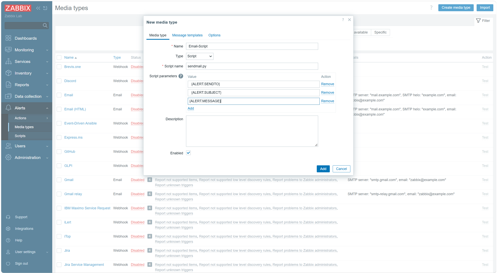

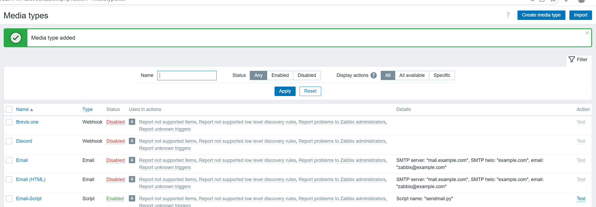

**为什么必须三行**:Zabbix 调用脚本时,每一行参数作为一个独立的命令行参数传入。写在一行的话,脚本只会收到一个参数,`argv[2]`、`argv[3]` 不存在,脚本会直接打印 `usage` 后退出。

#### 检验:用 Test 功能发测试邮件

```text
Alerts → Media types → 选中 Email-Script → Test
```

**测试窗口里的三个框是可以编辑的**,要填成真实值:

| 框 | 填 |
| --- | --- |
| 第 1 个框(原 `{ALERT.SENDTO}`) | `yourmail@qq.com` |
| 第 2 个框(原 `{ALERT.SUBJECT}`) | `Zabbix 测试` |
| 第 3 个框(原 `{ALERT.MESSAGE}`) | `这是一封来自 Zabbix 的测试邮件` |

然后点 **Test**。

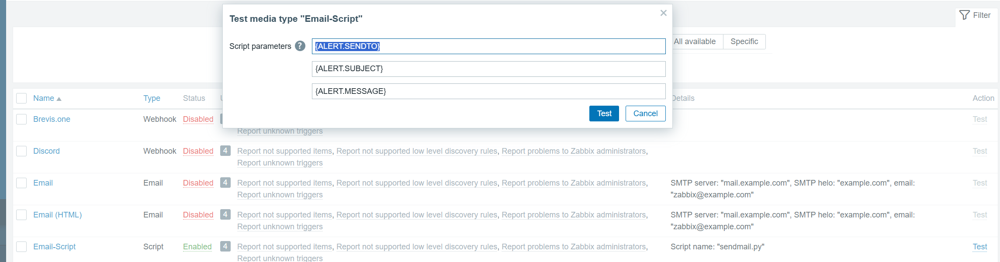

> 如果没替换、直接把 `{ALERT.SENDTO}` 原样提交,会报
> `SMTPRecipientsRefused: {'{ALERT.SENDTO}': (501, b'Bad address syntax...')}`。
> 这个报错说明**前面认证已经通过**(授权码没问题),只是收件人不是合法地址。
> **保存媒介类型时保持三个宏不变;只在测试窗口里临时填真实值。**

### 2.4 给用户绑定媒介

**【Web】**

```text
Users → Users → Admin → Media → Add

Type:            Email-Script
Send to:         yourmail@qq.com
When active:     默认(1-7, 00:00-24:00)
Use if severity: 全选
→ Add → Update
```

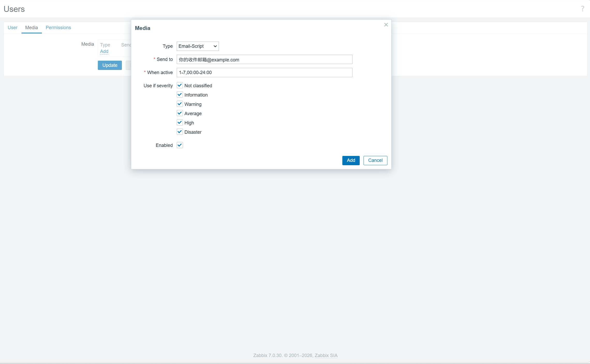

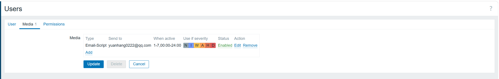

**检验**:Users 列表里 Admin 的 Media 列显示 `Email-Script`。

### 2.5 创建动作(Action)

**【Web】**

```text
Alerts → Actions → Trigger actions → Create action

【Action 标签页】
Name:      邮件告警
Enabled:   勾选
Conditions: Trigger severity >= Warning

【Operations 标签页】
点 Operations 的 Add:

  Operation type:   Send message
  Send to users:    Admin
  Send only to:     Email-Script
  Custom message:   ☑ 勾选
  Subject: 【Zabbix告警】{EVENT.STATUS}: {TRIGGER.NAME}
  Message:
    主机: {HOST.NAME}
    触发器: {TRIGGER.NAME}
    严重级别: {EVENT.SEVERITY}
    状态: {EVENT.STATUS}
    时间: {EVENT.DATE} {EVENT.TIME}
    当前值: {ITEM.LASTVALUE}
  Steps: 保持默认(1-1,不延迟)
  → 表单底部 Add

点 Recovery operations 的 Add:

  Send to users:  Admin
  Send only to:   Email-Script
  Custom message: ☑
  Subject: 【Zabbix恢复】{TRIGGER.NAME}
  Message:
    主机: {HOST.NAME}
    触发器: {TRIGGER.NAME}
    状态: {EVENT.RECOVERY.STATUS}
    恢复时间: {EVENT.RECOVERY.DATE} {EVENT.RECOVERY.TIME}
  → Add

→ 整个页面的 Add(保存动作)
```

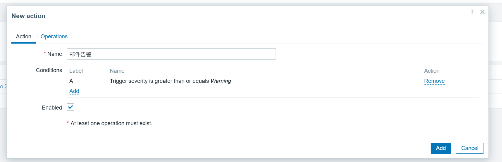

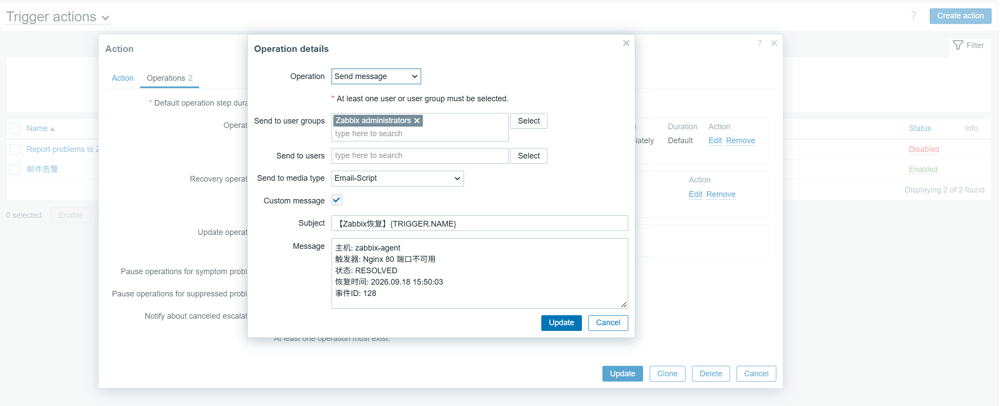

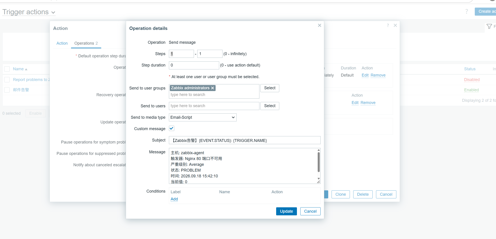

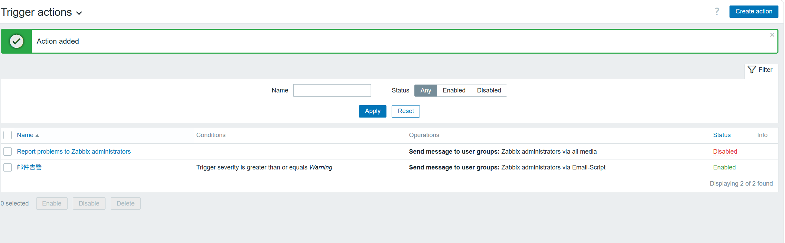

#### 三个易错点

| 易错点 | 正确做法 |
| --- | --- |
| 收件人弹窗没点确认 | 选完用户后要点弹窗底部的 **Select** 确认,否则会报 "At least one user or user group must be selected" |
| 同时选了「用户 Admin」和「用户组 Zabbix administrators」 | **二选一**即可。Admin 本身就是该组成员,两者都选可能收到两封重复邮件 |
| 恢复消息里用了 `{ITEM.LASTVALUE}` | 恢复事件中该宏无值,会显示 `*UNKNOWN*`;恢复消息要用 `{EVENT.RECOVERY.*}` 系列宏 |

**检验**:`Alerts → Actions` 列表里该动作 Status 为 **Enabled**。

### 2.6 端到端验证

> **重要:动作只对"新产生的事件"生效。**
> 如果已有一条持续了很久的 PROBLEM(且动作是在它之后才创建的),那条旧事件不会补发邮件。
> 必须先让它恢复,再重新触发。

#### 正确顺序

**第 1 步【agent】确认服务正常,让旧问题先恢复**

```bash
sudo systemctl start nginx
ss -nlt | grep -c ':80 '        # 期望 2
```

**【server】确认取值**

```bash
zabbix_get -s 192.168.171.142 -k nginx.port.status      # 期望 2
```

**【Web】等 1 分钟**

```text
Monitoring → Problems → 旧问题应变为 Resolved 并从列表消失
```

**第 2 步【agent】制造一次新故障**

```bash
sudo systemctl stop nginx
```

**第 3 步:等 1~2 分钟,观察三处结果**

| 检查点 | 期望 |
| --- | --- |
| 邮箱 | 收到标题含 PROBLEM 的告警邮件 |
| Monitoring → Problems | 出现新的问题,Duration 从几秒开始 |
| **Reports → Action log** | 出现 Status = **Sent** 的记录 |

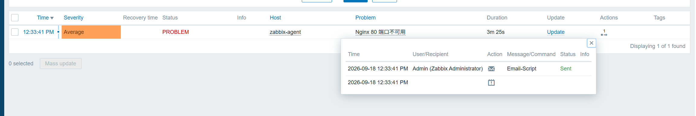

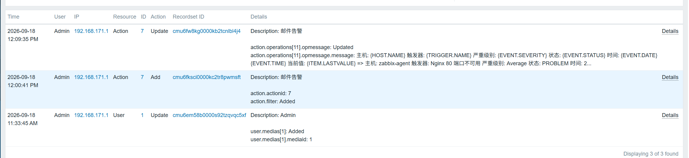

**第 4 步【agent】恢复服务**

```bash
sudo systemctl start nginx
```

等 1~2 分钟,应收到恢复邮件,Problems 里状态变为 Resolved。

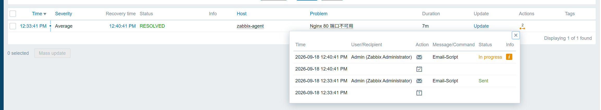

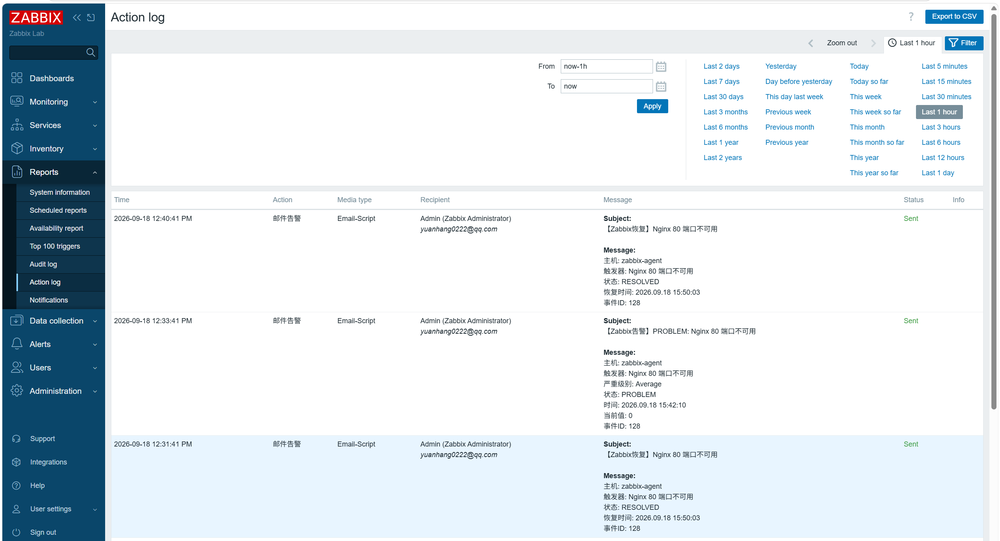

## 三、闭环自检清单

| 检查项 | 命令或位置 | 通过标准 |
| --- | --- | --- |
| 脚本可执行 | `ls -l /usr/lib/zabbix/alertscripts/sendmail.py` | 有 x 权限 |
| 脚本手动发信 | `sudo -u zabbix python3 .../sendmail.py 邮箱 主题 内容` | 输出 sent 且收到邮件 |
| AlertScriptsPath 正确 | `sudo grep AlertScriptsPath /etc/zabbix/zabbix_server.conf` | 指向脚本目录 |
| 媒介类型存在 | Alerts → Media types | 有 Email-Script |
| 媒介测试通过 | 媒介的 Test 功能(填真实值) | 提示成功 |
| 用户已绑定媒介 | Users → Users → Admin → Media | 显示 Email-Script |
| 动作已启用 | Alerts → Actions | Enabled |
| 动作日志 | **Reports → Action log** | 有 Sent 记录 |
| 收到告警邮件 | 邮箱 | 标题含 PROBLEM |
| 收到恢复邮件 | 邮箱 | 标题含恢复信息 |

## 四、常见问题

| 现象 | 原因 | 处理 |
| --- | --- | --- |
| `sed: no input files` | sed 命令被换行截断,文件路径没跟上 | 整条命令写在同一行 |
| `Permission denied` 读配置 | `zabbix_server.conf` 权限 640 | 加 sudo |
| 脚本报 535 认证失败 | 用了登录密码而不是授权码 | 重新生成授权码 |
| `UnicodeEncodeError` | 收件人地址里有中文 | 换成纯 ASCII 的真实邮箱 |
| 测试时报 `501 Bad address syntax` | 测试窗口里没把 `{ALERT.SENDTO}` 换成真实邮箱 | 三个框都填真实值 |
| 脚本执行超时 | 465 端口被防火墙拦 | `nc -vz smtp.qq.com 465` 测试连通性 |
| Action log 报脚本找不到 | AlertScriptsPath 配错 | 按 2.2 检验 1 显式配置路径 |
| 动作没执行 | 条件不匹配(级别低于阈值) | 检查触发器的 Severity |
| 有 Sent 记录但没收到 | 收件地址写错或进垃圾箱 | 在媒介 Test 里换邮箱验证;查垃圾箱 |
| 制造故障后没有新事件 | **旧问题一直挂在 PROBLEM 状态,状态没翻转** | 先恢复(变 OK),再重新触发 |
| 邮件进了垃圾箱 | 发件人/内容被判为垃圾 | 把发件地址加白名单 |

## 五、错误复盘(本次实验真实遇到)

### 复盘 1:AlertScriptsPath 被注释掉

**现象**:`grep -E '^AlertScriptsPath' /etc/zabbix/zabbix_server.conf` 没有任何输出。

**根因**:配置文件里该行是注释状态(`# AlertScriptsPath=...`),Zabbix 使用编译时的默认值。

**解决**:显式写入路径并重启 server。

```bash
sudo sed -i '/^# *AlertScriptsPath=/d' /etc/zabbix/zabbix_server.conf
echo 'AlertScriptsPath=/usr/lib/zabbix/alertscripts' | sudo tee -a /etc/zabbix/zabbix_server.conf
sudo systemctl restart zabbix-server
```

**经验**:涉及路径的配置,**显式写出来**比依赖默认值更可靠,排查时不用猜。

### 复盘 2:媒介类型测试报 501 Bad address syntax

**现象**:

```text
SMTPRecipientsRefused: {'{ALERT.SENDTO}': (501, b'Bad address syntax...')}
```

**根因**:测试窗口里的参数框需要**手动填真实值**,直接提交会把宏字面量 `{ALERT.SENDTO}` 当成收件人。

**解决**:在测试窗口把三个框分别改成真实邮箱、主题、内容再点 Test。

**经验**:这个报错**发生在 RCPT 阶段**,说明前面的 SMTP 登录认证已经通过——授权码是对的,只是收件人不合法。看报错要学会定位它发生在哪一步。

### 复盘 3:`sed 's/:80 /:9999 /'` 引发的一连串问题 ★

**现象**:

1. 为了模拟"80 端口消失",执行了下面这条命令把 key 的匹配条件改掉

```bash
# 【agent 上执行】
sudo sed -i 's/:80 /:9999 /' /etc/zabbix/zabbix_agentd.d/userparameter_my.conf
sudo systemctl restart zabbix-agent
```

2. 之后在 agent 上装好 nginx、`ss -nlt | grep -c ':80 '` 明明返回 2
3. 但 `zabbix_get -s 192.168.171.142 -k nginx.port.status` 仍然返回 **0**
4. 而且停掉 nginx 后,**Problems 里不再出现新的告警,也没收到邮件**

**根因(两个问题叠加)**:

| # | 问题 | 说明 |
| --- | --- | --- |
| 1 | key 的匹配条件被改成了 `:9999 `,且一直没有改回来 | 所以无论 nginx 是否运行,key 都返回 0 |
| 2 | 那条 PROBLEM 从 10:08 起一直是 PROBLEM 状态,从未恢复 | 触发器只在状态**翻转**时产生事件;状态没变,再停一次服务也不会有新事件 |

**解决步骤**:

```bash
# 【agent 上执行】
# 1. 把 key 改回监控 80 端口
sudo sed -i "s|:9999 |:80 |" /etc/zabbix/zabbix_agentd.d/userparameter_my.conf
sudo grep -n 'nginx.port.status' /etc/zabbix/zabbix_agentd.d/userparameter_my.conf
sudo systemctl restart zabbix-agent

# 2. 本机验证 key
sudo zabbix_agentd -t nginx.port.status          # 期望 [t|2]
```

```bash
# 【server 上执行】
# 3. 确认取值变成 2
zabbix_get -s 192.168.171.142 -k nginx.port.status
```

```text
# 4. Web 上等问题恢复
Monitoring → Problems → 旧问题变为 Resolved

# 5. 再去制造新故障(先 OK 后 PROBLEM)
#    【agent】sudo systemctl stop nginx
# 6. 等 1~2 分钟
Monitoring → Problems   出现新问题(Duration 从几秒开始)
邮箱                     收到告警邮件
Reports → Action log     出现 Sent 记录
```

**经验总结**:

1. **模拟故障优先用 `systemctl stop <服务>`**,这是最真实的方式;改 `UserParameter` 属于"改监控逻辑",用完**必须改回来**,而且很容易忘
2. **排查"没收到告警"的第一步**:先看 `Monitoring → Problems`,确认当前问题是否已经恢复。状态没从 PROBLEM 回到 OK,就不会有新事件
3. **每次改动后都用 `zabbix_get` 或 `zabbix_agentd -t` 验证取值**,不要凭"服务看起来在跑"就认为监控项正常
4. **两台机器来回切换时先执行 `hostname`**,避免在 server 上查 agent、或在错误的机器上改配置
5. **报错要看它发生在哪一步**:`POLLERR` 是连接被拒、`ZBX_NOTSUPPORTED` 是 key 不存在、`501 Bad address syntax` 是收件人非法——定位到具体环节,排查效率会高很多

### 复盘 4:授权码泄露风险

调试过程中如果把 QQ 邮箱授权码贴到了聊天或笔记里,实验结束后应**删除并重新生成**:

```text
QQ 邮箱 → 设置 → 账户 → IMAP/SMTP 服务 → 删除旧授权码 → 重新生成
```

以后写笔记或分享命令时,统一用占位符:`yourmail@qq.com`、`abcd1234efgh5678`。